## 11월24일 
* 실무 개발자(초보개발자)가 가져야할 기본기술
1. 화면제어 : HTML, CSS , Javascript + Bootstrap, Jquery
2. 데이터 제어 : SQL, JDBC, API, Mybatis 프레임 워크
3. 언어 및 도구 : Java, VScode, Eclipse, Git, Gradle(빌드도구)
  


시스템 소프트웨어 : 하드웨어 제어 목적. But 태블릿같은 하드웨어를 제어할 수 있는 소프트웨어가 벼로돌 없기에 Driver와 같은 소프트웨어를 제작.

        ex)  OS(운영체제) , Driver, TCP/IP,  DirectX

응용 소프트웨어(Application s/w) : 응용프로그램을 의미

        ex)  HWP, PPT, Web browser, 게임 등

    
  *  standalone(단독으로 실행 가능) : 로컬(Local)에 설치하면 단독으로 사용가능함

        ex) HWP, Photo Shop, 그림판, 메모장, MSoffice
  * Client / Server(CS : 양방향으로만 가능) : 로컬과 원격에 동시에 설치해야 함
        (서버없으면 동작할 수 없음)
        ex) 게임, 메신저, E-mail, 

    * Client /Server는 설치형, 서비스형으로 나뉜다. 설치형은 게임, 메신저 등(업데이트 필요)이 있으며 서비스형에는 E-mail 등(업데이트 필요 X)이 있다.

        * 서비스형 Application은 client가  server에 요청하면 server에서 작업이 이루어지고 client에게 응답하는 구조이다. client s/w가 사용자에게 입력받고 작업결과 출력.
        server s/w는 요청작업을 처리.
        모든 작업이 server쪽에서 실행된다.
        server는 여러 client의 요청을 처리한다.(Hardware의 성능이 좋아야함 -> 분산 computing의 등장. 한대의 컴퓨터가 아니라 여러대의 컴퓨터에서 server를 담당.)

        Web Application
        
        web server:  실행 ------>  <-------결과리턴  :App

        Java App에서 DBMS로  연결하는 과정은 Mybatis 프레임워크 이용.
        화면 출력은 HTML(contents),CSS(Contents의 모양) Javascript (Contents의 동작 제어)이용.
        
 ----------           


## 11월 25일
 ----------------------------------------------------------------------
 * Git Repo에 백업된 파일+ 변경기록을 복제해 오는 것이 clone 명령어.

      $User_HOME  = C:\Users\jys76\

    ex) Repo에 백업된 파일 bitcamp-study ->를
    C:\Users\jys76\에 클론 ->C:\Users\jys76\git\bitcamp-study(작업디렉토리)\.git(설정관련 파일: 백업된 파일을 편집할 수 있도록 꺼낸다. 백업 디렉토리의 역할) 
    작업할 파일을 꺼내오는 것을 check out. 작업디렉토리에서 백업디렉토리로 넘기는 작업을 commit이라고 한다.
  
  < local Repo >

  hello.txt ->변경
  
  README.md                  

  Hello.txt ->추가

 => Stage(백업명단)에 add => Stage에 등록된 파일을 
                                 Local Repo에 commit => Push를 통해 로컬저장소의 내용을 Server Repo에 Upload.

  때문에 Local 저장소에 파일을 백업하는 commit작업은 네트워크에 연결이 되어있지 않아도 수행 가능하다.

  pull 명령어 : 서버의 변경 사항을 내 local로 당겨오는 것.
  merge 명령어 : 서버의 변경사항과 local의 변경사항을 합치는 것

  * git으로 수업 준비 : 강사의 server Repo에서 pull 로 당겨서 보기만하기. pull로 당긴 파일을 편집하면 충돌이 일어남.
  * .gitignore : .으로 시작하는 무시하라는 설정파일


------------------------------------------------------------------------
  ## Application 빌드와 실행
  
  >1.인터프리터 방식 : Javascript 등
    자바스크립트 개발자 -> Javascript파일에서 명령문 실행 -> V8(Javascript 인터프리터). 크롬안에 webkit(HTML, CSS처리), V8(Javascript 처리)하는 툴이 있다. 
    Runtime 이전에 기계어로 해석하는 컴파일 방식과 다르게 Runtime이후에 해석하는 방식.
  **장점**
    - 인터프리터가 설치되어 있다면 OS와 CPU에 상관없이 실행 가능.
  **단점** 
    - 실행하기위해서는 소스파일이 있어야하고, 인터프리터가 설치되어 있어야 한다. 
    - 실행할 때마다 문법검사를 실행한다. 
    - 컴파일방식에 비해 실행속도가 느리다
    
  
  >2.컴파일 방식 : C, C++ 등
    개발자 -> 명령문 -> 번역기(computer) -> 번역과정을 거쳐 기계어(실행파일) 실행 -> OS에서 동작. 
    프로그래밍 언어를 Runtime 이전에 기계어로 해석하기 때문에 구동시간이 오래걸린다. 하지만 구동이후에는 하나의 패키지로 매우 빠르게 작동한다.
  **장점**
     - 인터프리터 방식보다 실행속도가 빠르다.
     - OS나 CPU에 맞는 실행파일만 있으면 실행 가능. 
     - 소스와 컴파일러가 필요없다.  
  **단점** 
     - OS나 CPU가 다르면 실행불가.
 
   
    ex) 안드로이드 모바일의 app을 애플 모바일에서 사용할 수 없다.
   >3.하이브리드 방식 : Java : 등
    [명령문 -> 컴파일러가 번역 -> 가상기계여(중간코드)] : 개발자의 역할(OS,CPU에 상관없이 프로그래밍 및 컴파일 가능)->인터프리터가 실행(JVM) ->OS ->CPU에서 실행
    시스템 관리자가 해당 OS/CPU에 맞는 인터프리터 설치.
    인터프리터 방식과 비교  : 컴파일 할 때 문법검사 완료(어느정도 기계어에 가깝게 변경->인터프리터방식보다 비교적 빠르다. )
    컴파일 방식과 비교 : 
      
  |인터프리터 방식|컴파일방식|하이브리드 방식<br>(컴파일+인터프리터)|
  |:--:|:--:|:--:|
  |실행하기 위해소스파일 필요  | 실행파일만 있으면 실행가능||
  |컴파일러 필요 |컴파일러 불필요|
  |컴파일방식에 비해 속도 느림 |인터프리터방식에 비해 속도빠름|
  |인터프리터 설치시 OS, CPU상관 없이 실행가능 |OS,CPU다르면 실행 불가능 |

    

  - 기계어 코드와 OS/CPU
  > 1. CPU 마다 명령어가 다르다
    Intel CPU는 Intel CPU가 이해할 수 있는 명령어로 작성되어야 실행할 수 있다.
    ex) Intel과 AMD는 명령어가 서로 호환되기 때문에 CPU가 달라도 프로그램을 따로 변환하지 않아도 그대로 실행 가능.
    서로 호환이 되지 않는다면 전용 프로그램을 따로 만들어서 변환해야 한다.

  - 같은 CPU더라도 OS가 다르다면(windows, Linux) 같은 App을 사용 할 수 없다. 
  >ex ) 같은 이력서를 window(삼성) , Linux(LG)에 제출했다. 삼성과 LG는 모두 한국어를 사용한다(같은 CPU언어). 하지만 삼성은 합격했지만 LG는 떨어졌다. 각 회사가 요구하는 이력서 양식이 다르기 때문이다.
  그래서 각 OS가 요구하는 포맷에 맞춰 명령어를 사용해야 한다.
  CUP가 같다는 것은 사용하는 명령어가 같다는 의미이다. 하지만 각 OS에 맞는 기계어(실행파일)를 사용해야 한다.


---
# 11월 26일
  - JVM / JRE / JDK / Java SE / Java ME
>Java 분류

|Java SE(Standard Edition|Java App 기본도구|
|:--:|:--:|
|JDK(Java Development Kit| JRE + 개발도구(컴파일러 , 디버거, 프로파일러|
|JRE(Java Runtime Environment|JAVA App 실행도구|
|JVM(Java Virtual Machine|Byte code interpreter|
|Java EE(Enterprise Edition|기업용 App 개발 관련 도구 *Java SE를 포함하지않는다. Jakarta EE로  이름변경됨(개발관리 소유권이 Eclipse 재단에 넘어감|
|Java ME(Micro Edition)|Embedded App 개발도구(반도체 메모리에 Java App미리 저장|

- Java 컴파일과 실행

>Hello.java -> 컴파일(javac.exe) -> Hello.class(Byte code : 가상의 기계어) -> 실행 불가능. 진짜 기계어가 아니기 때문. 그래서 JVM이 필요

>Hello.class -> JVM -> OS
 ex ) 
  
  |Class역할|JVM역할|
  |:--:|:--:|
  |.ppt |파워포인트| 
  |.xls |엑셀|
  |.mp3  |플레이어|    

  - Java 언어로 명령문 작성하는 최소 코드
      class Hello(클래스 명){

        public static void main(메서드 명 : JVM이 명령문을 시작하는 입구(String[] args){
          
        }
      } 

||Text 파일|Binary 파일|
|:--:|:--:|:--:|
|저장 형식|UTF -8 등 특정 문자 집합의 규칙에 따라 저장|.ppt, .pdf, .gif 등 특정 어플리케이션의 포맷에 맞춰 저장|
|파일보기| 텍스트 편집기라면 파일보기가능|해당 파일의 포맷의 알고있는 프로그램만가능|
|파일편집|텍스트 편집기는 모두가능|해당 파일의 포맷을 지원하는 프로그램가능(전용프로그램 필요)|
|파일크기|파일크기가 크다|크기가 작다|
|ex|.csv , .xml , .html, .cs , .js등|.pdf , .jpg, .png, .mp3 등|

- 프로그램 명령문(코드) 관리
    - 단순관리
    - 기능별로 묶어서 관리(코드가 복잡해지고 많아졌기 때문에)
    - 서로 관련된 기능을 "분류(Class)"하여 묶어서 관리  
    ex)
      > class calculator{
      }
       > class Math{
      }
       >class String{
      }

**클래스를 지정할 때 반드시 패키지명을 지정해야 한다**
### 11월26일 질문
- Java 최소 코드를 작성할 수 있는가?
  - 앤트리 포인트(entry point)의미를 설명할 수 있는가?
- Java 컴파일러를 사용하여 자바 소스를 컴파일 할 수 있는가?
  - 소스 파일과 클래스 파일을 분리하여 컴파일 할 수 있는가?
- JVM을 사용하여 Java 클래스 파일을 실행할 수 있는가?
  - 패키지에 소속된 클래스 파일을 실행할 수 있는가?
- 텍스트 파일과 바이너리 파일을 구분하는 방법을 아는가?
- 함수와 클래스, 패키지 문법이 등장한 이유를 설명할 수 있는가? 
  = 방대한 양의 코드를 체계적으로 관리하기 위하여.
- Java가 C/C++ 언어와 달리 각 파일마다 컴파일 하는 이유를 설명할 수 있는가?
- Java에서 편집한 소스 파일을 한 번에 컴파일하는 수동 컴파일 방식 보다 각 소스 파일 별로 자동으로 컴파일 하는 방식을 사용하는 이유를 설명할 수 있는가?(C/C++사례와 비교 설명)
- 이클립스 IDE용 프로젝트 폴더 구조와 Maven 프로젝트 폴더구조의 차이점을 설명할 수 있는가?
- 빌드 도구의 역할을 설명할 수 있는가? 
  - Ant, Maven, Gradle 빌드 도구를 비교 설명할 수 있는가?
- gradle 빌드 도구를 설치하고 설정할 수 있는가?
- gradle을 이용하여 자바 프로젝트 폴더를 구성할 수 있는가?
- build.gradle 빌드 스크립트 파일에 이클립스 관련 설정을 수행할 수 있는가?

  |자동컴파일|수동컴파일|
  |:--:|:--:|
  |Java IDE  도구에서 보통 자동컴파일을 수행한다|C/C++과 같은 기존 프로그래밍 언어에서 수동컴파일을 수행|
  
    App.c -> 컴파일 -> App.obj생성
    Sbu1.c-> 컴파일 -> Sub1.obj생성

    =>결과적으로 App.exe을 생성(링킹 작업)
 
  C/C++은 한개의 실행 파일을 만들기 때문에 보통 여러 파일의 코드를 변경한 후 한번에 컴파일 한다. 

 
  Java는 소스 파일을 변경할 때 각 파일마다 컴파일 한다. 또한 실행파일을 만들지 않는다. 
 
  ## 프로젝트 폴더의 기본 구조
  - 프로젝트폴더 -> 이클립스 IDE에서 사용하는 프로젝트 폴더구조(다른 IDE 툴과 호환이 안됨.)
    - src / : 자바소스파일, 설정파일
    - bin / : 컴파일된 클래스파일
    - {.project : 프로젝트 정보
    - .classpath : 외부 개발자가 제공하는 클래스파일
    - . settings / : 에디터 설정정보}
      =>이클립스 전용파일    

- 빌드도구 : 프로젝트의 소스 컴파일, 테스트, 문서생성, 배포파일 생성 등 애플리케이션을 만드는 작업을 도와주는 도구다.(컴파일러, 인터프리터 개념이 아니다. 컴파일러나 인터프리터를 사용하여 애플리케이션을 만든다.) 
   1.Ant-예전프로젝트(build.xml : 설정파일-컴파일방법, 테스트방법, 디렉토리정보) + 외부 라이브러리 기능이 없기 때문에 외부라이브러리 관리 기능을 추가해준다.
   2. Maven(웹프로젝트 -pom.xml : 설정파일 ) + XML태그 대신 groovy나 kotlin 같은 프로그래밍 언어를 사용하여 빌드과정을 정교하게 제어할 수 있다. 
   3. Gradle(Android 앱 및 최신프로젝트 : Maven 빌드도구의 기능을 사용). Gradle을 사용한다면 build.gradle(groovy : 설정파일)
   
## Gradle을 이용하여 Maven 표준 프로젝트 디렉토리 생성하기
 1. 프로젝트 폴더로 사용할 디렉토리 생성 : ~/git/bitcamp-study/java-lang
 2. 프로젝트 폴더를 구성 : $gradle init
 3. 이클립스용 프로젝트 설정파일 생성

# 11월 30일

    *스프링 부트 실행

웹 브라우저가 요청, 웹서버가 응답(HTTP라는 프로토콜을 이용해서 서로통신)
스프링 부트를 실행하기 위한 명령어 
SpringApplication.run(App.class, args);

exam1, 2 등을 실행하기 위해선 App.java라는 서버가 필요하다.
exam1, 2에는 엔트리포인트(메인메서드)가 없기 때문에 혼자서는
작동할 수 없다. 

11월30일
- 클래스 실행과 외부 라이브러리의 관계를 설명할 수 있는가 ?
 - jar 파일의 이름 유래를 설명할 수 있는가 ?
- Spring boot의 실행 과정을 설명할 수 있는가 ?
->자바 버츄얼머신 실행 -> App클래스 실행 -> 스프링부트 실행 
->서블릿컨테이너 + 웹 서버 동작 -> exam1, exam2실행


* 명령문 :  (메서드 : 특정 기능을 수행하는 명령문들의묶음 )
void main() { (명령문) } 
 (클래스 : 특정 역할을 수행하는 메서드들의 묶음) class calculator {
		int plus() {}
 패키지 : 비슷한 역할에 따라 클래스를 분류  -test/ c.class

* Data 크기와 메모리 관계

메모리는 Bit( 전기를 채우는 공간 - 완전히 채우거나, 안채우거나 2가지
상태만 가능). 더 정교하게 구분하려면 장비 자체가 더 정교해져야 하기 
때문에 비용이 더욱 증가하게 된다. 

* 메모리에 값 저장을 어떻게 할 것인가 ?  Bit에 전기를 채웠는지/안 채웠
는지의 상태로 표현.
1Bit 전기가 안 찬 상태를 0이라고 가정, 찬 상태를 1이라고 가정. 
2Bit 2개 모두 안찬 상태를 0, 한쪽 비트만 찬 상태를 1, 또 다른 한쪽만
찬 상태를 2, 모두 찬 상태를 3

* 값(Data)를 메모리에 저장? 
 숫자, 문자, 색상, 어떤 타입의 데이터든지 Bit의전기적 상태(Bit가 차
있는지, 차 있지 않은지)로 표현
 
 전기적 신호로 표현할 때 규칙이 필요하다. 

* 비트의 전기 상태를 표현하는 간단한 방법 
 
 2진수 표기법(0과 1로 표현)  0 0 0 0 , 0 0 0 1 .... 1 1 1 1

* 값을 메모리에 저장 

값에 대한 2진수 표현 규칙을 정의하여, 값을 2진수로 표현
-> 어떤 값이든 2진수로 표현할 수 있다면 메모리의 전기적 상태로(Bit)로
저장할 수 있다. 

* 값과(Data) 2진수의 관계
 숫자 -> 2진수 -> Bit에 저장가능  : 2의 보수 표기법
 문자 -> 2진수 -> Bit에 저장가능  : char(UTF-8 등) 
 색상 -> 2진수 -> Bit에 저장가능  : RGB
 => 메모리에 저장하려면 2진수로 표현할 수 있어야 한다.(규칙이 필요)
      2진수로 표현할 수 없는 것은 메모리에 저장할 수 없다. 

* 메모리의 크기와 값의 범위
<양의 정수로 표현할 경우>
 1bit => 0 또는 1 
 2bit => 0, 1, 2, 3
 4bit => 0~15
 8bit(1byte : 기본 메모리 단위)  => 0~255
 16bit => 0~65535
 
정수를 2진수로 변환하는 규칙

* sign-magnitude(절대 부호) 
       + 5 = 0101
        - 5 = 1101 : 처음 1이 부호를 결정하는 비트(부호비트)이다
       단점 : 양수와 음수의 더하기가 불가능
	+5 0101 
	 -5 1101
	=> 0010 = 2  : 오류발생
* 1의 보수  (1이 되기 위해 보충해 주는 수)
	   0 + () = 1
	   1 + () = 1  
	1과,0이 각각이 1의 보수이다.            
 1의 보수는 계산 결과에 1을 더해야만 정확한 결과값을 얻을 수 있다. 

* 2의 보수 


**1의 보수, 2의 보수 개념 정리하기

자바의 정수 리터럴
1. 4바이트 정수 리터럴
2. 8바이트 정수 리터럴 표현방식 공부하기  

## 11월 30일 질문
- 클래스 실행과 외부 라이브러리의 관계를 설명할 수 있는가?
  - jar 파일의 이름 유래를 설명할 수 있는가?
- 스프링부트의 실행 과정을 설명할 수 있는가?
- 메모리에 값을 저장하는 원리를 설명할 수 있는가?
- 정수를 2진수로 표현하는 규칙을 알고 있는가?
- Sign-Magniutude/1의 보수 /2의보수 /Excess-K규칙을 설명할 수 있는가?
- 메모리 크기에 따라 저장할 수 있는 정수값의 범위를 설명할 수 있는가?
- 4바이트 크기의 정수 리터럴과 8바이트 크기의 정수 리터럴을 표현할 수 있는가?  8바이트는 숫자 뒤에 L or l 추가.
- 부동소수점이 메모리에 저장되는 원리를 설명할 수 있는가?

> **부동소수점을 메모리에 저장하는 방법**
> 부동소수점을 2진수화 시켜야만 메모리에 저장할 수 있다. (어떤 data든 2진수로 표현할 수 있으면 메모리에 저장가능하다.)

* 부동소수점 리터럴
  * 4byte 부동 소수점
    * 12,375f -> 소문자 f를 선호
    * 12.375F
  * 8byte 부동 소수점
    * 12.375 -> 안붙이는 걸 선호
    * 12.375d
    * 12.375D
* 메모리 크기에 따른 부동소수점 값의 범위
  * 4byte 메모리 : (소수점 앞의 정수값 , 소수점 이하의 값)
->2진수화 -> 정규화 처리 : 이 과정을 통해 메모리에 값이 저장되기 때문에 명확하게 -xx ~ +xx 범위를 산정할 수 없다. 또한 소수점 앞 자리수, 소수점 뒤 자리수도 결정할 수 없다. 
다만 IEEE-754 방식에 따라 2진수로 바꾸더라도 값이 짤리지 않는 범위를 대략적으로 알 수 있다.
 >ex ) 4byte -> 소수점을 제거했을 때 7개의 숫자라면 거의 99.9% 메모리에 저장할 수 있다. 
    > 8byte 메모리 : 소수점 제거후 15개의 숫자라면 거의 99.9% 메모리에 저장할 수 있다
    => 이것을 '유효자릿수' 라고 부른다.

  8byte 메모리는 4byte 메모리보다 2배더 많은 수를 저장할 수 있다. (2배더 정밀 한 수 저장 가능.) -> double precision(배정도) <-> single precision(단정도)

  * 부동소수점의 유효범위 
    * 4byte : 7자리 정도 유효. 그 이상의 숫자는 짤린다(정수 리터럴과 달리 오류는 발생하지 않음)
    * 8byte : 15자리 정도 유효. 그 이상의 숫자는 짤린다. Exam03 - 0340.java예제 참조

  ---
  # 12월 01일
  #12월 1일

Maven web프로젝트 .pom .xml(설정파일)
* 문자 리터럴
 
유니코드  'A' = \uabcd : 역슬래쉬(\)u 뒤에 4개의 문자(문자코드)
를 정확하게 설정해야한다.

* 값을 메모리에 저장하기 위해 2진수화 시키는 규칙
 - 정수 
	
	 sign - magnitude
	 1의보수
	 2의보수
	 Excess-k

- 부동소수점 
	 
	 IEEE-754

- 문자 
	 Unicode(UTF-16BE= ucs2) 자바 기본규칙(국제표준)
	 UTF-8(유니코드 변형규칙, 국제표준) 
	 MS949(CP949) MS Windows에서 사용하는 규칙(비표준)
	 EUC - KR(KSC5601) 예전의 국가 표준 한글 규칙(국제표준)
	 조합형 HWP규칙(비표준)
	 ISO-8859-1(영어권 표준규칙)
	 ASCII 코드(미국규칙)

* 문자의 2진수화 규칙(character set : 문자 집합- 문자에 번호를 부여<문자코드>한 테이블)

	* **ASCII** - 7bit 크기의 번호를 부여 - 유럽 문자 포함
	* **ISO-8859-1234(ISO-latin-1)** - 8bit 크기의 번호를 부여
	* **EUC-KR** - 16bit 크기의 번호 부여,  한글 2350자에대해서만 번호 부여(ISO에는 한글규칙없음)
	* **조합형** - 16bit 크기의 번호를 부여. 초성, 중성, 종성, 각 5bit로 번호부여
	* **MS949(CP949)** - 16bit 크기의 번호를 부여. MS Windows에서 추가한 규칙. EUC-KR+ 알파. 11172자의 한글 음절에 대해 번호부여
	* **Unicode(UCS2 = UTF-16)** - 16bit 크기의 번호 부여. 국제표준 규칙으로 한글, 영어등 번호 다시부여
	* **UTF-8(유니코드 변형 포맷)** - 1~4byte 크기의 번호 부여. 영어는 다시 1byte사용. 한글은 2byte에서 3byte로 변경 및 재정의
		
		* unicode - JVM
		* UTF -8 - 일반 App에서 사용
	* **ASCII character set** - 문자에 대한 번호를 부여한 테이블
	 문자 에서  2진수 (7bit)로 변환
		
		0 -> 0 1 1 0 0 0 0	(0x30)
		1 -> 0 1 1 0 0 0 1	(0x31)		
		2 -> 0 1 1 0 0 1 0	(0x32)
		A -> 1 0 0 0 0 0 1	(0x41)
		B -> 1 0 0 0 0 1 0 (0x42)
		C -> 1 0 0 0 0 1 1	(0x43)

	* **ISO - 8859 (8bit)** - 1 - 영어, 프랑스어, 이탈리어 등. ASCII(128자) + 프랑스어 등(128자). 한글 음절(8bit로 표현불가)에 대한 정의가 없다.
	
	     	0 -> 0x30 0(ASCII보다 1bit추가) 0 1 1  0 0 0 0 
		1 -> 0x31 0 0 1 1  0 0 0 1
		2 -> 0x32
		A -> 0x41
		B -> 0x42

	* **EUC-KR(2byte)** - 한글음절 2350자 (국제표준)
	  문자 에서 2진수

		0 -> 0x30
		1 -> 0x31
		2 -> 0x32
		A -> 0x41
		B -> 0x42
		=> ISO-8859-1 (영어 1byte사용)	
		가 -> 0xB0A1
		나
		다
		=>한글 2byte사용
	* **조합형** - MS-DOS, Windows 3.0, Windows 3.1기간 동안 사용. 2byte를 사용.
		
    |초성(5bit)|중성(5bit)|종성(5bit)|
    |--|--|--|
    |ㄱ|ㅏ|ㄱ|
    |ㄲ|ㅔ|ㄲ|

> ex) 넬 -> 1(한글의 경우 첫비트가 1로시작)00100(5bit) 10100(5bit) 01001(5bit) : 초성, 중성, 종성에 부여된 숫자를 합쳐서 문자 코드를 정한다. 16bit 중에서 1로 시작하는 절반의 값을 한글이 모두 사용한다.

* **MS949(CP949)** -2byte사용 = EUC-KR + 알파
  <br>
   * MS949에서 새로추가한 문자에 대해 사용되고 있지 않는 번호를 부여. 그래서 번호가 순서대로 부여되지 않았지만 기존 EUC-KR규칙과 호환가능. 즉, MS949 규칙에 따라 문자를 저장하더라도 EUC-KR에 정의된 문자는 기존과 같은 번호를 사용한다. 

* **Unicode(UTF-16) =UCS2 -2byte사용(영어도 2byte 사용)
<bR>
  |문자|2진수|
  |:--:|:--:|
  |0|0x0030|
  |1|0x0031|
  |2|0x0032|
  |A|0x0041|
  |B|0x0042|
  -> 숫자, 영어는 기존의 ISO-8859-1 문자도 2byte 숫자를 사용.
  -> 11172개의 한글 음절에 대해 새로 번호를 부여했다.(EUC-KR과 호환되지 않는다.)

 * **Unicode(UTF-8)** - 8bit 숫자로 정의 가능한 것은 그대로  8bit사용(ISO-8859-1 문자는 예전처럼 1byte사용 -> 영어권에서는 unicode를 처리하기 위해 따로 작업할 필요가 없다. ISO-8859-1과 호환 가능) 
 
  |문자|2진수|
  |:--:|:--:|
  |0|0x30|
  |1|0x31|
  |2|0x32|
  |A|0x41|
  |B|0x42| 
  -> 예전처럼 1byte사용(메모리 절약, 기존 편집기와 호환)
  -> 한글의 UTF-8 변환 규칙에 따라 유니코드를 변환한다(2byte -> 3byte로 메모리 증가)

* 컴파일과 문자 집합

macos(UTF-8)에서 이클립스를 통해 java source file(UTF-8)을 저장. 컴파일러(javac.exe)가 source file을 읽어서 bytecoed 작성. 명령창(콘솔) - UTF-8 규칙에 따라 작성된 것으로 간주한다.

하지만 window에서 컴파일할 경우 windows는 MS949를 사용하기 때문에 명령창 또한 MS949 형식이다. 이 때 이클립스는 UTF-8형식을 사용하는데 컴파일러는 MS949규칙에 따라 작성된것으로 간주하기 때문에 충돌이 일어나 컴파일 에러가 발생한다. 그렇기 때문에 windows os에서 컴파일 할때, 만약 소스파일이 os와 다른 characterset으로 저장했다면, 컴파일 할 때 알려줘야 한다. 
ex) $javac -encoding UTF-8 Hello.java

* 제어코드
제어 명령
줄바꿈 -> windows  0D(캐리지 리턴 -CR)0A(LF) ->타자기의 행동을 모방함, Unix/Linux 0A(라인 피드-LF) 

*값 -> 2진수화 -> 메모리 저장

정수(1의보수,2의보수 규칙), 부동소수점(정규화 규칙), 문자(UTF-16규칙)이렇게 다른 규칙을 이용해 값을 저장하는 데이터들의 값을 저장할 때도 같은 메모리를 사용한다.
그렇다면 메모리에 저장된 값을 읽을 때 어떤 형태로 간주하고 읽어야 할 것인가?
-> 메모리에 저장된 값에 대해 정보가 주어지지 않으면 어떤 형태인지 알 수 없다.

* 변수 - 값을 담는 메모리. 어떤 형태의 값이 담기는지 명시해줘야 한다.
  * ex ) 
  int - 4byte의 정수
  long - 8byte의 정수
  float - 4byte의 부동소수점
  double - 8byte의 부동소수점
  char - 2byte의 UTF- 16코드값
  boolean - 4byte의 ture, false를 가리키는 숫자(1,0)

  **메모리에 저장하려면 무조건 2진수로 변환해야함**

 ---
 #12월02일
 
>@RestController
@RequestMapping("/lang/literal/exam5") ->이 경로는 패키지 명과 반드시 같을 필요는 없다. 하지만 접근에 용이하기 위해 패키지 명과 동일한 경로를 표시해주는 것 뿐이다.
public class Exam5 {
   @GetMapping("/test1")
  public String test1() {

* 2진수를 표시하는 접두어는 0b이다.

* (char)0x41 : 뒤에 놓인 값의 유형이 문자에 지정된 지정된 번호(UTF-16 - 컴파일러에 data타입을 툭 던지는 정보<.type casting,형 변환>)를 의미한다.

* 인코딩과 디코딩
  * 4 -> 00000100 ->11111100 (2의 보수 규칙에 따라 2진수화 시킴 = 인코딩, 어떤 규칙에 따라 데이터의 형태를 변환시키는 것). 
  * '가' (UTF-16규칙이용)-> 1010 1100 0000 0000 (UTF-8규칙이용)-> 11101010 10110000 1000000
  * 인코딩된 형태를 다시 원래의 형태로 되돌리는 것 = 디코딩
  * 문자코드와 '' 
    * '가'('' 연산자는 문자에 부여된 번호를 리턴한다) = '\uac00' = (char) 0xac00

* Escape character
  * "012\nabc" -> 라인피드를 의미 = 제어문자(일반문자 아니고 이스케이프 문자)


* 스프링부트에 값을 보내는 방법
  * http://localhost:8080/lang/varialbe/exam1/test1?name(파라미터명-값을담는 메모리)=abc(파라미터값)& tel = 010-1111-2222&gender woman
->  http://localhost:8080/lang/varialbe/exam1=요청 URL

name~woman 까지 Query String(= qs)

String test 1(String(데이터 타입) name(변수명), String gender) {

} =>파라미터명(?name)과 변수명이 일치해야 한다.

ex04 예습하기

#12월 03일
---

##변수
  - 변수란 값을 저장하는 메모리이다.
  - **메모리를 준비시키는 명령문 작성법(변수 선언)**
    - Data type 변수(variable) 이름;  -> String(메모리 type) str(메모리 이름);
    - Webrowser가 요청 -> Spring Boot에서 test1예제에 요청 ->요청받은 test1 메서드에서 작업 후 Spring Boot(웹서버 내장)에 return. Spring Boot에서 Web Browser에 HTTP형태로 전달. 요청받은 test1예제는 Web Browser가 바로 호출하는 것이 아니라 Spring Boot에서 호출을 하여 test1에서 넘겨 받은 정보를 쪼개서 Web Browser에 전달한다. 
      - ->Hyper-Text Trasfer Protocl(HTTP)
   - **변수의 데이터 타입**
     - 정수 
     
     |--|--|
     |--|--|
     |1byte|byte a;|
     |2byte|short b;|
     |4byte|int c;|
     |8byte|long d;|

     - 부동소수점
     
     |--|--|
     |--|--|
     |4byte( 7자리 까지 유효숫자)|float x;|
     |8byte( 15자리 까지 유효숫자)|double y;|

     - 논리 

     |--|--|
     |--|--|
     |4byte|boolean v;|

     -문자

     |--|--|
     |--|--|
     |2byte|char ch;|

  

     --> 총 8개 데이터를 구분하는 기본타입(java pribitive data type - 자바 원시 데이터 타입)

     - 레퍼런스(메모리주소를 저장)

      |--|--|
      |--|--|
      |objcet|obj ;|

* 문자 전송과 URL 인코딩
  * 'A'라는 문자 -> Web Browser에 전송 -> 'A'(영어는 변환 없이 보낸다 -> URL을 작성할 때의 문자 사용 규칙에 따라 변한다.-RFC 3986문서에 따름 : 영어, 숫자 , 특수문자를 제외한 나머지 문자는 변환(문자에 부여된 정수값을 '%-'와 같은 형식의 문자열로 변환한다. 7bit 네트워크 장비를 거쳐갈 때 데이터가 날아가지 않도록 조치하기 위함)한다.) -> Spring Boot로 전송
  *  '가'라는 문자 -> Web Browser에 전송 (%EA%BO%80 -이런식으로 변환되어 Spring Boot에 전송 : RF 3986 규칙에 따라 '퍼센트 인코딩'으로 변환. 영어, 숫자를 제외한 60여가지의 문자를 %인코딩함.)-> Spring Boot에 전달
  
  >ex) !(0x21) -> %21, #(0x23) -> %23 등..

* 논리 값 전송 및 수신
  * test / 5?b = true  -> web browser에서 1을 입력해도 true로 출력되는 이유는 Spring Boot가 변환을 해주었기 때문이다.

## 배열

- 같은 종류의 메모리를 여러개 만드는 명령문
  - int a; -> 4byte 크기인 하나의 메모리 a.
  - int a,b,c;  4byte크기인 각각의 메모리 a, b, c.(연속되지 않음)
  - 더 많은 수의 변수를 선언 하려면 너무 많은 시간이 소요된다.
  - 그렇기 때문에 배열을 통해 연속된 메모리를 선언해준다.
  -> int[] age(레퍼런스 변수 - 배열의 주소를 담는 변수. 배열 메모리의 이름) = new int[30](메모리를 준비시키는 명령. -> 배열 선언); / int age[]의 형식(c/c++의 형식)으로도 선언이 가능하지만 전자의 방식이 일반적으로 사용된다.
  - age[0] = 98;
  - age[2] = 80;    
  - age[29] = 100;
   

- 배열과 메모리
  - int a; (데이터 타입 : 데이터 종류 = 정수, 메모리크기4byte)
  - a = 준비할 메모리를 가리킬 때 사용할 이름, 정수를 저장할 4byte크기의 메모리를 준비
  - 만약 같은 값을 여러개 저장해야 되는 상황이라면 int age1, age2, age3, age4, age 100 ... 와 같이 유사한 이름으로 변수명을 적을 것이다. 저장할 값의 개수가 많으면 변수 선언이   더 번거로워 진다. 
  - new data type[메모리 개수]
  > new int[5] -> 4byte크기의 연속된 int 메모리 준비. -> index 0, 1, 2, 3, 4.
  배열 메모리를 준비한 후 그 메모리에 주소를 리턴 -> new int[5]. int[a](int 배열주소) age(주소를 담는 변수 -참조변수(reference -> c/c++에서 pointer의 개념));

  - offset address : Java vertual machine이 

  - 레퍼런스와 인스턴스
    - int[] arr1 = new int[3]; 
    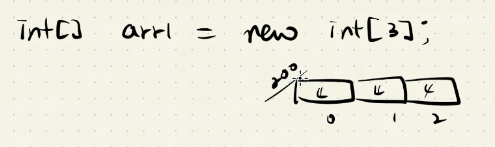 arr1에는 200이라는 주소가 들어가 있다. 주소를 보관하는 변수를 레퍼런스라고 한다.
    - int[] arr2; -> arr2 = arr1; : arr1메모리에 저장된 값을 arr2 메모리에 복사하라. 
    - -> arr1[1] = arr2[1] : 메모리가 복사 되었기 때문에 같은 메모리 항목을 가리키게 된다.  
      

  - 배열의 초기화 : arr1 = null -> 레퍼런스(메모리의 주소)만 초기화 하는 것. 인스턴스값은 남아 있다. 
  - 주소를 알고 있는 레퍼런스가 없어서 더이상 사용할 수 없는 인스턴스 -> garbage.(메모리 부족, cpu한가할 때 garbage colector가 제거한다.)
  -  garbage가 생기는 즉시 처리 하는 것은 아니다. 
  -  배열 인스턴스 자동 초기화
     -  배열은 자동으로 초기화 되지만, 일반 변수는 초기화를 해주지 않고 사용하면 오류발생.
     -  ex01~ ex99까지 연습해보기(복습도)

## 12월 06일
- 레퍼런스와 인스턴스 
  - int[] age = new int[5] ; -> 배열을 저장한다는 의미가 아님. 배열이 들어있는 주소를 담는 것. 
  - 실체를 가리키는 주소(reference). 실체 자체를 가리키는 값(instance). 배열의 인스턴스를 배열 레퍼런스에 담는다.
  - 존재하지 않는 index번호에 접근하게 되면 array out of bound exception 에러 발생.
   ex) 100만원이 들어있는 계좌번호, 비밀번호를 알려주면 100만원을 현금으로 주는 것이 아니라 은행에 가서 찾아쓸 수 있는 정보를 주는 것.
- 스프링부트와 배열 파라미터
  - 웹브라우저에서 요청한 파라미터 개수만큼 메서드의 파라미터 개수가 일치해야 한다.
  ex) return "=>  " + name[0]+","+name[1] + "," + name[2] + ","+ name[3] + ","+ name[4] + ","+ name[5] + ","+ name[6] ;

  http://localhost:8080/lang/variable/exam2/test2?name=%ED%99%8D%EA%B8%B8%EB%8F%99&name=%EC%9C%A0%EA%B4%80%EC%88%9C&name=%EC%9E%84%EA%BA%BD%EC%A0%95&name=%ED%99%8D%EB%B2%94%EB%8F%84&name=%EA%B9%80%EA%B5%AC&name=%EB%B0%95%EC%97%B4&name=%ED%97%88%EA%B7%A0

- 예제 프로그램 실행 과정
  - **일반 자바 프로그램j** : java-lang/Exam1.class -> main호출로 직접실행
  - **스프링 부트 프로그램** : java-lang-boot/Exam1.class -> 사용자가 웹브라우저에 요청 -> 웹브라우저에서 스프링부트에 요청 -> 스프링부트가 Exam1.class에 test1() 호출 -> Exam1.class에서 스프링부트로 리턴 -> 스프링부트에서 웹브라우저에 리턴 -> 웹브라우저에서 호출
  - **HTML/CSS/Javascript 실행** : java-lang-boot/static/exam1.html -> 사용자가 웹브라우저에 요청 -> 웹브라우저에서 스프링부트에 요청 -> 스프링부트에서 exam1.html 읽기 -> exam1.html에서 파일 내용을 스프링부트로 그대로 가져옴 -> 스프링부트에서 웹브라우저로 가져온 내용 전달 -> 웹브라우저에서 HTML 실행 후 출력

 - Java 상수 변수 
   - final 키워드를 앞에 붙이고 변수 명은 모두 대문자로 표시(소문자로 적어도 도긴 함) 
   - Java의 경우에는 변수 선언 후 초기화를 따로 해줘도 된다.
   - 하지만 Javascript의 경우는 상수 변수를 선언하자마자 초기화를 해줘야한다.(그렇지 않으면 에러 발생)

- 부동소수점의 형변환
  |--|--|
  |--|--|
  |byte ->|int|
  |short ->|int|
  |int ->|long|
   - 계산은 같은 type일 경우만 가능
     - ex) int + int, float + float
   - 작은 크기의 메모리 값은 큰 크기의 메모리에 저장할 수 있다. 

   - 정수 메모리는 부동소수점 메모리에 저장할 수 있다. 하지만 부동소수점 메모리는 정수 메모리에 저장할 수 없다.
   - 강제적으로 저장하려면 명시적 형변환을 해주어야 한다.
 - Spring Boot의 자동 형변환
   - literal 
   
   |literal|variable|array|
   |--|--|--|
   |정수 : 100, 100L, 100l|byte b;, short s ;, int i;, long l;|int arr(레퍼런스)= new int[5(인스턴스)];|
   |부동소수점 : 3.14f, 3.14F, 3.14, 3.14d, 3.14D|float f;, double d;|--|
   |논리 : true, false|boolean bool;|--|
   |문자 : 'A','\u0041'|char c;|--|
   |문자열 : "abcd"|String str;|--|

- 형변환
  - 큰 값을 작은 메모리에 저장 가능(형변환 거쳐서). but 값이 누락된다.
  - 정수 -> 부동소수점 변수의 형변환 할 때 유효자릿수 넘어가는 값을 저장할 때 값이 누락되는 것을 주의!.
    - ex) byte b= 100; int s = b; : 형변환 불필요.
          int i = 100; byte x = i; : 컴파일 오류. int > byte
          -> 명시적 형변환 필요. byte x = (byte)i;
          float f = 31.419f; int y = (int)f;
- 문자열을 primitive type(원시타입 : byte short int...)으로 변환하는 방법.

- Spring Boot에서의 형변환
  - 웹 브라우저에서보내는 값은 무조건 "문자열"이다(단, 파일 업로드의 경우 binary data이다). -> test1?value=100(query string) 스프링부트에서 자동 형변환해서  문자열을 byte.valueof("100")을 통해 byte값 100을 전달한다. 
  - Spring Boot에서 문자열을 Byte.valueof, Short.valueof, Intvalueof을 통해 각 타입에 해당하는 값으로 형변환을 시켜준다.
  - Date type은 java.sql.Date 타입을 입력하면 날짜값을 입력받을 수 있다. 
  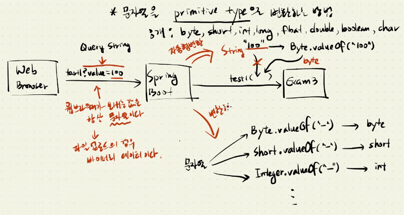

  |primitive type|wrapper class|
  |--|--|
  |byte|Byte|
  |short|Short|
  |int|Integer|
  |long|Long|
  |float|Float|
  |double|Double|
  |boolean|Boolean|
  |char|Character|

  - 이클립스와 스프링부트
    -  개발자 이클립스 실행 -> eclipse.exe(사용자 대신 메인클래스를 대신 실행시켜주는 도우미프로그램. eclipse자체는 아님) 실행 -> JVM -> 메인클래스 -> eclipse IDE 실행 -> eclipse에서 App.class 실행 -> JVM에서 APP.class 실행 -> Spring Boot 실행 -> Tomcat 서버 실행(웹서버 + 서블릿 컨테이너) 

    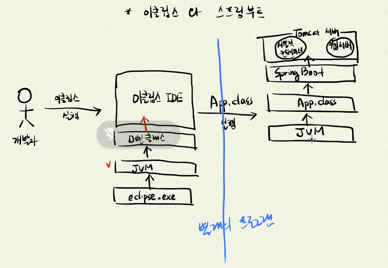

    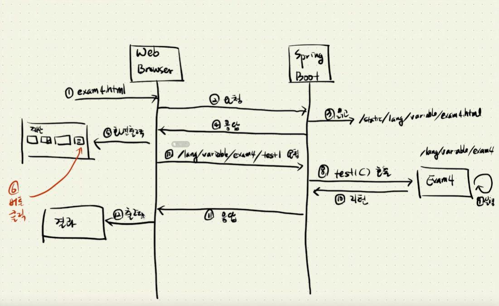

    스프링부트가 html파일(스프링부트가 다이렉트로 처리함)과 class(서블릿컨테이너와 spring webmvc를 통해 )를 다른 방식으로 처리한다

    ## 12월 07일
- 상대 경로 : lang/variable/exam4/test.html -> 현재 위치를 기준으로 함.
- 절대 경로 :/lang/variable/exam4/test.html -> root를 기준으로 함.
- 클라이언트 렌더링
  - 웹 브라우저에서 test2의 실행결과 스프링부트에 요청 -> 스프링부트 test2 호출해 Exam4 실행 -> 작업 수행하여 결과값을 스프링부트에 리턴. -> 리턴받은 결과값을 웹브라우저에 응답 -> 응답받은 결과를 통해 생성, 변경, 삭제 결과를 거쳐 화면출력
- 코드 관리가 쉽도록 코드를 묶고 분류한다 ->  코드를 function(어떤 기능을 수행하는 코드들의 묶음, function - < java에서는 method > 하나당 한개의 기능)으로 묶고, function 들을 class로 묶고, class들을 package로 묶는다.
- String( : 기능을 수행한 후 리턴하는 값의 타입 - 리턴타입) toString( : function 이름) int i (: 기능을 수행하는데 필요한 값을 받는 변수(파라미터), 넘겨주는 값(argument))
- java.lang 패키지에 소속된 클래스만 java.lang 생략 가능 : integer.tostring 
- 서버에 요청할 때 사용할 도구를 준비한다.
 var xhr = new XMLHttpRequest(); // XMLHttpRequest =XHR

- 태그 용어
  - < h1 id - "x-title">(시작태그)제목1(content) < /h1>(끝 태그)
    - h1 : 태그명 , id : 속성명(attribute), "x-title" : 속성 값.
    - < input readonly(속성 중에 값을  생략할 수 있는 속성이 있다. 이 경우 속성의 존재 유무에 따라 동작이 제어 된다. 값을 설정하더라도 아무런 의미가 없다.)>
- URL 인코딩과 파라미터 값
  -  url 에서 + 는 공백(space)를 의미한다
  -  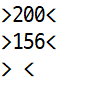
  -  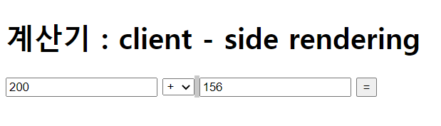
  -  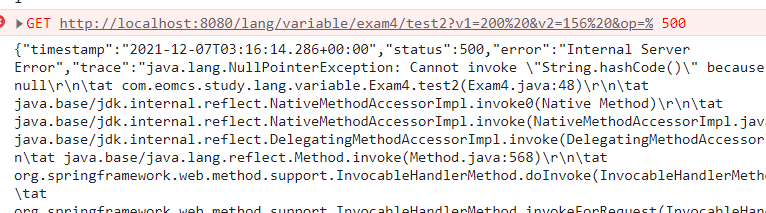
  에러 발생.
  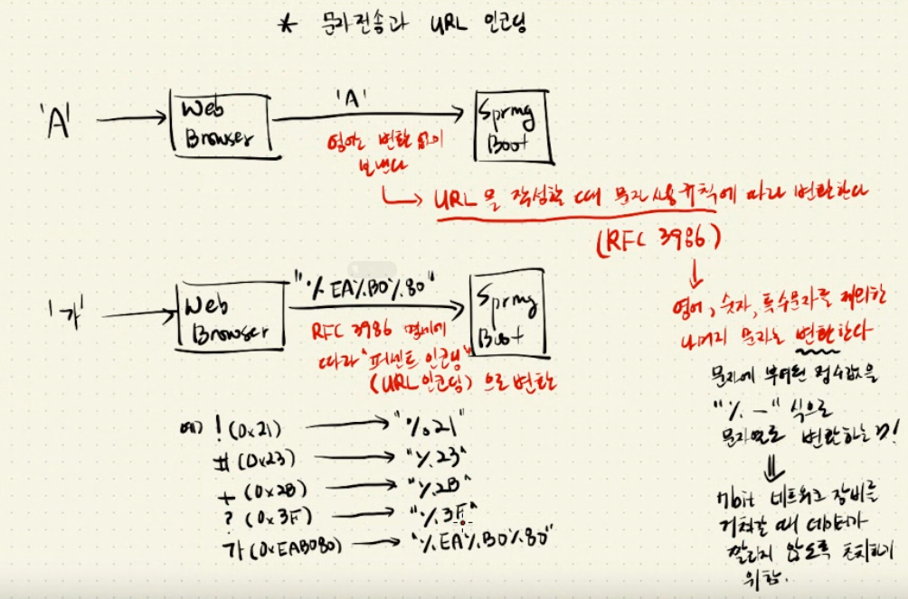
 
 |클라이언트|URL인코딩|서버|
 |--|--|--|
 |A|인코딩 X|A|
 |가|%EA%BO%80|가|
 |+|%2B|+|
 |+|인코딩 X|공백문자로인식|
 |?|%3F|?|
 |?|인코딩 X|쿼리스트링 시작명령으로 인식|
 -> 인코딩을안하면 다른 문자로 인식하는 경우들이 있다.
 -> 알파벳, 숫자, 일부 특수문자는 URL 인코딩하지 않아도 그대로 전달 된다.
  - 주의! 웹브라우저에서 직접 요청할 때는 URL인코딩 필요 X (웹 브라우저가 알아서 URL 인코딩 수행하기 때문)
  - 자바스크립트를 이용해서 요청할 때는 개발자가 직접 URL인코딩을 해야 한다.
  - 즉 URL인코딩을 하지 않았을 때 문제가 발생할 문자에 대해 반드시 URL 인코딩을 처리해야 한다.
  - encodeURIComponent(문자열) -> URL에서 URL인코딩이 필요한 문자를 처리해주는 문법.

- Front-end 핵심 API
  - Dom API(Document Object Model) : 태그를 찾고, 태그의 속성/값을 변경, 태그를 제거 등

|--|--|
|:--:|:--:|
|document.getEelementById(태그아이디)| 태그 객체 1개를 찾음|
|document.getEelementsByTagName(태그명)|여러개의 태그|
|document.getElementsclassName(클래스명)| -> 여러개의 클래스|
|document.querySelector(css 셀렉터) |-> 한 개의 태그 객체|
|document.querySelectorAll(css 셀렉터) |-> 여러개의 태그 객체
|document.createElement(태그명) |-> 태그 객체 1개|
|document.createTextNode(내용) |-> 콘텐트 객체 1개|
|Node.appendChild(태그객체) |-> 다른 태그 아래에 자식 태그 추가|
|Node.removeChild(태그객체) |-> 자식 태그 제거|
|Node.textContent = 내용 |-> 태그의 콘텐트 설정|
|Element.innerHTML = 내용(내용 안에 태그가 있다면 자식 태그를 처리한다.) |-> 태그의 콘텐트 설정|
|HTMLInputElement.value = 입력값|--|
|HTMLSelectElement.value = 선택한 옵션 값|--|

|태그의 이벤트처리 -> 각 태그에 대해 특정 이벤트 발생했을 때 호출 될 함수(callback 함수 = event listener = event handler)를 등록|
|:--:|
|태그.onclick(event handler의 이름 - 이미 태그에 대해 이름이 정해져있음) = function(){...}|
|태그.addEventListener("click"(이벤트 이름),function()(이벤트가 발생하면 호출되는 함수){...}|
|<태그 onclick(event handler) = "자바스크립트 코드(이벤트가 발생하면 실행될 코드">|

- Ajax(Asynchronous JavaScript and XML) API  - 비동기식 처리(별도의 서버 요청 작업을 수행할 때 사용)

  - var xhr = new XMLHttpRequest();

  - 신규프로젝트에 사용 - xhr.addEvnetListener('load'(서버에서 응답이 오면 발생하는 이벤트), function((응답이 왔을 때 호출될 함수 : 서버가 보낸 실행결과를 처리!)){...}

  - 예전프로젝트에 사용 - xhr.onreadystatechange = function(){...}

  - xhr.open("GET",URL, 비동기여부); : 서버에 연결
  - xhr.send(쿼리스트링 or null)  : 서버에 요청
  
- CSS selector(태그를 가리키는 명령)
 - < h1 id = 'x-title' class = 't1 t2'> < /h1>
 - < h1 id = 'x-name' class = 't1 t3'> < /h1>
 - < h1 id = 'x-tel' class = 't2'> < /h1>
   - -> #x-title : 태그 아이디, h1 : 태그 이름, .t2 : 클래스 이름
   

- JSON(J-avaS-cript O-bject N-otation) 형식의 문자열
  - Javascript의 객체 초기화 문법(Object initializer)을 모방해서 만든 데이터 형식
- 클라이언트가 요청한 것을 처리하는 메서드(리퀘스트 핸들러)가 들어있는 클래스를 페이지 콘트롤러라고 부른다. 
- 메시지 컨버터(기본 :Jackson, JSON가 스프링부트에 있다.)를 통해 가공한 정보를 스프링부트가 받아서 클라이언트에게 응답한다.

  ## 12월 08일
  ---
- 스프링부트에서 결과 리턴 : 스프링부트가 웹브라우저에서 요청받으면 메서드 호출 -> 메서드에서 request handler를 통해 요청 처리

- 배열 ->JSON문자열 
  - new String[] {"aaa",bbb"} -> [ "aaa", "bbb"]
  - new String[] {100,200} -> [ 100, 200]

- 자원(resource)과 그 자원을 가리키는 주소(Uniform Resource Locator : 단일화된 자원에 대한 위치정보)

- 컴퓨터 A < - > 컴퓨터 B
   APP1    <--->      APP1
   APP2    <--->      APP2
   APP3    <--->      APP3
  - 다른 APP에 요청을 하는 APP을 client app, 요청을 받고 처리하여 응답하는 App을 Server app이라고 한다.
  - Server app의 주소가 자주 변한다면 상대방에게 혼란을 줄 수 있다. 그래서 Server는 정적 IP주소를 써야한다. Client는 동적 ip를 사용한다.

서로 다른 APP은 각자의 고유 포트번호를 가지고 있어서 어떤 APP이 데이터를 요청했는지 포트로 구분하여 요청한 APP에 데이터를 보낸다.
- 데이터를 주고받을 때 데이터에는 DATA내용, 보내는 이의 IP주소,       PORT번호와 받는이의 IP(인터넷 프로토콜)주소, PORT번호가 포함되어 있어야 한다.(이러한 정보들을 packet이라고 한다.)
  - 하지만 데이터 용량이 커질 때는 한 패킷에 모든 데이터를 보내지 않고 일정 단위크기로 나누어서 보낸다. 나누어서 보낸 데이터들이 모두 도착했을 때 원래의 데이터 하나로 합쳐서 요청한 곳에 전달한다.(오퍼레이팅 시스템의 구조)
  - 8080 port는 웹서버가 아니라 프록시 서버이다.
  - "/lang/variable/exam4/test3" ->고정자원
  - //http://localhost:8080/lang/variable/exam4/test3_6.html ->동적자원

- int i = 5; int j = 2. float r =i / j => 결과는 2.0
  - int, int의 연산결과는 int값이 나온다. 자바의 연산단위는 무조건 int이다.
    - byte ( -> int로 변환) + short ( -> int로변환) => int
    - int + long : 단위가 다르면 연산할 수 없다. -> int를 long으로 변환 후  연산결과는 long
    - int + float = 정수를 부동소수점으로 변환 후 연산결과는 float
    - long + float -> 정수를 float로 변환후 연산결과는 float ( : 큰 메모리를 작은 메모리로 바꿨기 때문에 값이 짤릴 수 있다.)
    - **다른 타입끼리는 연산 불가!!**
    - **다른 타입일 경우 형 변환(암시적 형 변환)후 연산수행**
    - 형변환을 한다고해서 int메모리가 float메모리로 바뀌는 것은아니고 임시 메모리로 바꾸어서 임시적으로 저장하는 것이다.
    - 두개의 정수 값 중 한개만 float으로 형변환해도 된다. 암시적으로 형변환 하도록 유도하기 때문
      - ex) r = i/ (float)j = (float)i / (float)j
- int x = Integer.MAX_VALUE; // 0x7fffffff = 약 +21억
    int y = Integer.MAX_VALUE; // 0x7fffffff = 약 +21억
   - int r1 = x + y; // 0x7fffffff + 0x7fffffff = 0xfffffffe = -2 
   - long r2 = x + y;  // 0x7fffffff + 0x7fffffff = 0xfffffffe = -2
     -  -> 이 문제를 해결하기위해선 r2 = (long)x + (long)y; 형변환을 해줘야 한다

- 산술 연산자(+, - ,* ,/ ,%)
  - 정수의 기본 연산은 int이다.
  - 같은 타입이어야만 연산가능 (다른 타입일 경우 암시적 형변환 : 작은메모리 타입 -> 큰 메모리타입 / 정수 -> 부동소수점 / 연산자 우선순위에 따라 변환) -> 타입을 일치 시킨후 연산해야 한다(명시적 형변환 수행 가능)
    - ex) i + l , l + f, f + i/i (암시적 형변환)
          (float) i (명시적 형변환)
- 연산자 우선순위
  - 1순위 () 2순위 ++a, a-- 3순위 *, /, % 4순위 +, -
- boolean 에서의 부동소수점 비교
  - double d1 = 987.6543;
    double d2 = 1.111111;
    System.out.println((d1 + d2) == 988.765411);
-> 결과는 false : IEEE규칙 때문에 맨 끝자리에 극소수점이 붙기 때문에 오차 발생.
- double EPSILON = 0.00001;
    System.out.println(Math.abs((d1 + d2) - (x + y)) < EPSILON);과 같이 따로 처리를 해줘야 한다.
    - abs : 절대값, 양수로 괄호안의 숫자를 바꾸라는 명령.
      ex) Math.abs((f1 + f2)

- 비교 연산자(<, <=, > , >=, ==,!=)
  - 부동소수점 비교시 예측 결과와 다른 경우를 조심!
    - folat f1  = 12.321f;
    - float f2  = 1.1f 
      - 둘의 합 = 13.421f ? no! 13.421(0005 -> IEEE754 규칙에서 부동소수점을 2진수로 바꿀 때 극소수의 값이 붙기 때문) -
      - 13.4210005 - 무시할 값 = 최종결과 이런식으로 정확한 값을 구해야 함.
 
- 논리연산자 
  - 정수에 대해서 논리연산자 AND OR NOT은 안돼지만 ^는 정수값에대해 사용하면 논리연산자가 아닌 비트 연산자로 작동하게됨. 두 피연산자의 비트가 같으면 0, 다르면 1이 된다.
  ex)  
  00000000_00000000_00000000_00000010 (2)
  00000000_00000000_00000000_00000011 (3)
  ㅡㅡㅡㅡㅡㅡㅡㅡㅡㅡㅡㅡㅡㅡㅡㅡㅡㅡㅡㅡ         
  00000000_00000000_00000000_00000001 (1)

  - ex5예제에 351번 확인하기.
 - 비트 연산자
   - int 타입의 값에 대해 비트 이동을 할 때는 0 ~ 31까지만 유효하다.
     만약 31을 넘는 경우 32로 나눈 나머지 값을 비트 이동으로 간주한다.
     ex)
        system.out.println(3 << 33); // 6
        System.out.println(3 << 65); // 6
        System.out.println(3 << 97); // 6

        33 % 32, 65 % 32, 97 % 32 -> 모두 나머지가 1이다.
    - 비트 이동 연산 응용
      - 특정 위치의 바이트값을 추출할 때
      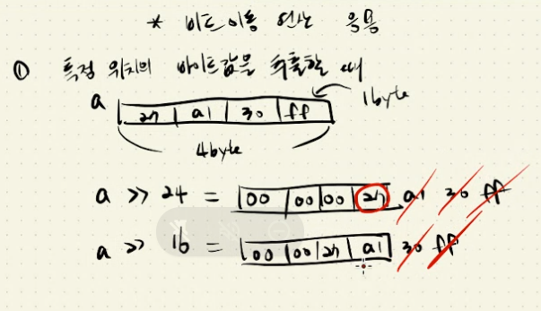

  - 조건 연산자
    - 삼항연산자라고도 한다.
    - 조건(boolean) ? 표현식1(true일 때 실행) : 표현식2(false일 때 실행)

# 12월 09일
---

- 증감 연산자
  - 전위 연산자(++i)
    -  int a = 100 ; 
        ++a; -> 컴파일 시에 변환된다.
        다양한 프로그래밍 언어들로 만들어진 코드는 컴파일 시에 기계어로 바뀌게 된다.(각기 다른 언어들의 특징들이 있지만, 결국은 모두 공통적으로 기계어로 바뀌게 된다는 의미.)

            ++a;와 a = a+1; 은 같은의미.
            여기서 "=" 는 assignment operator(할당연산자, 
            배정연산자) 라고 한다.    
            a(left-value -메모리 :l-value) = a + 1;
            (right-value-값 :r-value)
            반드시 l-value는 메모리, r-value는 값이어야 한다. 
            100 + 1을 먼저 연산한 후 왼쪽에있는 l-value에 
            저장한다는 의미.
            
  - 후위 연산자(i++)
    - int a = 100; 
        a++; -> 먼저 임시 변수가 만들어진다. 
         - int temp = a;
           a = a+1; 
           a? -> 101
        
        a--; 

        - int temp = a;
          a = a-1;
          a? -> 99
    - int a = 100;
      int b;
      b = ++a;

            **r-value가 모두 실행된 후 할당연산자 '='가 실행된다.
            즉 b = ++a;는 컴파일 시에  a = a+1;, b = a; 
            순서로 실행.
            

    - int a = 100;
      int b;
      b = a++;

            b = a++; -> int temp = a(100);
            a = a+1;(101)
            b = temp(100);
            a = 101;
            b = 100; 
    
    - 메서드 호출 (System.out.println과같은)전에 파라미터로 주어진 표현식을 먼저 실행한다. 
    
    int a = 100;
    a++; 
    System.out.println(a) -> 100출력 왜? : int temp = a; 임시메모리에 a값 저장 -> a = a+1 -> System.out.println()에는 현재 int temp값 = 100이 저장되어 있다. 따라서 메서드 호출 결과는  System.out.println(a) = 100 이다.

- 부동소수점의 쓰레기값 처리
  - https://hayeon17kim.github.io/posts/floating-point-epsilon/ - 참고하기

- 조건문
  - if(조건); -> 조건문 뒤에 ";" 를 포함하게되면 if 문을 **빈문장**으로 처리한다.
  - 조건에는 boolean값만 와야한다. if(a=100) -> 불가능. if(b=true) -> 가능.
  - else : else statement는 단독으로 실행할 수 없다. if문과 함께 실행 되어야 한다.
  - else문은 가장 가까운 if문에 소속 된다.
          
        - if (age >= 19)
            if (age >= 70) 
             System.out.println("지하철 무임승차 가능합니다.");
            else  
            System.out.println("미성년입니다.");

           System.out.println("------------------------------");
           
           -> else는 두번 째 if에 소속된다.
- **java.io.InputStream keyboard = System.in;** :
-  키보드로 입력한 데이터를 읽을 때 사용할 도구 준비 ->ex99 210번 참고

- 키보드 입력 다루기
  - System.in : in = 키보드 입력 도구
  
  - System.out : out = 콘솔 출력 도구

          System.out.print("float: ");
          float f = keyScan.nextFloat();

          System.out.print("boolean: ");
          boolean b = keyScan.nextBoolean();

          keyScan.close();

          System.out.printf("%d, %f, %b\n", i, f, b);  

          -> float에 일반 정수값을 넣어도 알아서 float의 유효자리수 7자리까지 출력한다.
          -> boolean 값에는 true,TRUE,flase,FALSE 입력가능하고 1,0은 불가능하다.(1,0은 Spring Boot에서만 가능)
  - 키보드 입력 다루기 - nextInt / nestLine
    - 사용자 입력 => 100
    - nextInt() -> 첫번 째 문자열을 토큰(엔터, 스페이스, 텝 등)을 만나기 전까지 읽어온다. "100" 
    - nextLine() -> nextInt는 한 토큰을 읽으면 엔터를 읽기전의 상태로 돌아가기 때문에 아직 엔터가 남아있는 상태가 된다. 그렇기 때문에 nextLine이 엔터를 읽어서 공백을 출력하게 된다.
    - 따라서 keyboardScanner.nextLine();를 추가해서 nextLine이 정상적으로 키보드를 입력받을 수 있는 상태로 만들어줘야 한다.


              char c;
                c = 'A' -> A라는 문자에 부여된 번호 0041(2byte) , 65 
                UTF-16규칙 65가 c에 저장된다.
                문자 자체를 저장하는 것이 아니라, 유니코드번호를 저장하는 것이다.
- switch case 조건문
  - case문에 리터럴값만 올 수 있다, 즉 변수를 사용할 수 없다. But 상수 final을 사용하면 case문에 미리 선언해둔 상수를 사용할 수 있다.
  - case에 올 수 있는 리터럴에는 string, int 등이 있다.

              int x = 1, y = 300;
              switch(x) {
                case 1 * 300(가능)
                case 1 * y(불가능)
              }
              final int = x;
              switch(x){
                case x
              }
  - swich의 조건에는 4byte를 넘어가는 값, 부동소수점, boolean값 사용 불가.
   즉, byte, short, int, char만 사용 가능하다.
  - swtich 문에서 enum으로 정의된 상수를 사용하면 코드의 안정성을 높일 수 있다.
  **ex06 예제321번 홀수, 짝수 비트연산자 &으로 판별하는거 확인하기**
    -> x % 2 보다 x & 1이 연산속도가 빠르다.

          while (count < 100) {
            count++;
              if ((count & 1) == 0) // count & 1 ==> count & 0x01 ==> count % 2
                  {               
                  sum += count; 
                      짝수, 홀수를 구별할 때 비트 연산자 &을 이용해 맨 끝에 
                      있는 비트가 0인지1인지를 판별한다. 0이면 짝수, 1이면 
                      홀수. 16 8 4 2 1 -> 이런식으로 비트는 증가하기 때문에
                      1을 제외한 나머지는 모두 짝수이다, 그래서 맨끝 비트로만
                      판단한다.

  - continue 사용

                while (conut < 100) {
                  conutn ++;
                    if((count % 2)==1)
                    continue;
                    sum += count;

                }                
      위 코드와 아래 코드의 결과는 같다.
      


- while 반복문
  - while(조건) {
     수행할 작업
  }  

- for 반복문
  - for문 안에 있는 변수는 for문이 끝나면 밖에서 사용하지 못한다. 그래서 for문 밖에 변수 선언해놓고 for문에서 초기화해주면 된다.
  
            int x;
            for(int x = 1 ...)
    
    
# 12월 10일
---
- 배열 변수 선언과 동시에 배열 초기화를 할 때는 new String[] 생략 가능
 -> String[] names = {"..."}

- 배열과 ArrayList
  - ArrayList는 배열이 꽉차면 자동으로 배열을 확장한다. ArrayList는 배열을 간접적으로 다룬다.
    - 기존보다 더큰 새 배열을 생성
    - 기존의 배열 값을 새 배열로 복사
    - 기존 배열 대신 새 배열사용
    - 배열의 항목을 삭제할 때 다음 항목을 자동으로 앞으로 옮긴다.
    - 배열의 특정부분을 추출할 수 있다.
-> 배열을 상요할 때 유용한 기능1(메서드)를 제공. 이렇게 목록을 다루는 클래스를 "컬렉션 API" 라고 부른다.
  - 배열을 직접 다룰 때는, 배열을 선언한 후 크기를 조정할 수 없다.
  ```java
   ArrayList list = new ArrayList();
    list.add("홍길동");
    list.add(3.14f);
    list.add(true);
    list.add(365);
    -> 이렇게 배열이 선언된 후에도 추가할 수 있다. 
    서로다른 타입의 데이터도 보관 가능
    (크기가 가변적)
    for (int i = 0; i < list.size(); i++)
      System.out.println(list.get(i));
    -> 컬렉션 인덱스에 접근하는 방법
  ```

- 배열의 처음부터 끝까지 꺼내는 방법
- for(배열에서 꺼낸 값 저장할 변수 : 배열주소)
  - 단순히 배열의 처음부터 끝까지 꺼내는 작업이라면 이 방법이 더 간편하다.
  - 이 경우 변수 선언은 for문 안에 해주어야 한다.
  ```java
  for(String name(꺼낸 배열 저장소) :names(배열 주소))
  ```
- 로컬 변수로 메서드 호출(실행) 될 때 생성된 호출 끝난 후 삭제된다.
- 다른 메서드의 로컬 변수를 사용할 수 없다.
  
  # 12월13일
  - 변수, 배열, 연산자, 제어문 활용
    - 연락처 관리 구현하기
    - Front-end :  static/index.html   
                    /contact/index.html(연락처 메인화면(연락처 목록 출력)), form.html(연락처 입력화면), view.html(연락처 상세보기 및 변경 화면)
    - Back-end : ContactController
                  - list(목록 데이터 제공)
                  - add(입력처리)
                  - get(연락처 상세정보 제공)
                  - update(정보변경처리)
                  - delete(삭제처리)
    - < b>콘텐트< /b> 이 전체를 요소(element)라고 함.
    - fetch(url).then(함수 -> 서버로부터 응답을 받으면 ).then(함수 -> 이전 then안에 있는 함수의 작업이 끝나면 호출됨.) 주면 서버와 연결 -> 서버에 요청 -> 서버로부터 응답받음.

  - 리팩토링(refactoring) : 소스코드 관리를 용이하도록 변경하는 것.( 함수의 리턴 값을 받는 변수를 한 번만 사용할 경우, 변수 대신 함수 호출을 삽입하라!)
  - 최적화(optimizing) : 실행 횟수를 줄이고, 실행 속도를 높이는 방향으로 소스코드를 변경하는 것.
  - tag객체 
    - 기본변수(attribute)
    - id, type, name
    - onclick, onchange, onkeydown -> 리스너에서 변수를 찾을 때 로컬 변수가 없을 경우 태그 객체에서 찾는다. 태그 객체가 없다면, window 객체(글로벌 객체)에서 찾는다.
    - 배열의 값 리턴
  - 객체
    - 값이 들어있는 상자


# 12월 14일
- HTML에서 Javascript는 < script >태그 안에 두어야 한다
  - Java 
    - static type binding
    - int a;(고정-static)
  - Javascript
    - var a;(undefined)
    - dynamic type binding(값을 변수에 넣는 순간 변수의 타입이 결정된다). 변수의 타입은 값에 따라 바뀔 수 있다.
    - Javascript 상수변수 const는 선언과 동시에 초기화를 해줘야한다. 
    ```javascript 
    const PI;
    PI = 3.14; -> 불가능. const PI = 3.14; -> 가능
    ```
    - 파라미터(Parameter)와 아규먼트(Argument)
    ```javascript
    function plus(a,b){
      return a+b;
                  }
      var result = plus(100,200); 
      a,b = parameter(아규먼트를 받는 변수), 
      100,200 = argument(함수를 호출할 때 넘겨주는 값)
      실무에서는 혼용하여 사용한다.            
      ```
    - 함수 이름과 함수 객체
    ```javascript
    function plus(a,b){...}
    파라미터 : a,b -함수 객체의 주소를 가지고 있는 레퍼런스이다.
    코드 : {...}
    ->함수에 대한 정보와 코드를 담은 객체생성
    
    ```

- 설계도 기반 객체 생성
  - Java 
  ```java
  class Score{
    String name;
    int kor;
    int eng;
    ->new Score()
    int, String과 같은 설계도면이 필요하고
     그 도면대로 객체를 생성한다.
    } 
    ```
    

- 프로토타입 기반 객체 생성
  - Javascript
  ```javascript
    new Score()
    var obj1 = new Object //object() 틀을 기반으로 기본 객체를 생성
    obj1.name = "홍길동"; 
    obj1.age = 20; // => obj1.put("age", 20);
    obj1.working = true
    console.log("안녕하세요, " + this.name + "님!");
    }; //this는 obj1이라는 같은 객체 내에 있는 name이라는 프로퍼티를 가리킨다.
    //this.name이 아니라 그냥 name만 치면
    //함수 안에 있는 변수를 먼저 찾고
    //함수 안에도 없으면 함수 밖에 있는 name을 찾고
    //밖에도 없으면 obj1객체 안에 있는 name을 찾는다
    ->기본 객체에 프로퍼티를 덧붙인다.
    설계도면이 필요 없이 원형객체를 복제해서 메모리를 덧붙인다.
  ```
  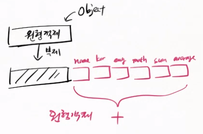

 ```javascript

      var tag1 = document.getElementById("btn1");
      //querySelector와 다르게 #을 쓰지않고 id자체만 입력.
  ```
- < script >태그 안에 있는 코드 실행 중 오류가 발생하면 즉시 해당 script 태그의 실행을 멈추고 다음 script태그로 넘어가 실행한다.
- not defined : 변수 선언이 안됨.
- undefined : 변수 선언은 됐지만, 값 할당이 안됨.
- 호이스팅 : 스크립트를 실행하기 전에 변수 선언을 스크립트 최 상단으로 끌어 올려서 하는 것.
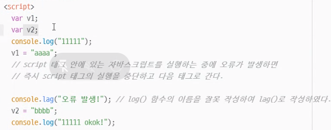
해당 스크립트 태그의 변수에만 해당.
- 외부 소스와 실행
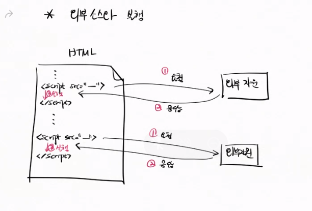

# 12월 15일
- Spring Boot와 기본 패키지
  - Spring Boot가 클래스를 인식하는 기본 범위는 Spring Boot를 실행시키는 App 클래스 패키지에 한정한다.
  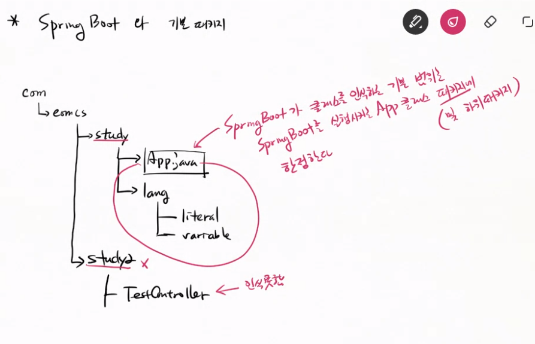
  - @ComponentScan("com.eomcs.study2")
    - 스캔할 패키지 명을 괄호 안에 적어준다.
    - @ComponentScan({"com.eomcs.study2","com.eomcs.study"}) 배열형식으로 여러개를 지정할 수도 있다.
  - form 에 action 설정하지 않으면 현재 html파일url에 요청을 한다.(기본 메서드는 get메서드) - ex00 = 05_2예제(10시46분 녹화)
  - button의 타입을 설정하지 않으면 서브밋 타입이다. 서브밋을 누르게 되면 버튼이 소속되있는 form의 입력값에 대해서 서버에 요청할 때 입력값을 보내게 된다. 
  - form 태그에 action으로 설정된 url로 보내게 되는데 설정되어 있지 않으면 현재 url을 주소로 사용하게 된다. 
  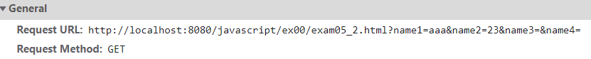

- ex02 - literal
  - Javascript 변수 선언
    - var v7 = "윤봉길", 
          v8 = 100, 
          v9 = true;
    - 글로벌변수
      - 함수 안에 글로벌 변수와 같은 이름의 변수가 있을 경우, 가까이에 있는 변수가 우선이다.
      ```javascript
      var v1 = 홍길동;
      function f1() {
        var v1 = 100;
        ->v1 = 100; 이다.
      }
      ```
    - 로컬변수
      - 함수 안에 선언된 변수를 의미
      ```javascript
      function f1(){
        var v1 = 0
        var v2 = 1
        var v1,v2는 function f1에서만 사용되는
         로컬변수이다.
      }
      ```
    - 상수변수
      - 상수변수는 한 번 선언되면 값을 중복선언, 값 변경이 불가하다.
    - Javascript에서는 Java와 달리 문자, 문자열 구분없이 선언가능.
    - 부동소수점에도 f,d 등을 붙이지 않는다.
    - 변수의 타입 확인하기 : typeof 변수명
    - Javascript에서 "use strict" 를 script의 가장 첫 문장에 선언하면, 변수를 선언하기 전에 사용할 수 없다.
    ex) v3 = 100; 
        console.log(v3); // 실행 오류!
    - 호이스팅 
      - // 변수 선언을 하기 전에 그 변수를 사용하는 코드를 먼저 둘 수 있다.
      v2 = "임꺽정";
      console.log(v2);
      var v2; // 변수 선언은 항상 script 태그를 실행할 때 제일 먼저 실행된다.
- 배열 생성
  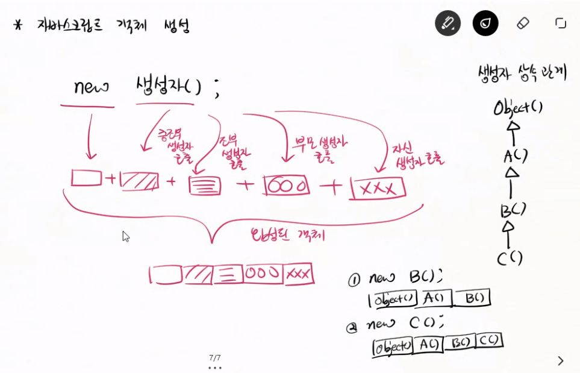
- Javascript 에서 배열의 인덱스 넘버는 객체의 키 값이다
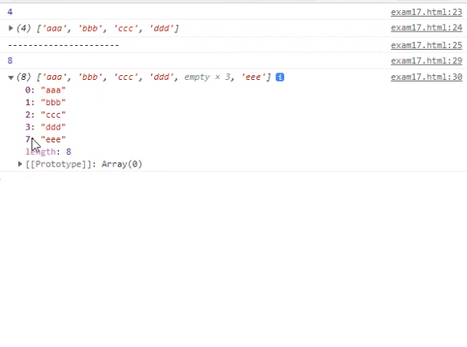
- Javascript의 배열은 객체로 이루어져있다. 배열의 인덱스 번호는 변수이름과 같은 의미이다. 
- 호출한 변수가 객체내에 존재하지 않을 때는 undefined가 된다. 
- 일반 변수가 선언되어 있지 않을 때 호출하면 is not defined이다.
- < a(태그) href(속성-attribute)>
- obj(객체-레퍼런스).kor(property-객체에 소속된 변수) =100;
- obj.sum(method - 객체에 소속된 함수) = function(){...};
- Java
   ```java
    class Score{
      String name(field = 변수);
    }
    ```
- 배열 만들기 [,,]
  - var arr = ["aaa", "bbb","ccc"];
   ```javascript
    var arr = ["aaa", "bbb", true, 100];
    var i;
    for (i in arr) { // i 변수에 저장되는 것은 
    배열의 인덱스이다.
	  console.log(i, arr[i]); 
    ```
    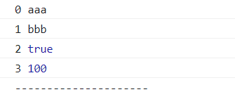
  - destructuring 문법
    ```javascript
     var arr = ["홍길동", "1111-2222", true, 20];
     var [name2, tel2] = arr;
    console.log(name2, tel2); 
    ```
    
    - 객체에 들어있는 값을 분해해서 받을 때는 {}를 사용
    -> var {name,sum,aver} = obj;
       obj.name = "홍길동"
       obj.a = 90
       obj.b = 100
       obj.c = 80
       obj.sum = 270
       obj.aver = 90
       name에는 홍길동, sum에는 270, aver에는 90. 같은 이름을 가진 프로퍼티의 값이 할당된다.

# 12월 16일

## 함수

- 함수의 파라미터도 로컬변수이기 때문에 함수 호출이 끝나고나면 제거된다.
- 함수에 파라미터를 주지 않고 호출하면 함수의 리턴값이 호출된다.

```javascript
console.log(function())
function()이란 함수의 리턴값을 출력.
```
- 리턴값이 없는 함수를 출력하면 undefined를 출력하게된다
- 파라미터 = 함수가 작업하는데 사용할 값을 받는 변수
- 아규먼트 = 함수를 호출할 때 전달하는 값.
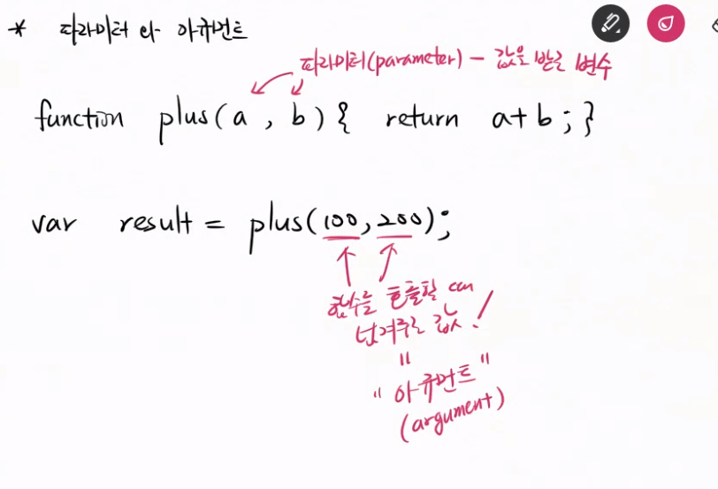

- 파라미터 개수 < 아규먼트 개수 : 파라미터 개수를 초과하는 아규먼트 값을 전달해도 오류는 발생하지 않는다.
- Java에서는 메서드 오버로딩이 가능하여 동일한 이름의 함수가 존재 가능하다.
- 하지만 Javascript에서는 오버로딩을 지원하지 않아 같은 이름의 함수가 존재할 수 없다.
- 그래서 제일 마지막에 정의된 함수가 최종적으로 존재하게 된다.

```javascript
function f1(a) { 
	console.log("f(a)==>", a);
}
function f1() {
  console.log("f()==>", "호출됨!")
}
function f1(a, b, c) {
  console.log("f(a,b,c)==>", a, b, c)
}
-> 마지막 f1(a,b,c)가 출력된다.
```
- Javascript의 모든 함수는 arguments라는 배열과 유사한 변수를 내장하고있다.
- arguments는 함수를 호출할 때 전달할 값들을 보관하는 역할을 한다.
- 생성자, 객체, Prototype
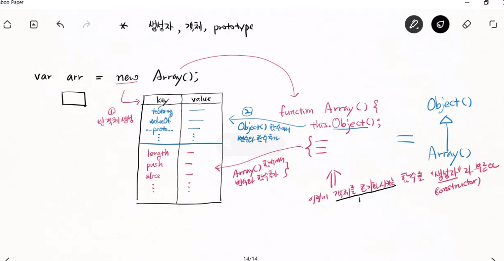
-https://doitnow-man.tistory.com/132#t1 생성자함수 참고하기
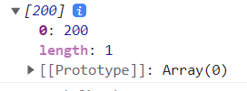
prototype을 초기화한 대상이 Array이면 배열이고
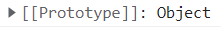
Array가아닌 다른 대상이면 배열이 아니다.

- 함수의 arguments에는 넘어 오는 모든 값이 저장되어 있다.
```javascript
function f1(a) { 
	console.log("a =", a);
  console.log(arguments);
  f1(100, 200, 300, 400);
	console.log("----------------");

}
```
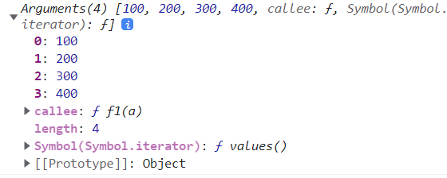
- 함수의 주소를 값처럼 다룰 수 있다.
  ```javascript
  function f1(str){
    console.log(str);
  }
  var f2 = window.f1;
  f2("안녕");
  ```
- 함수 객체
  - 객체 = key : value
  - 함수 = 객체 + 함수코드
    - key : value {함수코드...} => 함수가 들어있는 객체이다.(함수또한 객체이다.)
  ```javascript
  function f1(str){
    console.log(str);
  }
  f1.age = 20;
  f1.working = true
  console.log(f1.age, f1.worknig)
  ```
  - 함수의 정의와 실행
    ```javascript
    var f1;
    f1 = function(a) { 
  	console.log(a + "님, 안녕!");
    }; //->함수를 정의하는것. 실행 x
    f1("홍길동"); //정의한 함수를 실행시키는 명령(함수 호출 - call)
    ```
  - 함수의 호이스팅(hoisting)
    ```javascript
    f1();

    function f1() {
      console.log("안녕!");
    }
    -> 함수를 정의하기전에 실행해도 오류가 발생하지 않는 이유 = 호이스팅. 실행하면 함수의 정의를 맨위로 끌어
     올린다.
    하지만 함수를 호출한 해당 스크립트가아닌, 다른 영역의 스크립트의 함수를 호출하게 된다면 오류가 발생한다.
    <script>
    f1();
    f2();
    </script>

    <script>
    function f2() {
      console.log("안녕2!");
    } 
    --> 오류 발생.(다른 영역의 스크립트에서 함수를 정의하기 전에 호출했기 때문)
    </script>
     ```
  - 익명함수는 호이스팅되지 않는다.
  - 호이스팅은 선언만 위로 올라가고 값의 할당은 분리되서 제자리에 남는다.
- Jquery는 크로스 브라우저 기능을 제공한다.(브라우저의 종류를 구분하지 않고 작업을 수행할 수 있다.)
- call back 함수
  ```javascript
  function play(cb) {
    console.log("계산 결과 =", cb(100, 200));  // 콜백 함수
  }
  function plus(a, b) {return a + b;}
  function minus(a, b) {return a - b;}
  play(plus); 
  play(minus);
  -> 호출될 함수를 파라미터로 넘긴다. (plus, minus함수 객체가 가지고 있는 주소를 넘기는것) 
  그러면 함수 play()가 호출할 것이다.
  ```
- 함수 안에서 함수를 만들어 리턴할 수 있다.
  - 함수 안에서 정의한 함수를 클로저(closure)라고 한다.
  - 클로저 개념 공부하기.
    ```javascript
    function outer(){
      var closure = /*function() {
        return closure;*/ 이 부분을 closure라고 한다
        (함수 안에서 정의한 함수)
      };
    }
    ```
   - closure에서 바깥함수의 로컬 변수를 사용할 때, 바깥 함수의 호출이 끝나면 해당 로컬 변수가 제거되기 때문에 closure는 존재하지 않는 변수를 사용하는 상황이 발생한다.
   - 떄문에 closure에서 사용하는 바깥 함수의 로컬 변수는 closure의 별도 메모리에 복제된다.
     - closure와 local vairable
       ```javascript
       function createGreeting(name){
         var message = name + "님 환영!";
         var fn = function(){
           console.log(message(closure의 로컬변수가 아닌 closure를 만들어주는 바깥함수의 로컬 변수이다));
         }
         return fn;
       }
       var test1 = createGreeting("홍길동");
       var test1 = createGreeting("임꺽정");
       
       test1();
       test2();
        파라미터, var message 또한 로컬변수이다.
        함수 호출이 끝나면 그 함수가 만든 로컬변수도 
        제거된다.(name, message)
        하지만 closure는 바깥 함수의 로컬변수를 사용하면
        , closure 자체 메모리에 같은 이름, 값을 복제해두기
         때문에 호출이 끝난 함수의 로컬변수가 
         사라지더라도 그 변수를 복제한 값을 사용할 수 있는것이다.(제거된 로컬변수에 접근할 수 있다라는 개념이 아님)
       ``` 
      - closure간의 복제 변수 공유
        }
- 함수도 객체다!
  - 함수도 객체이기 때문에 프로퍼티를 추가할 수 있다.
- Javascript 주요 함수
  - setTimeout 
    - window.setTimeout(함수, 경과시간);
    ```javascript
    function f1() { 
    console.log("f1().....")
    window.setTimeout(f1, 5000);
    }
    -> 5초후에 f1함수 호출해!
    window.setTimeout(function() {
    console.log("익명함수 호출...")
    }, 10000);
    -> 익명함수로 변환
    window.setTimeout(() => console.log("화살표 함수..."), 10000);
    -> 화살표 함수로 변환.
    ```
    16-3,16-4 건너뛰기
    - JSON.parse()
      - JSON형식의 문자열을 Javascript의 객체 형태로 변환.
      - JSON형식에서는 "문자열", boolean값은 소문자. 
      - 숫자는 부동소수점, 정수 상관없이 그냥 입력.
        - {"name" : "홍길동", "age" : 20, "working" : false}
        - {"name" : "홍길동", "age" : 20, "working" : false, "address" : {"postno : "12345","baseAddress" : "경기도 화성시"}}
        - 객체 안에 객체를 넣을 수 있다.
        - 객체 안에 배열을 넣을 수 있다.
        - 프로퍼티명은 ""안에 넣어 줘야한다.
    - JSON.stringify()
      - 객체를 JSON형태의 문자열로 변환.
    - 익명함수
      ```javascript
      (function () {
        console.log("방법1")
      }())
      ----------------------
      (function () {
        console.log("방법2")
      })()
      ```
- CSV(Comma-Seperated Values) -콤마로 분리된 값
  - 홍길동, hong@test.com,1111,비트캠프
  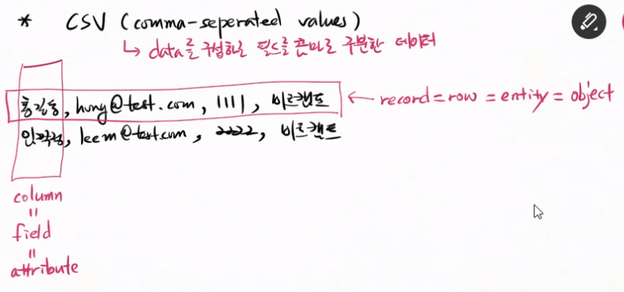

- 이클립스에서 네비게이터에서 클래스 파일 복사하면 단순 파일복사만해주기 때문에 자바소스로 인식하지 않는다.

# 12월 17일
 
|최적화(optimizing)|리팩토링(refacttoring)|
|:--:|:--:|
|실행속도 향상|코드의 가독성과 재사용성 향상|
|실행과정을 단축(메모리사용 최소)|유지보수 쉽게하기위해 코드를 작은 단위로 분리|
|기능 추가, 변경, 삭제가 어렵다. 즉 유지보수에 시간이 많이든다|  실행속도가 느려진다.|
|코드를 읽기 어렵다|실행 단계가 더 많아진다|
|더 적은 자원을 사용한다(CPU, 메모리 등)|비교적 유지보수 기간이 짧다.|

예제 자바랭에 ex07부터시작
- Java
  - 메서드를 리턴한 후에 작업을 수행할 수 없다
  
  - 가변 파라미터
    static void main(String...names)
    -> String의 값을 0개 이상 전달할 수 있다.
  
  - 클래스 실행 과정과 메모리영역
  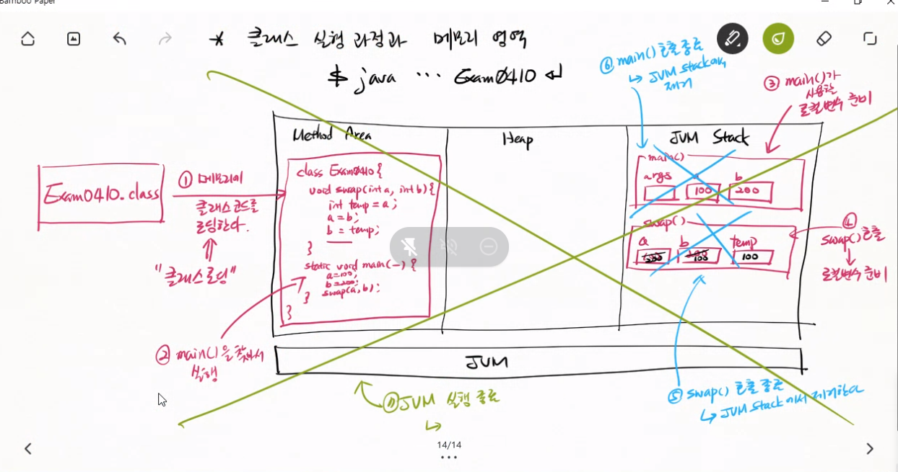

# 12월 20일
- 메서드 호출과 JVM Stack 메모리 영역
  - 메인 메서드 호출시 JVM Stack에 메인 메서드에서 사용할 로컬변수를 생성
- Bytecode 작성하기(컴파일러 경유하지않고 바로 class파일 작성하기)
  - 소스파일(.java)작성 -> 컴파일 -> 바이트코드(.class) 작성

# 12월 21일
- Class 다루기
  - 코드의 규모가 커지면 체계적 관리를 위해 관련 변수들을 묶어서 관리한다.
  - 데이터 타입의 정의
    ```java
    class Contact {
      String name;
      String email;
      String tel;
    }
    ```
  - 새 데이터 타입의 메모리 만들기 
    ```java
     Contact c(contact인스턴스의 주소를 저장할 변수 = reference) = new Contact(데이터 타입명= 클래스명)();
    name, email, tell, company 등의 메모리 (변수)를 클래스 설계도에 따라 heap영역에생성( = 인스턴스 = 객체)
    ```  
  - 레퍼런스 배열
    - 배열 사용전 
    ```java
    Contact c1, c2, c3(인스턴스의 주소를 저장하는 변수 = 레퍼런스)
    c1 = new Contact();
    c2 = new Contact();
    c3 = new Contact();
    c1, c2 ,c3(레퍼런스들) 에는 name, email, tel, ,company등의 Contact의 객체(인스턴스)의 주소가 저장된다.
    ```  
    - 배열 사용 후
    ```java
    Contact[] arr = new Contact[3](reference를 3개만드는 명령);
    new로 만다는건 배열이든 인스턴스든 heap영역에 저장된다.
    arr[0] ,arr[1] ,arr[2] -> 각각의 레퍼런스들
    ```
  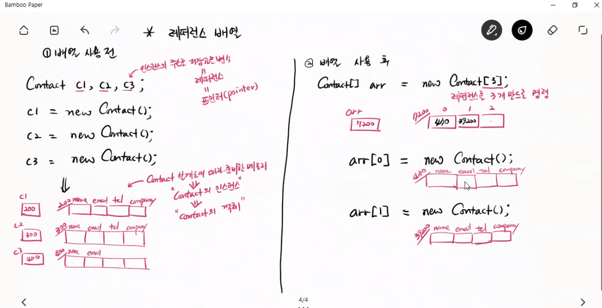
  - toString : 선언한 변수를 한줄의 문자열로 만들어줌
  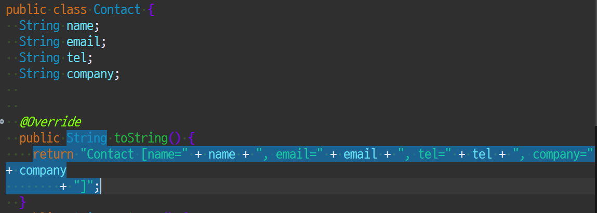

  ## Spring Boot와 클래스 파라미터(get, set메서드)
    - 웹 서버에서 각 파라미터를 요청 (add?name=aaa&email=aaa@test.com 등) -> 스프링부트는 페이지컨트롤러(ContactController)의 요청핸들러(add()메서드) 를 호출하기 전에 add()에 선언된 클래스 인스턴스를 생성한다.
    그 후 요청파라미터값(name=aaa&email=aaa@test.com 등)을 그 인스턴스 각 변수에 저장(name에 aaa, email에 aaa@test.com 저장)
    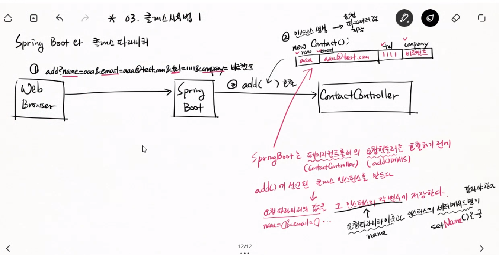
    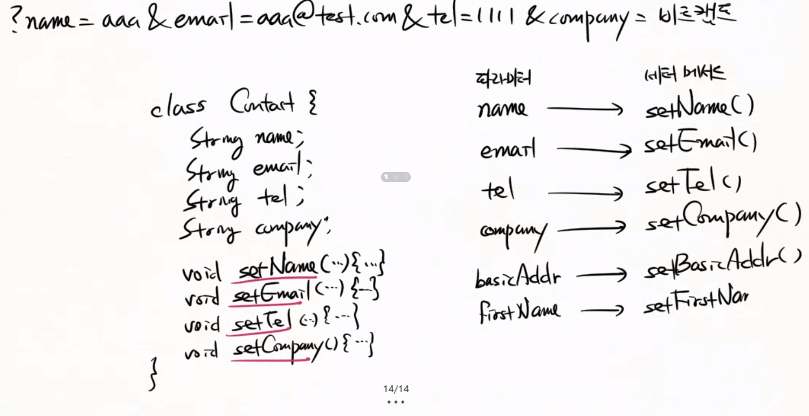
    -> String으로 선언한 변수명은 쿼리스트링의 파라미터와 관련없다.
    -> 세터메서드는 쿼리스트링의 파라미터와 관련있다.
    -> 쿼리스트링의 파라미터와 세터메서드
    name -> setName
    email -> setEmail
    tel -> setTel
    company -> setCompany
    basicAddr -> setBasicAddr
  - 레퍼런스와 인스턴스 변수
    - 인스턴스 변수에 값저장
   ```java
    Contact c = new Contact()
    c(인스턴스 주소를 알고있는 레퍼런스).name(인스턴스 변수) = "홍길동";
    c.email = "test@test.com";
    c.tel  = "1111";
    c.company = "비트";
   ```
   - 인스턴스 변경
   ```java
   c = new Contact()
   c.name = "임꺽정";
   c.email = "leem@test.com";
   c.tel =  "2222"
   c.company = "캠프";   
   ```

- web ex04 객체
  - 기본 틀(원형 객체) 없이 빈 객체 만들기
  ```javascript
  var obj1 = Object.create(null);
  var obj2 = new Object;
  var obj3 = {};
  모두 같은결과, 빈객체 생성
  ```
  - ex04/exam02.html
  
   Object 라는 생성자가 초기화한 object(객체)라는 의미.
  - javascript에서 프로퍼티 변수를 사용할 때는 java와 달리 this.를 생략할 수 없다
  ```javascript
  var obj = new Object();

  obj.name = "홍길동";
  obj.kor = 100;
  obj.eng = 90;
  obj.math = 80;
  obj.toString = function() {
	return this.name + "," + this.kor + "," + this.eng + "," + this.math;
  };
  ```
  - javascript 객체 생성과 JSON
  ```javascript
  <jvascript 객체> 
  { name : "홍길동"
    "email" : "a@test.com"
    'tel' : '1111'
    프로퍼티명, value는 "", '' 둘다 사용가능
  }
  <JSON(Javascript Object Notation) 문자열>
  { "name" : "홍길동"
    "email" : "a@test.com"
    "tel" : "1111"
  }
  JSON형식 데이터의 프로퍼티명은  반드시 문자열 형식으로 사용해야하고, 문자열은 ""를 사용해야한다.
  ```
```javascript
var obj = {
	sum: () => this.kor + this.eng + this.math,
	aver: () => this.sum() / 3,
}; 
화살표 함수로 객체를 정의할 때 this.는 window객체를 가리키게 된다.
```
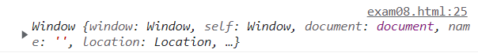
-> 때문에 객체의 멤버 함수로 등록할 때는 화살표 함수는 가급적 사용하지 않는다.

- 객체 생성과 초기화의 다양한 방법
  ```javascript
  1)
  var s1 = new Object();
  s1.name = "홍길동";
  s1.kor = 100;
  s1.eng = 100;
  
  2)var scores = []; //new Array();
  scores[0] = new Object();
  scores[0].name = "홍길동";
  scores[0].kor = 100;
  scores[0].eng = 100;
  //배열을 이용해 객체를 생성하면 반복문을 돌릴 수 있다.
  for (var score of scores) {
  console.log(score.name, score.kor, score.eng,score.math, score.sum, score.aver);
  }
  
  3)function createScore(name, kor, eng, math) {
	var obj = new Object();
	obj.name = name;
	obj.kor = kor;
	obj.eng = eng;
  //함수를 이용해 객체를 생성하면 프로퍼티의 값을 일일이 지정하지 않아도 함수를 호출하여 파라미터에 값만 넣어주면 된다.
  var scores = []; // new Array();
  scores[0] = createScore("홍길동", 100, 100, 100);

  4)function createScore(name, kor, eng, math) {
	var obj = new Object();
	obj.name = name;
	obj.kor = kor;
	obj.eng = eng;
  obj.sum = function() { 
		return this.kor + this.eng;
  	};
  }
  //객체에 함수를 포함시킬 수 있다.
  ```

# 12월 22일
- 생성자
  - 함수 호출시 new로 초기화 하면 this.을 사용할 수 있다.(new명령으로 함수 호출 시 생성자 함수)
  - 객체에 대해 공통으로 사용하는 함수는 메모리 낭비를 방지하기 위해 생성자 객체 내의 prototype객체에 별도 보관한다.
  - new 명령후에 함수 호출하면 기본객체를 생성하고 그 객체 자체가 리턴값이 된다.
  - 하지만 new명령없이 함수를 호출하게 되면 리턴값이 없기 때문에 undefined가 된다.
  - 상속
    ```javascript
    function f1(n){
      this.name = n;

    }
    function f2(n, k, e, m) {
      //상위 생성자를 명시적으로 호출한다.
      f1.call(this, n);

      this.kor = k;
      this.eng = e;
      this.math = m;
    }
    var obj1 = new f2("홍길동", 100, 90, 80)
    -> 상위 생성자.call(this.상위 생성자의 프로퍼티)
    ```
## CSS

- ul : unordered list
    
   
- ol : ordered list
    
  
- 선택자
  - id : "#"으로 id를 구분
  - class : "." 으로 class를 구분
    - 여러 클래스에 소속되있는 경우 
    < li class="guest member" >와 같이 클래스명 클래스명 식으로 표기
  - tag  : tag명으로 구분
  - 부모태그 자식태그
    ```html
    <style>
    #부모 > ul {
      스타일 적용
    }
    #형제 + ul {
      스타일 적용
    }
    </style>
    <div id = "부모">
      <ul>
      </ul>
    </div> 
    div태그는 ul태그의 부모태그, 
    ul태그는 div태그의 자식태그이다.
    <div id = "형제">
      <ul>
      </ul>  
    </div>
    똑같은 ul 태그이지만 부모태그의 자식태그인 ul태그로
    특정지었기 때문에 부모태그 안에있는 ul태그에만
    style이 적용된다.
    형제를 id로 갖는 태그 + ul 태그로 지정하면 형제 id를
    갖는 태그 다음의 ul태그만을 지정하게 된다. 
    ```
    ```css  
      input[name^="office"] { 
        /* 속성의 값이 특정 문자열로 시작하는 경우*/}
    ```
## javascript
- 자바스크립트는 태그를 다룰 때 사용할 도구를 제공.
  - DOM(Document Object Model), API가 그 도구이다
    - DOM API -  doucument 객체

# 12월 23일
## 생성자 (예제 javascript 04-11-8)
- 모든 함수는 prototype을 가지고 있다.
- Object()함수에 prototype.test0추가
```javascript
Object.prototype.test0 = function() {
  console.log("test0()...");
}
```
- prototype안에는 constructor에 대한 정보가 들어있다
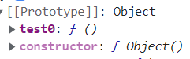
- prototype안에는 기본적으로 toString, valueOf, constructor정보 등이 보관되어 있다.
- Object()상위 생성자의 prototype은 null(Object생성자가 최상위이기 때문에 상위생성자가 없다.)
- 생성자 상속
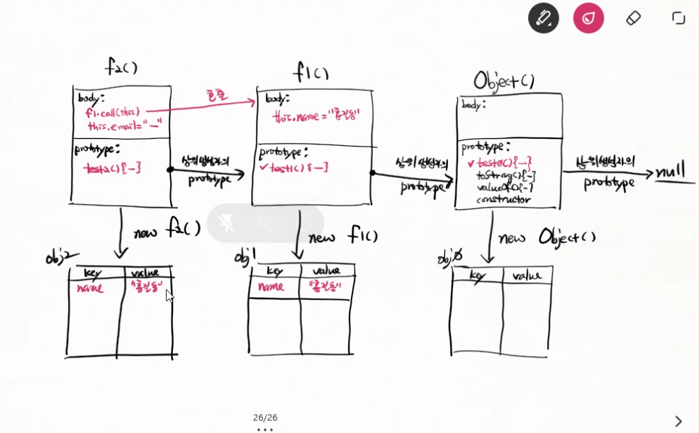
- instanceof 오른편 생성자, 왼편 객체주소
 ex) obj1(객체명) instanceof Object(생성자)

- 함수 소속 프로퍼티와 객체 소속 프로퍼티
  - JSON.passe()(함수 소속)
      JSON.parse('{"name" : "홍길동", "age" :20}')
  - JSON.stringify()
  -  Array.prototype.push() (객체 소속)
      var arr = new Array();
      arr(객체).push(프로퍼티명)("aaa")
  - 특정 객체를 다루지 않는 프로퍼티는 함수에 소속시켜라
    ```javascript
    Score.count = 0; /* 몇명의 학생을 
    만들었는지 특정하지 않는 프로퍼티이기 
    때문에 함수에 소속시켰다*/
    Score.count++;
    var values =  csv.split(",");
      return new Score(values[0], parseInt(values[1]), parseInt(values[2]), parseInt(values[3]))
    }
    ```
  - 특정 객체를 다루는 프로퍼티는 prototype에 소속시켜라
  ```javascript
  Score.prototype.sum = function() {
    return this.kor + this.eng + this.math;
  };
  Score.prototype.aver = function () {
    return this.sum() /3;
    };
  var score1 = Score.create("홍길동,100,100,100")
  console.log(score1.sum(), score1.aver());
  /*sum, aver는 특정학생, 홍길동학생의 점수의
   합산, 평균을 다루기 때문에 prototype에 넣었다.*/
  ```
- Document.getElementById -> Document함수에 소속된 것이 아니라 Document.prototype에 소속되어 있는 것이다  -> 그 객체에 대해 사용할 수 있다는 의미.

javascript ex 05 01~

- getElementsByTagName은 HTMLCollection 객체를 리턴한다.
- 이 객체는 배열이 아니기 때문에 for...in 반복문을 사용하게되면 인덱스 번호에 포함되지 않은 프로퍼티 까지 반복되게 된다.
- 그래서 일반적으로 for...of 반복문을 사용한다
ex05 0번에서 끝까지

# 12월 24일(ex06 - 1~)
## 이벤트 다루기
- 이벤트 발생할 때 호출되는 메서드
  - 리스너(Listener) = 이벤트 핸들러(Event handler)
- 이벤트 종류
  - click 이벤트
    - 태그 속성에 onclick 속성 넣기
    ```javascript
    ex1) 
    <button onclick ="자바스크립트 코드">
    //onclick에 직접 자바스크립트 코드 등록
    ex2) 
    <button id="btn1-2" onclick="btn1Click()">버튼1-2</button>
      function btn1Click() {
        var str = "Hello";
        window.alert(str);
        }//함수를 따로 등록해놓고 onclick에서 함수를 호출
    ex3) 
    var btn2 = document.getElementById("btn2");
    // var btn2 = document.querySelector("#btn2")
    btn2.onclick =f1;
    둘 중 아무거나 사용하면 됨.
    // btn2에 객체 멤버로 on클릭을 등록하는 방법
    ex4)
    btn2.onclick = function() {
    var str = "Hello2b!";
    window.alert(str);
    console.log(this); 
    //일반 함수에서 this가 가리키는 객체는 현재 소속된 객체(btn2)이다.
    /* 익명함수를 정의하고 정의된 함수 객체
    주소를 onclick이란 이름으로 btn2에 
    저장하겠다는 의미(onclick에 직접저장하는 것 아님)*/
    객체에 저장하는 속성 : property
    속성 값 : value
    ex5)
    btn2.onclick = () => {
      var str = "Hello2c!";
      window.alert(str);
      console.log(this);
    }
    //화살표 함수에서 this가 가리키는 객체는 window객체이다
    ex6)
    var btn3 = document.querySelector("#btn3");

    btn3.addEventListener("click", btn3Click);
    // 함수 정의 전에 함수를 호출해도 호이스팅 도기 때문에 상관 없다.
    function btn3Click() {
      var str = "Hi2!!";
      window.alert(str);
      console.log(this); // this는 btn3 객체이다.
    } 
    
    ex7)
      btn3.addEventListener("click", function() {
      var str = "Hi2!!";
      window.alert(str);
      console.log(this); // this는 btn3 객체이다.
    });

    보통 한개의 이벤트만 등록할 때는
    btn.onclick = () => {
    }
    방식을 자주 쓴다.
    ```
- 리스너 실행 순서
  - 리스너를 등록할 때 한가지 종류로만 등록해야 유지보수가 용이하다.
  - 태그에 직접 onclick을 등록하고, 태그 객체에 onclick을등록했다면 태그 객체에 등록한 것이 덮어쓴다.
  ```javascript
  우선순위1) btn1.onclick = () => {
    var str = "Hello2";
    window.alert(str);
    };

   우선순위2)btn1.addEventListener("click", () => {
      var str = "Hello3";
      window.alert(str);
  });

  우선순위3)<button id="btn1" onclick="var str='Hello1'; window.alert(str);">버튼1</button><br>
  ```
 ```javascript
 <button id="btn1" onclick="btn1Click(event)">버튼1</
 button><br>
 태그에 이벤드 객체이름은 (event)를 반드시 써야 한다
 ```
  - ***id가 부여된 태그는*** window 객체를 통해 바로 접근할 수 있다.
  window.btn1.onclick = function() {
	console.log("test..ok!");
    }; 
    하지만 window변수는 글로벌 변수이기 때문에 변수이름을 덮어 쓸수 있기 때문에 주의해야 한다.
- 태그의 속성값 꺼내기
  ```javascript
  <button id="btn1" data-no="100">버튼1</button><br>
  document.getElementById("btn1").addEventListener("click", function(e) {
	console.log(this); 
	console.log(this.getAttribute("data-no"));
  console.log(this["data-no"])// 임의로 태그에 속성에 
  //추가한 방법은 getAttribute없이 꺼낼 수 없다.
  ------------------------------------------------
    // arrow function인 경우 
    // this는 window 객체를 가리킨다.
 
  document.getElementById("btn1").addEventListener("click", (e) => {
  console.log(this); // window 객체이다.
  
  // 그럼 arrow function(자바에서는 Lambda라 부른다)에서는 
  // 이벤트가 발생된 객체를 알 수 없는가?
  // => 있다!
  //    이벤트 객체에 이벤트가 발생된 태그의 주소가 들어 있다.
  console.log(e.target);
  ```
- 이벤트 발생과 전달 과정
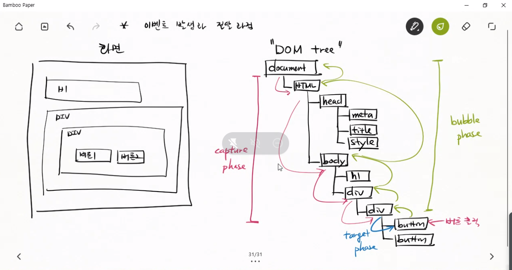
이 그림에서 HTML은 root element라고 한다.
- d1 클릭하면 이벤트 리스너 호출된다, 거기서 실행이 끝나는게 아니라 부모 태그인 body태그로 다시가서 이벤트 리스너가 있는지 찾는다.
- 찾으면 부모태그인 body태그의 이벤트리스너도 호출한다. -> 의도하지 않은 작업이 실행될 수 있다.
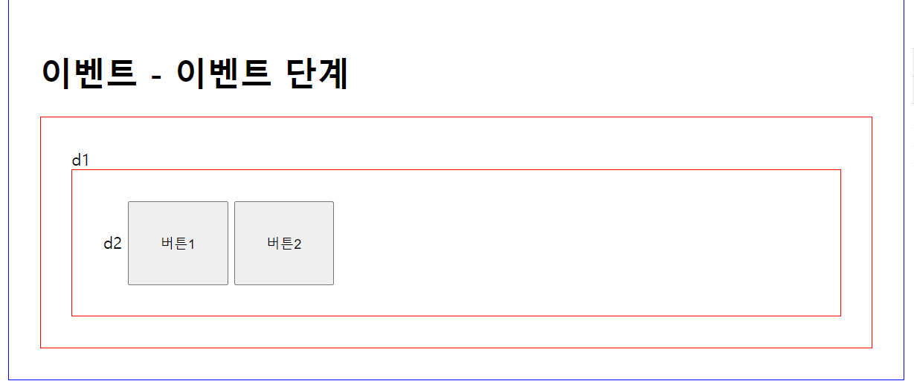
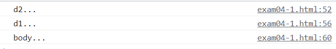
d2만 클릭했는데 d1, body에 등록되어있는 이벤트리스너도 호출된다.
  - target단계뿐만아니라, bubble단계에서도 이벤트리스너가 호출됨을 주의하자.
  - 이를 막기위해서 stopPropagation(전파 중지)를 쓴다
- 직접 이벤트 실행하지 않고 이벤트 발생시키기
  ```javascript
   <button id="btn1">버튼1</button>
   document.getElementById("btn1").addEventListener(function(e){
     var myEvent = new MouseEvent("click")
     document.getElementById("btn2").dispatchEvent(myEvent)
   })
   document.getElementById("btn2").addEventListener("click", function(e) {
    console.log("버튼2...");
    });
   btn2에 이벤트객체 myEvent를 dispatchEvent를 통해 보낸다
   이렇게 하면 직접 btn2를 클릭하지 않아도 btn1을 눌렀을 때
   btn2를 클릭하면 실행되는 작업이 수행되게 된다.
  ```
- 기본 작동을 막는 명령
  - return false
  - preventDefault  
  - **주의** addEventListener()로 함수를 등록하면 return false 로 기본동작을 취소할 수 없다.
  - onclick로 함수를 등록했을 때만 return false로 취소할 수 있다.
  - preventDefault는 onclick, addEventListener 상관없이 기본동작 취소 가능하다.
- button type 지정안하면 defalut가 submit이다