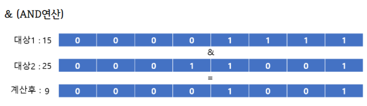
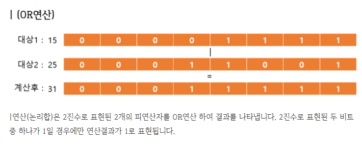

# Spring boot란
- 엔터프라이즈 어플리케이션 개발을 용이하게 해주는 Spring framework의 복잡한 초기 설정없이 바로 개발에 들어갈 수 있게 해주는 프레임워크이다. 
- Spring boot는 관련 라이브러리를 일일이 추가할 필요 없이 spring-boot-starter-web을 통해 손쉽게 받아올 수 있다. 

**framework** : framework는 library보다 상위 개념이다. 여러기능을 가진 클래스와 라이브러리가 특정 기능 구현을 위해 합쳐진 형태이다. 메소드 , 클래스, 모듈은 기능의 재사용성을 목적으로 하는데- framework는 재사용성을 목적으로 하는 요소들을 큰 단위로 묶어주는 역할을 한다. 

  * 스프링 부트 실행
  
 

   * JVM(자바가상머신) : JAVA와 OS사이의 통로역할, JAVA소스를 OS에 구애받지 않고 재사용할 수 있도록 해줌.

### 리터럴(literal)(값을 표현한 것)

 - 리터럴은 소스 코드의 고정된 값을 대표하는 용어이다.
 
 
 - 종류에는 정수, 실수, 문자, 논리, 문자열 리터럴이 있다. 
   - 정수 : 자연수(양의 정수), 자연수에 음의 부호를 붙인 음의 정수, 0을 합친 수의 모임.
     - 정수 type에는 byte,short(=2byte), int(=4byte), long(=8byte)가 있다.
   - 실수 : 직선상에 위치한 수들을 의미한다.
     - 실수 type에는 float(=4byte), double(=8byte)가 있다.
   - boolean : true or false(1byte)
   - 문자타입 : char(2byte)

  - 정수 리터럴과 진수법
    |10진수|100 = 10의2승 *1 +  10의1승 * 0 + 10의0승 * 0|
    |:--:|:--:|
    |8진수|100 = 0144-> (8의 2승 *1) +(8의 1승 *4) + (8의 0승 *4)|
    |2진수|100 = 01100100 ->(2의6승 * 1) +(2의 5승 * 1) + (2의 2승 * 1)
    | 16진수|100 = 0x64 -> (16의 1승 *6) + (16의 0승 * 4)|

   - 비트의 전기 상태를 표현하는 간단한 방법
     - 2진수 표기법
       -다양한 형태의 값을 메모리에 저장할 때 형태에따라 다른 규칙들이 필요하다.
       메모리에 저장하려면 2진수로 표현할 수 있어야 하기 때문이다.
   - 값(Data)과 2진수의 관계 

|--|--|
|--|--|
|숫자|2의 보수법|                           
|문자|charset|                            
|색|RGB|     

- 정수를 2진수로 변환하는규칙
   - sing magnitude(절대부호)
   +5 : 0101
   -5 : 1101
   0(양의 부호비트)
   1(음의 부호비트)
   -> 양수와 음수의 더하기가 불가능(양수와 음수를 더했을 때 실제 값과 다른 결과의 2진수로 표기됨) ->부동소수점에서 가수부를 저장할 때 사용

   - 1의 보수 (**보수 : 보충해주는 수**)
   
   2진수로 표현된 값의 반대 값 ex) 5 = 0101 ->1010 : 5의 1의보수
   
   -> 실제 결과 값에 1을 더해줘야 정확한 결과 값이 나온다.

   - 2의 보수
     - 2의 보수는 
       - 1. 7을 예로 들면 7을 이진수로 표현 -> 컴퓨터는 8비트를 사용 00000111
       - 2. 7에 대한 1의 보수를 구한다 -> 11111000
       - 3. 구한 1의 보수에 1을 더해준다 -> 11111001
       - 4. 7의 2진수 값(00000111) 과 1의 보수에 1을 더한 값(11111001) 을 더해 결과 값이 0이 되는지 확인한다.

   - excess-k규칙(초과법)
     - 4bit를 기준으로 하면, 4bit는 0~15까지 16개의 수를 나타낼 수 있다. 
       - 1111 (15) ->  7

1110 (14) ->  6

1101 (13) ->  5

1100 (12) ->  4

1011 (11) ->  3

1010 (10) ->  2

1001 (9)  ->  1

1000 (8)  ->  0

0111 (7)  -> -1

0110 (6)  -> -2

0101 (5)  -> -3

0100 (4)  -> -4

0011 (3)  -> -5

0010 (2)  -> -6

0001 (1)  -> -7

0000 (0)  -> -8
  -> nbit 기준으로 -(2의n-1승) ~ +(2의 n-1승-1) : 4bit 일 때 -8(-2의4-1승) ~ 7(2의4-1승-1)까지 표현이 가능하다. 부동소수점에서 지수부를 저장할 때 사용.
   
  - 부동소수점을 2진수로 변환하는 규칙
   
     
      
      
      - 10.625라는 소수를 예로들면
        - 1.우선 정수부와, 소수부를 분리하고 정수부를 2진수화 시킨다 -> 10 = 1010
        - 2. 소수부의 숫자가 0으로 나누어 떨어질 때까지 2를 곱해준다. -> 0.625 * 2 = 1.25
        - 3. 그 후 정수부를 2진수로 표기 한 후 다시 소수부에만 2를 곱한다 -> 1 x x x, 0.25 * 2 = 0.5
        - 4. 이런식으로 소수부가 0으로 나누어 떨어질 때까지 반복한다. -> 1 0 x x, 0.5 * 2 = 1.0
        - 5. 1 0 1. 최종적으로 소수부는 1 0 1 이 되었다.
        - 6. 정수부 소수부의 2진수표기를 합치면 10.625 = 1010.101로 표기된다.
    - 부동소수점을 메모리에 저장하는 법
      - 1. 부동소수점을 2진수로 변환한다 : 정수부분을 2진수로 표현. 소수부분은 0으로 나눠떨어질 때 까지 2를곱하여 2진수로 표현
      - 2. 정수,소수의 2진수를 합쳐 표기하여 제일 왼쪽의 1부분까지 소수점을 옮긴다.  ex) 111.011010 -> 1.11011010. 소수점을 옮긴 자리수만큼 카운트 하고 정수부분의 1을 버린다. (2번 옮겼으니 2의 2승) -> 정규화 과정
      - 3. 1을 버리고 남겨진 소수부분을 가수부 영역에 할당하고 총 비트수가 23비트가 되도록 0으로 채운다.
      - 4. 2번에서 소수점을 옮긴 자리수만큼의 수에 32비트의 bias값인 127을 더해준다 = 127+2 그후 127을 2진수로 변환하여 지수부를 채운다.
      - 5. 부동소수점의 값이 음수이면 비트부호 = 1, 양수이면 비트부호 = 0 을 할당한다.
      
      

- 부동소수점의 유효 범위
  - 4byte ->  7자리까지 유효(그 이상은 짤림, 그러나 오류는 발생하지 않음)
  - 8byte ->  8자리까지 유효(그 이상은 짤림, 그러나 오류는 발생하지 않음)
  

## 12월 04일
    
  ### 변수의 종류
- 인스턴스 변수(Instance variable)
  - 각각의 인스턴스 변수는 독립된 저장 공간을 가진다. 사용하기 위해서는 먼저 인스턴스를 생성해야 한다. 클래스 영역내에서 생성되며 자유롭게 변수의 값을 변경할 수 있다.
- 클래스 변수(Class variable)
  - 인스턴스 변수와 같이 클래스 영역내에서 생성되고 변수 앞에 'static' 을 붙여 선언한다. 인스턴스 변수와의 차이점은, 클래스 변수는 모든 인스턴스 값들이 공통된 변수(저장공간)를 공유한다. 인스턴스를 생성하지 않고 바로 사용할 수 있는 특징을 가진다.
- 지역 변수(Local variable) 
  - 메서드 내에서 생성되는 변수이다. 메서드가 끝난 후 소멸되며 메서드 범위 밖에서 사용될 수 없다. 
>ex )public class Exam0720 {
   int a; // 인스턴스 변수
   
   >static int b; // 클래스 변수
   
   
   >public static void main(String[] args/*로컬변수=파라미터*/) {
   int c; // 로컬 변수

   
> static 이 붙은 블록(스태틱 메서드=클래스 메서드)에서는 
     그 블록 바깥 쪽에 있는 스태틱 변수(클래스 변수)를 사용할 수 있다.
    b = 20;
   그러나 static 붙지 않은 인스턴스 변수는 사용할 수 없다.
  a = 100; // 컴파일 오류!
  }
  
- static 이 붙지 않은 블록에서는(인스턴스 블록) 블록 영역이 아닌 곳에 선언된 모든 변수(다른 메서드에 선언된 지역변수는 제외)에 접근할 수 있다. 
- static이 붙은 블록에서는 static이 붙은 메서드에 선언된 변수(클래스 변수)에 접근할 수 있다. static이 붙지 않은 변수는 접근 할 수 없다.
- 같은 블록 내에서는 변수의 타입에 관계 없이 중복선언이 불가능하다. 하지만 다른 블록에서라면 같은 변수 이름을 사용할 수 있다.
- 블록이 끝나는 순간 안에 선언된 변수는 모두 제거된다. 때문에 블록 바깥쪽에서 블록 안쪽의 변수를 사용할 수 없다. 하지만 안쪽 블록에서는 바깥쪽의 변수를 사용할 수 있다.
>ex) public static void main(String[] args) {
    
        int a = 100; 
        {
           int b= 200;
        }
        system.out.println(a); -> 가능
        system.out.println(b); -> 불가능
}
- 부동소수점의 값을 정수 메모리에 저장할 수 없다.(자바에서 문법적으로 막고, 정수는 소수점 이하의 값을 저장할 수 없기 때문).
- 하지만 정수 값을 부동소수점 메모리에 저장하는건 가능하다.(그러나 유효자리범위를 초과하는 값은 짤리거나 반올림되어서 저장되기 때문에 주의해야 한다.) 

## 12월05일
- 비트 논리연산자(&,|)
  - 비트 논리연산자는 대상이 boolean타입일 경우 일반적인 논리연산자로 사용된다.
  - 하지만 대상이 정수일 경우에는 다른 연산을 수행하게 된다.
  
  
-> 두 대상의 비트가 모두 1일 때 = 1, 둘 중 하나라도 1이 아닐 때 0으로 결과 값을 갖게 된다.

-> 두 대상의 비트 중 하나라도 1일 때 1로 표기. 둘다 0인 경우 0으로 표기

- 비트 이동 연산자(>>,<<)
  - "<<" 연산자는 2진수로 표현된 비트값 *2의 연산 결과 값을 나타낸다.
    - 1 << 1 = 00000000 00000000 00000000 00000001 -> 0|00000000 00000000 00000000 00000010 - : 1을 나타내는 비트 값에서 한자리 왼쪽으로 자릿수를 이동한다. 그 후 빈자리는 0으로 채워준다.(음수일 경우 빈자리는 -1로 채운다) 
    - 결과 값은 1에서 2로 바뀌게된다.
  - ">>" 연산자는 2진수로 표현된 비트값 /2의 연산 결과 값을 나타낸다.
  -  2 >> 1 = 00000000 00000000 00000000 00000010 -> 00000000 00000000 00000000 00000001 : 2를 나타내는 비트 값에서 한자리 오른쪽으로 자릿수를 이동한다. 그 후 빈자리는 0으로 채워준다.(음수일 경우 빈자리는 -1로 채운다)

## 12월 06일
- 메모리 크기에 따라 저장할 수 있는 값의 범위
 
 |메모리 타입|메모리 크기|저장 가능 범위|
 |--|--|--|
 |byte|1byte|-128 ~ 127|
 |short|2byte|-32768 ~ 32767|
 |int|4byte|약 -21억 ~ 21억|
 |long|8byte|약 -922경  ~ 922경|
 |--|부동소수점|--|
 |float|4byte|유효자릿수 7자리|
 |double|8byte|유효자릿수 15자리|
 |--|문자|--|
 |char|2byte|0~65535|
 |--|논리값|--|
 |boolean|JVM : 4byte(int) 배열일 경우 1byte|--|
 

