# 마크다운 단축키
굵은 글씨 ( ctrl + B )
글씨 기울기 ( ctrl + I )
링크 ( ctrl + L )
이미지 넣기 ( ctrl + shift + L )
코드 블럭 생성/삭제 ( ctrl + M, ctrl + C )
인라인 코드 블럭 생성/삭제 ( ctrl + M, ctrl + I )
블릿 생성/삭제 ( ctrl + M, ctrl + B )
리스트 생성/삭제 ( ctrl + M, ctrl + 1 )
체크박스 생성/삭제 ( ctrl + M, ctrl + X )
# Spring boot란
- 엔터프라이즈 어플리케이션 개발을 용이하게 해주는 Spring framework의 복잡한 초기 설정없이 바로 개발에 들어갈 수 있게 해주는 프레임워크이다. 
- Spring boot는 관련 라이브러리를 일일이 추가할 필요 없이 spring-boot-starter-web을 통해 손쉽게 받아올 수 있다. 

**framework** : framework는 library보다 상위 개념이다. 여러기능을 가진 클래스와 라이브러리가 특정 기능 구현을 위해 합쳐진 형태이다. 메소드 , 클래스, 모듈은 기능의 재사용성을 목적으로 하는데- framework는 재사용성을 목적으로 하는 요소들을 큰 단위로 묶어주는 역할을 한다. 

  * 스프링 부트 실행
  
 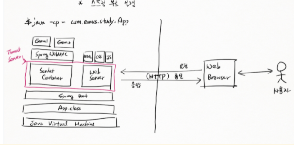

   * JVM(자바가상머신) : JAVA와 OS사이의 통로역할, JAVA소스를 OS에 구애받지 않고 재사용할 수 있도록 해줌.


### 리터럴(literal)(값을 표현한 것)


 - 리터럴은 소스 코드의 고정된 값을 대표하는 용어이다.
 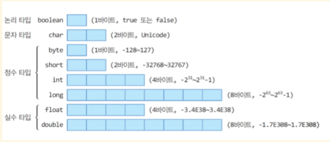
 
 - 종류에는 정수, 실수, 문자, 논리, 문자열 리터럴이 있다. 
   - 정수 : 자연수(양의 정수), 자연수에 음의 부호를 붙인 음의 정수, 0을 합친 수의 모임.
     - 정수 type에는 byte,short(=2byte), int(=4byte), long(=8byte)가 있다.
   - 실수 : 직선상에 위치한 수들을 의미한다.
     - 실수 type에는 float(=4byte), double(=8byte)가 있다.
   - boolean : true or false(1byte)
   - 문자타입 : char(2byte)

  - 정수 리터럴과 진수법
    |10진수|100 = 10의2승 *1 +  10의1승 * 0 + 10의0승 * 0|
    |:--:|:--:|
    |8진수|100 = 0144-> (8의 2승 *1) +(8의 1승 *4) + (8의 0승 *4)|
    |2진수|100 = 01100100 ->(2의6승 * 1) +(2의 5승 * 1) + (2의 2승 * 1)
    | 16진수|100 = 0x64 -> (16의 1승 *6) + (16의 0승 * 4)|

   - 비트의 전기 상태를 표현하는 간단한 방법
     - 2진수 표기법
       -다양한 형태의 값을 메모리에 저장할 때 형태에따라 다른 규칙들이 필요하다.
       메모리에 저장하려면 2진수로 표현할 수 있어야 하기 때문이다.
   - 값(Data)과 2진수의 관계 

|--|--|
|--|--|
|숫자|2의 보수법|                           
|문자|charset|                            
|색|RGB|     

- 정수를 2진수로 변환하는규칙
   - sing magnitude(절대부호)
   +5 : 0101
   -5 : 1101
   0(양의 부호비트)
   1(음의 부호비트)
   -> 양수와 음수의 더하기가 불가능(양수와 음수를 더했을 때 실제 값과 다른 결과의 2진수로 표기됨) ->부동소수점에서 가수부를 저장할 때 사용

   - 1의 보수 (**보수 : 보충해주는 수**)
   
   2진수로 표현된 값의 반대 값 ex) 5 = 0101 ->1010 : 5의 1의보수
   
   -> 실제 결과 값에 1을 더해줘야 정확한 결과 값이 나온다.

   - 2의 보수
     - 2의 보수는 
       -  7을 예로 들면 7을 이진수로 표현 -> 컴퓨터는 8비트를 사용 00000111
       -  7에 대한 1의 보수를 구한다 -> 11111000
       -  구한 1의 보수에 1을 더해준다 -> 11111001
       -  7의 2진수 값(00000111) 과 1의 보수에 1을 더한 값(11111001) 을 더해 결과 값이 0이 되는지 확인한다.

   - excess-k규칙(초과법)
     - 4bit를 기준으로 하면, 4bit는 0~15까지 16개의 수를 나타낼 수 있다. 
       - 1111 (15) ->  7

1110 (14) ->  6

1101 (13) ->  5

1100 (12) ->  4

1011 (11) ->  3

1010 (10) ->  2

1001 (9)  ->  1

1000 (8)  ->  0

0111 (7)  -> -1

0110 (6)  -> -2

0101 (5)  -> -3

0100 (4)  -> -4

0011 (3)  -> -5

0010 (2)  -> -6

0001 (1)  -> -7

0000 (0)  -> -8
  -> nbit 기준으로 -(2의n-1승) ~ +(2의 n-1승-1) : 4bit 일 때 -8(-2의4-1승) ~ 7(2의4-1승-1)까지 표현이 가능하다. 부동소수점에서 지수부를 저장할 때 사용.
  <br>
  - 부동소수점을 2진수로 변환하는 규칙
  <br>
     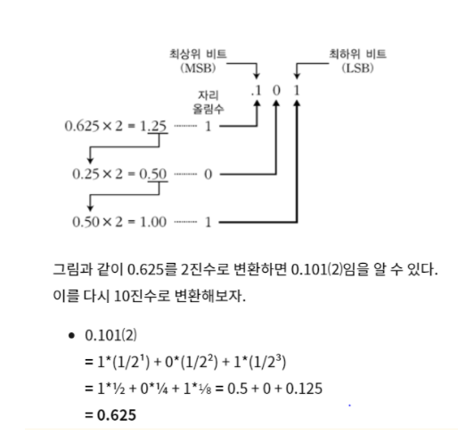
     <br>
     <br>
      - 10.625라는 소수를 예로들면
        - 우선 정수부와, 소수부를 분리하고 정수부를 2진수화 시킨다 -> 10 = 1010
        -  소수부의 숫자가 0으로 나누어 떨어질 때까지 2를 곱해준다. -> 0.625 * 2 = 1.25
        -  그 후 정수부를 2진수로 표기 한 후 다시 소수부에만 2를 곱한다 -> 1 x x x, 0.25 * 2 = 0.5
        -  이런식으로 소수부가 0으로 나누어 떨어질 때까지 반복한다. -> 1 0 x x, 0.5 * 2 = 1.0
        -  1 0 1. 최종적으로 소수부는 1 0 1 이 되었다.
        -  정수부 소수부의 2진수표기를 합치면 10.625 = 1010.101로 표기된다.
    - 부동소수점을 메모리에 저장하는 법
      -  부동소수점을 2진수로 변환한다 : 정수부분을 2진수로 표현. 소수부분은 0으로 나눠떨어질 때 까지 2를곱하여 2진수로 표현
      -  정수,소수의 2진수를 합쳐 표기하여 제일 왼쪽의 1부분까지 소수점을 옮긴다.  ex) 111.011010 -> 1.11011010. 소수점을 옮긴 자리수만큼 카운트 하고 정수부분의 1을 버린다. (2번 옮겼으니 2의 2승) -> 정규화 과정
      -  1을 버리고 남겨진 소수부분을 가수부 영역에 할당하고 총 비트수가 23비트가 되도록 0으로 채운다.
      -  2번에서 소수점을 옮긴 자리수만큼의 수에 32비트의 bias값인 127을 더해준다 = 127+2 그후 127을 2진수로 변환하여 지수부를 채운다.
      -  부동소수점의 값이 음수이면 비트부호 = 1, 양수이면 비트부호 = 0 을 할당한다.
      
      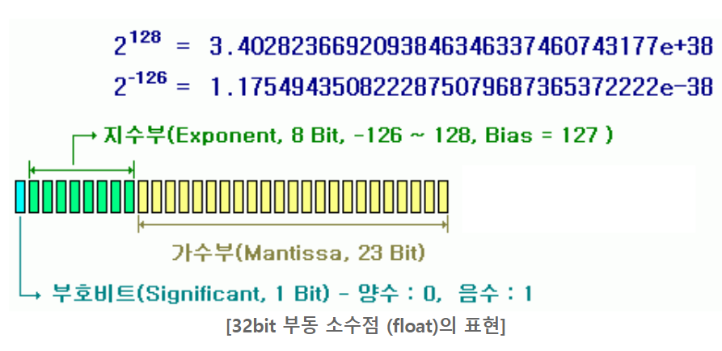

- 부동소수점의 유효 범위
  - 4byte ->  7자리까지 유효(그 이상은 짤림, 그러나 오류는 발생하지 않음)
  - 8byte ->  8자리까지 유효(그 이상은 짤림, 그러나 오류는 발생하지 않음)
  

## 12월 04일
    
  ### 변수의 종류
- 인스턴스 변수(Instance variable)
  - 각각의 인스턴스 변수는 독립된 저장 공간을 가진다. 사용하기 위해서는 먼저 인스턴스를 생성해야 한다. 클래스 영역내에서 생성되며 자유롭게 변수의 값을 변경할 수 있다.
- 클래스 변수(Class variable)
  - 인스턴스 변수와 같이 클래스 영역내에서 생성되고 변수 앞에 'static' 을 붙여 선언한다. 인스턴스 변수와의 차이점은, 클래스 변수는 모든 인스턴스 값들이 공통된 변수(저장공간)를 공유한다. 인스턴스를 생성하지 않고 바로 사용할 수 있는 특징을 가진다.
- 지역 변수(Local variable) 
  - 메서드 내에서 생성되는 변수이다. 메서드가 끝난 후 소멸되며 메서드 범위 밖에서 사용될 수 없다. 
>ex )public class Exam0720 {
   int a; // 인스턴스 변수
   
   >static int b; // 클래스 변수
   
   
   >public static void main(String[] args/*로컬변수=파라미터*/) {
   int c; // 로컬 변수

   
> static 이 붙은 블록(스태틱 메서드=클래스 메서드)에서는 
     그 블록 외부 쪽에 있는 스태틱 변수(클래스 변수)를 사용할 수 있다.
    b = 20;
   그러나 static 붙지 않은 인스턴스 변수는 사용할 수 없다.
  a = 100; // 컴파일 오류!
  }
  
- static 이 붙지 않은 블록에서는(인스턴스 블록) 블록 영역이 아닌 곳에 선언된 모든 변수(다른 메서드에 선언된 지역변수는 제외)에 접근할 수 있다. 
- static이 붙은 블록에서는 static이 붙은 메서드에 선언된 변수(클래스 변수)에 접근할 수 있다. static이 붙지 않은 변수는 접근 할 수 없다.
- 같은 블록 내에서는 변수의 타입에 관계 없이 중복선언이 불가능하다. 하지만 다른 블록에서라면 같은 변수 이름을 사용할 수 있다.
- 블록이 끝나는 순간 안에 선언된 변수는 모두 제거된다. 때문에 블록 외부쪽에서 블록 안쪽의 변수를 사용할 수 없다. 하지만 안쪽 블록에서는 외부쪽의 변수를 사용할 수 있다.
>ex) public static void main(String[] args) {
    
        int a = 100; 
        {
           int b= 200;
        }
        system.out.println(a); -> 가능
        system.out.println(b); -> 불가능
}
- 부동소수점의 값을 정수 메모리에 저장할 수 없다.(자바에서 문법적으로 막고, 정수는 소수점 이하의 값을 저장할 수 없기 때문).
- 하지만 정수 값을 부동소수점 메모리에 저장하는건 가능하다.(그러나 유효자리범위를 초과하는 값은 짤리거나 반올림되어서 저장되기 때문에 주의해야 한다.) 


## 12월05일
- 비트 논리연산자(&,|)
  - 비트 논리연산자는 대상이 boolean타입일 경우 일반적인 논리연산자로 사용된다.
  - 하지만 대상이 정수일 경우에는 다른 연산을 수행하게 된다.
  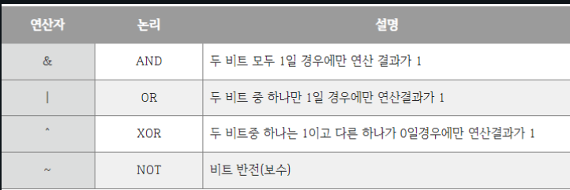
  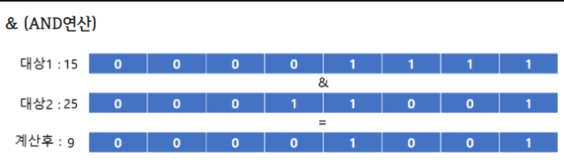
-> 두 대상의 비트가 모두 1일 때 = 1, 둘 중 하나라도 1이 아닐 때 0으로 결과 값을 갖게 된다.
  
-> 두 대상의 비트 중 하나라도 1일 때 1로 표기. 둘다 0인 경우 0으로 표기

- 비트 이동 연산자(>>,<<)
  - "<<" 연산자는 2진수로 표현된 비트값 *2의 연산 결과 값을 나타낸다.
    - 1 << 1 = 00000000 00000000 00000000 00000001 -> 0|00000000 00000000 00000000 00000010 - : 1을 나타내는 비트 값에서 한자리 왼쪽으로 자릿수를 이동한다. 그 후 빈자리는 0으로 채워준다.(음수일 경우 빈자리는 -1로 채운다) 
    - 결과 값은 1에서 2로 바뀌게된다.
  - ">>" 연산자는 2진수로 표현된 비트값 /2의 연산 결과 값을 나타낸다.
  -  2 >> 1 = 00000000 00000000 00000000 00000010 -> 00000000 00000000 00000000 00000001 : 2를 나타내는 비트 값에서 한자리 오른쪽으로 자릿수를 이동한다. 그 후 빈자리는 0으로 채워준다.(음수일 경우 빈자리는 -1로 채운다)

## 12월 06일
- 메모리 크기에 따라 저장할 수 있는 값의 범위
 
 |메모리 타입|메모리 크기|저장 가능 범위|
 |--|--|--|
 |byte|1byte|-128 ~ 127|
 |short|2byte|-32768 ~ 32767|
 |int|4byte|약 -21억 ~ 21억|
 |long|8byte|약 -922경  ~ 922경|
 |--|부동소수점|--|
 |float|4byte|유효자릿수 7자리|
 |double|8byte|유효자릿수 15자리|
 |--|문자|--|
 |char|2byte|0~65535|
 |--|논리값|--|
 |boolean|JVM : 4byte(int) 배열일 경우 1byte|--|
 

 ## 12월 07일
 
 - Tag 사용법
   - form tag : 웹 페이지에 표현되는 입력양식. 로그인, 회원가입 폼 등. 
     - 텍스트필드 등에 값을 입력하고 제출 등의 기능을 수행하면 서버에 데이터들을 보내 처리하게 된다.
       - < form action="데이터를 보낼 서버의 url(처리할 정보가 들어있는 저장소의 경로)">
   - input tag : 사용자의 데이터를 입력받을 수 있는 다양한 형태의 입력창을 생성.
   
   
   

   - select tag : 드롭다운 박스를 만드는 태그, option 태그를 이용해 드롭다운에 여러가지  메뉴를 추가할 수 있다.
   

- 서버에 데이터를 요청
  - XMLHttpRequest : XML은 텍스트 데이터 형식으로, 인터넷에 연결된 시스템끼리 데이터를 쉽게 주고 받을 수 있게 하여 HTML의 한계를 극복할 목적으로 만들어졌다. 
  - var xmlHttp = new XMLHttpRequest(); 자바스크립트에서 XMLHttpRequest객체를 생성.

# 12월08일
  
- 기본 연산 단위
        
         byte x = 5, y = 6, z;
         z = x; // OK!
         z = y; // OK!
         but z = x + y -> 오류
         Java에서 연산의 기본 단위는 int(4byte)이기 때문에
         x + y의 연산결과 또한 4byte메모리이다. byte는 1byte이고 x + y의 연산결과는 4byte이기 때문에 범위를 초과해서 에러가 발생한다.
      
   결론 : 다른 타입과 연산을 수행할 때는 
  내부적으로 같은 타입으로 맞춘 다음에 실행한다(암시적 형변환)
  -  => byte + byte = int
     => short + short = int
     => byte + short = int         

  - 연산의 결과
    - 같은 타입의 연산결과 : int의 최대범위 약 21억 + 21을 연산하면 int의 최대범위를 초과하기 때문에 원하는 결과값을 얻을 수 없다.
    - 그러면 long타입에는 담겨질까? 아니다 연산의 결과값을 long타입 변수에 담기 전에 이미 결과값이 잘못된 연산 결과값이기 때문에,  long타입 변수에도 잘못된 결과가 담기게 된다.

            ex) 
            int x = Integer.MAX_VALUE;
            int y = Integer.MAX_VALUE;
            int r = x + y 
            System.out.println(r1)

            long r2 = x + y
            System.out.println(r2)

       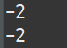

       두 결과값 모두 -2로 잘못된 결과가 출력된다.
      
           r2 = (long)x + (long)y;
          System.out.println(r2);

      
      형변환을 해주어야 옳은 결과가 출력된다.
# 12월09일
---
- **증감 연산자**
  - *후위 연산자(post-fix)*
    - int a = 100;
      a++
      System.out.println(a);
      후위 연산자는 임시 메모리를 생성하여 현재 변수의 값을 저장한다. -> int temp = a;
      그후 증감 연산을 실행한다 -> a = a+1;
      System.out.println에는 int temp의 값 100이 들어가게 된다.
- *조건 연산자(삼항 연산자)*
  - 조건() ? 표현식1 :표현식 2
    - 조건이 참일 때 표현식 1을 실행, 거짓일 때 표현식 2를 실행. 
    - 
- printf 의 출력 서식
  |사용법|서식|
  |:-----:|:-----:|
  |%d|정수형|
  |%f|실수형|
  |%s|문자형|
  |%c|문자열|
  |%n|줄바꿈|

- **흐름제어문**
  - if 조건문
    - if문에 여러 문장을 묶을 때
     ```java
     int age = 17;
     if (age > 19)
      System.out.println("성인이다"); 
      //괄호 없이 여러 문장을 작성하게되면 첫 번째 문장만 if문에 속하게된다
      System.out.println("군대에간다");
      System.out.println("노인이다");
      System.out.println("청소년이다");
      ```

    - if문의 조건은 무조건 boolean 데이터만 올 수 있다.
      - true, false <, >, ==. 
        ex) if (a == 100), if( a = 100) ->불가능
  - switch case
    ```java
    switch(값){
      case 조건 :
        실행문
        break; //멈추는 포인트(break를 만나면 실행문 종료.)
        default; (if else의 else와 같은역할)
    }
    ```
    - switch의 값에는 4바이트 정수, 문자만 사용 가능하다.
    - 부동소수점, boolean값 사용 불가능.
  - while 반복문
    ```java
    while(조건){
      실행문 //조건이 참일동안 실행문을 반복한다
    }
    ```
  - 라벨을 이용한 반복문
  ```java
    라벨명 :
    while(조건){
      실행문
      break 라벨명; 
      //라벨을 통해 break하게되면 라벨에 해당하는 반복문 자체를 종료시킨다.
    }
  
  ```
  - do while 반복문
    - do while반복문은 다른 반복문들과 다르게 조건이 거짓이라도 일단 한번은 실행시킨다. 그 후 참, 거짓을 판별해 반복, 중단을 실행한다.
  - for 반복문
    - for 반복문 안에 선언된 변수는 for문을 나가는 순간 사용할 수 없다.
    ```java
    int a = 10;
    for(~~){

    }
     -> 따라서 for문 밖에 변수를 선언하면 for문 밖에서도 
        변수를 사용할 수 있다.
    ```
    - for 반복문의 여러가지 작성법
  
  ```java
  
  1. for(int a = 0; a <10;){
      a++;
  }
   -> 증감문을 따로 작성할 수 있다.
  2. int a = 1;
     for(; a < 10;){
      a++;
  }
   -> 변수의 선언 및 초기화 또한 따로 작성할 수 있다.
  3. int a = 1;
     for(; ;){
       if(a < 10;)
      a++;
     }
     -> 조건문 또한 따로 작성할 수 있다.
  ```
  
  
# 12월15일
  
- Javascript의 배열에서 배열에 없는 데이터를 호출할 때 undefined를 리턴한다.
 ```javascript
 var arr = [1,2,3,4]
 console.log(arr[5])
 console.log(arr[2])
 console.log(arr[1])
 console.log(arr[0])
 ```
 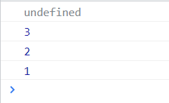
 - Javascript에서는 Java와달리 배열의 크기를 결정하지 않고 생성한다.
  ```javascript
  var arr = [];
  ```
  - 중간 인덱스번호를 건너뛰고 배열을 생성할 수 있다.
  ```javascript
  var arr = [1,2,3,4];
  arr[7] = 8;
  중간에 건너뛴 인덱스 번호는 empty로 출력이 되고,
  건너뛴 인덱스 번호를 호출하게 되면 undefined를 리턴하게 된다.
  ```
- for in 반복문
  - 객체의 반복을 위한 반복문.(배열의 반복에는 추천하지 않음)
  ```javascript
  obj.name = "홍길동"; 
  obj.age = 20;
  obj.tel = "1111-1111";
  obj.working = true;
  for (i in obj){
    console.log(i(객체에 있는 프로퍼티 이름),obj[i](속성값))
    console.log(obj)
    프로퍼티명, 프로퍼티 값으로 각각의 객체 요소에 접근할 수 있으며
    객체 자체 이름을 호출하여 하나의 객체로 출력할 수 도 있다.
  }
  ```
  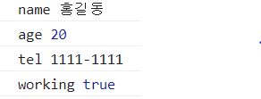
  

- for of 반복문
  - 배열의 반복을 위한 반복문

- 배열의 값 분해
    ```javascript
    var arr = ["홍길동", "1234-5678", true, 20];
    var [name, tell, working, age] = arr;
    console.log(name,tell);
    -> 홍길동 1234-5678 출력
    동일한 인덱스 번호의 값이 출력된다.
    홍길동 = arr[0], name = arr[0]
    호출할 때 배열의 모든 값을 호출하지 않으면 배열[0]
    부터 순서대로 호출된다.
   var obj = { name : "홍길동" , tel :"1234-5678", working : true, age : 20};
   var {name,tel,working,gender} = obj;
   console.log(name) //홍길동
   console.log(tel) // 1234-5678
   console.log(worknig) // true
   console.log(gender) // undefined
   객체의 프로퍼티 명과 같은 변수를 선언해주어야 한다. 
   프로퍼티명과 변수가 일치하지 않으면 
   undefined가 된다.
    ```
  - const로 객체 선언
    ```javascript
    const v2 = new Object();
    v2.name = "홍길동";
    v2.age = 20;
    v2.tel = "1111-2222";
    v2.name ="임꺽정"
    console.log(v2);
    v2 = new Object // 에러발생
    -> name = 임꺽정으로 바뀜
    즉, const로 선언된 객체 내에서의 프로퍼티의 값은 
    수정될 수 있지만, const로 선언된 객체의 주소는 변경 할 수 없다.
    ```
  
# 12월 16일
## 함수
- 함수 호이스팅
```javascript
var v1;
console.log(v1); //아직 변수의 값이 할당되지 않았다.
var v1 = "홍길동"; //하지만 호이스팅으로 인해 변수 선언이 먼저 실행 되기 때문에 사용할 수는 있다. 값을 할당하는 "="연산자는 현재 위치에서 실행된다.
```
- Parameter 와 argument
  - Prameter는 매개변수, 인자. 
  - argument는 인수, 전달 값
  ```javascript
  function f1(a,b) 
  (a,b) : 매개변수(parameter) - 함수가 호출되었을 때 argument가 
  전달해준 값을 보관하는 매개체 역할을 하는, 함수의 로컬 변수
  console.log(f1(100,200));
  (100,200) : 아규먼트(argument) - 함수를 호출할 때 매개변수에 값을 전달해주는 역할.
  ```
- 함수 오버로딩
  - Javascript는 메서드 오버로딩을 지원하지 않는다.
  - 같은 이름의 변수를 여러번 선언하면 값이 덮어씌워지듯이 Javascript의 함수 또한 기존의 함수를 덮어쓴다.
- arguments는 함수 내장 변수이다
  - Javascript에서 Array()로 생성한 배열은 forEach()메서드를 사용할 수 있다
  - 하지만 arguments는 Object()생성자에 의해 초기화되었기 때문에 forEach() 메서드를 사용할 수 없다.
- 함수와 window 객체
  - 함수도 변수와 같이 자동으로 window 객체에 소속된다.
  ```javascript
  function f1(str) {
    console.log(str);
  }
  window.f1("안녕!")
  f1("안녕1!");
  -> f1함수는 window 객체에 소속되었기 때문에 객체명인 window. 으로 프로퍼티에 접근할 수 있다.
  window.은 생략할 수 있다. 
  window["f1"]도 가능. -> 객체명["프로퍼티명"]
  -------------------------------------------
  함수의 주소를 값처럼 다룰 수 있다. 즉 다른 변수에 저장하여 사용할 수 있다.
  var f2 = window.f1;
  f2("안녕2!")
  ```

- argument를 이용한 함수전달
  - 함수는 객체이기 때문에 주소를 주고 받을 수 있다.
  - 객체가 key, value로 이루어져 있는 것처럼
  ```javascript
  function play(cb) {
    console.log("계산 결과 =", cb(100, 200));  /* 콜백 함수 - 직접호출하지 않고 다른함수에게 파라미터 값으로,
     호출될 함수의 주소를 전달하여 호출되도록함.*/
    }
    function plus (a, b) {
      return a + b;
    }
    function minus (a, b){
      return a - b;
    }
    play(plus);
    play(minus);
    -> plus, minus함수는 콜백함수이다. 
    직접 호출하지 않고 play함수의 파라미터로 전달하여 play함수가
     plus, miunus라는 콜백함수를 호출하게 하는 것이다.
    
  ```
- Javascript에서 변수는 Java에서 처럼 정적인 형태가 아니다. 변수에 저장하는 
  값에 따라 타입이 변한다.(dynamic type
   binding)
- Javascript에서 함수의 호이스팅(hoisting)
  - 함수를 정의하기전에 먼저 사용해도 오류가 발생하지 않는다.
  - 함수의 정의가 먼저 실행되기 때문이다
  ```javascript
  f1();
  function f1() {
    console.log("안녕");
  }
  function f1(){...} -> 함수정의 단계가 f1(); 함수 실행단계보다 먼저 실행된다.
  -------------------------------
  하지만 변수 선언과 할당이 함께 위치할 경우
  f1();
  var f1 = function {
    console.log("안녕");
  }
  이 문장은 오류가 발생하게 된다.
  호이스팅은 변수선언만 위로올리고 변수의 할당에는 호이스팅이 적용되지 않기 때문이다.
  ```
- 함수 안에서 함수를 만들어 리턴할 수 있다.
  - 함수 안에서 정의한 또다른 함수를 closure라고 한다.
  - 내부함수에서 찾는 변수가 내부에 없으면 외부에서 변수를 찾게 된다.
  ```javascript
  function outter() {
    var title = 'coding everybody';
    return function() {
      alert(title);
    }
  }
  inner = outter();
  inner();
  -->외부함수 outter는 return을 만나 실행이 종료되었다. 그래서 외부함수의 변수인 var title은 제거되었다. 하지만 closure의 특성을통해 내부함수가 이미 제거된 변수에 접근할 수 있다.
  ```
  - closure가 외부 함수의 로컬 변수를 사용할 때, 외부 함수의 로컬변수는 외부함수의 호출이 끝나면 제거된다. 
  - 그렇기 때문에 closure는 존재하지 않는 로컬 변수를 이용하는 상황이 된다. 
  - 이것을 방지하기 위해 외부 함수의 로컬변수를 closure의 별도 메모리에 복제해두었다가 사용하게된다.(외부함수의 로컬변수에 직접 접근하는 것은 아님)

- 파라미터 또한 로컬변수이다.
- 함수가 호출될 때 함께 생성된 클로저는 메모리를 공유한다
```javascript
function f1{
  var value = 3;

  function f2{
    return value
  };
  function f3{
    return value;
  };
return f1();
}
f2와 f3는 f1함수가 호출될 때 함께 생성된 클로저이기 때문에 value라는 변수를 공유하게 된다. 
```

- 화살표 함수
  ```javascript
  function f1() {
    console.log("안녕");
  }
  ----------------------
  f1() => {console.log("안녕");
  }
  -----------------------
  f1() => console.log("안녕");
  함수안에 있는 문장이 한 문장으로 이루어졌을 때 "{}"를 생략할 수 있다.
  function f2(a,b){
    return a+b;
  }
  f2(a,b) => a+b
  그 한 문장이 return 문장일 경우 return과 ";"를 생략해야 한다.
  ``` 
- 함수도 객체이기 때문에 프로퍼티를 추가할 수 있다.
- Javascript 주요함수
  - setTimeout
  - window.setTimeout(함수명, 시간)
    - 지정한 시간이 지난 후 함수 실행
  - JSON.parse() 
    - JSON형태의 문자열을 Javascript의 객체형태로 변환한다.
    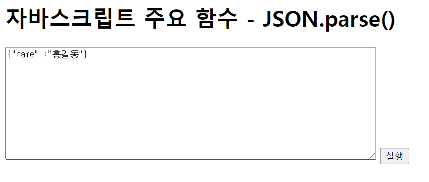
    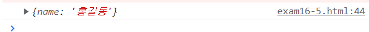
  - JSON.stringify()
    - 객체를 JSON문자열로 변환한다.