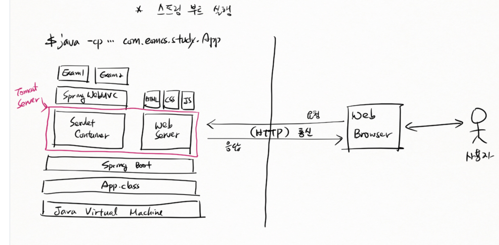
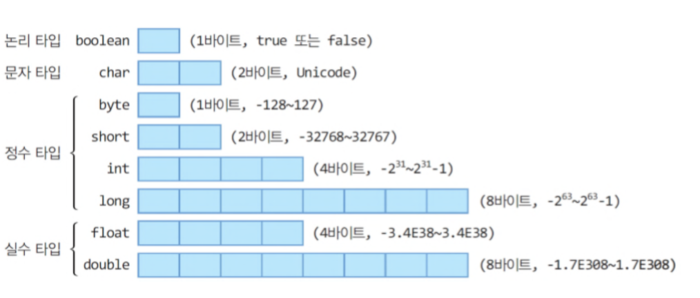

# Spring boot란
- 엔터프라이즈 어플리케이션 개발을 용이하게 해주는 Spring framework의 복잡한 초기 설정없이 바로 개발에 들어갈 수 있게 해주는 프레임워크이다. 
- Spring boot는 관련 라이브러리를 일일이 추가할 필요 없이 spring-boot-starter-web을 통해 손쉽게 받아올 수 있다. 

**framework** : framework는 library보다 상위 개념이다. 여러기능을 가진 클래스와 라이브러리가 특정 기능 구현을 위해 합쳐진 형태이다. 메소드 , 클래스, 모듈은 기능의 재사용성을 목적으로 하는데- framework는 재사용성을 목적으로 하는 요소들을 큰 단위로 묶어주는 역할을 한다. 

  * 스프링 부트 실행
  
 

### 리터럴(literal)(값을 표현한 것)

 - 리터럴은 소스 코드의 고정된 값을 대표하는 용어이다.
  
 - 종류에는 정수, 실수, 문자, 논리, 문자열 리터럴이 있다. 
   - 정수 : 자연수(양의 정수), 자연수에 음의 부호를 붙인 음의 정수, 0을 합친 수의 모임.
     - 정수 type에는 byte,short(=2byte), int(=4byte), long(=8byte)가 있다.
   - 실수 : 직선상에 위치한 수들을 의미한다.
     - 실수 type에는 float(=4byte), double(=8byte)가 있다.
   - boolean : true or false(1byte)
   - 문자타입 : char(2byte)

  - 정수 리터럴과 진수법
    |10진수|100 = 10의2승 *1 +  10의1승 * 0 + 10의0승 * 0|
    |:--:|:--:|
    |8진수|100 = 0144-> (8의 2승 *1) +(8의 1승 *4) + (8의 0승 *4)|
    |2진수|100 = 01100100 ->(2의6승 * 1) +(2의 5승 * 1) + (2의 2승 * 1)
    | 16진수|100 = 0x64 -> (16의 1승 *6) + (16의 0승 * 4)|

   - 비트의 전기 상태를 표현하는 간단한 방법
     - 2진수 표기법
       -다양한 형태의 값을 메모리에 저장할 때 형태에따라 다른 규칙들이 필요하다.
       메모리에 저장하려면 2진수로 표현할 수 있어야 하기 때문이다.
   - 값(Data)과 2진수의 관계 

|--|--|
|--|--|
|숫자|2의 보수법|                           
|문자|charset|                            
|색|RGB|     

- 정수를 2진수로 변환하는규칙
   - sing magnitude(절대부호)
   +5 : 0101
   -5 : 1101
   0(양의 부호비트)
   1(음의 부호비트)
   -> 양수와 음수의 더하기가 불가능(양수와 음수를 더했을 때 실제 값과 다른 결과의 2진수로 표기됨)

   - 1의 보수 (**보수 : 보충해주는 수**)
   
   2진수로 표현된 값의 반대 값 ex) 5 = 0101 ->1010 : 5의 1의보수
   
   -> 실제 결과 값에 1을 더해줘야 정확한 결과 값이 나온다.

   - 2의 보수
     - 2의 보수는 
       - 1. 7을 예로 들면 7을 이진수로 표현 -> 컴퓨터는 8비트를 사용 00000111
       - 2. 7에 대한 1의 보수를 구한다 -> 11111000
       - 3. 구한 1의 보수에 1을 더해준다 -> 11111001
       - 4. 7의 2진수 값(00000111) 과 1의 보수에 1을 더한 값(11111001) 을 더해 결과 값이 0이 되는지 확인한다.
  
   
   