## 11월24일 
* 실무 개발자(초보개발자)가 가져야할 기본기술
1. 화면제어 : HTML, CSS , Javascript + Bootstrap, Jquery
2. 데이터 제어 : SQL, JDBC, API, Mybatis 프레임 워크
3. 언어 및 도구 : Java, VScode, Eclipse, Git, Gradle(빌드도구)
  


시스템 소프트웨어 : 하드웨어 제어 목적. But 태블릿같은 하드웨어를 제어할 수 있는 소프트웨어가 벼로돌 없기에 Driver와 같은 소프트웨어를 제작.

        ex)  OS(운영체제) , Driver, TCP/IP,  DirectX

응용 소프트웨어(Application s/w) : 응용프로그램을 의미

        ex)  HWP, PPT, Web browser, 게임 등

    
  *  standalone(단독으로 실행 가능) : 로컬(Local)에 설치하면 단독으로 사용가능함

        ex) HWP, Photo Shop, 그림판, 메모장, MSoffice
  * Client / Server(CS : 양방향으로만 가능) : 로컬과 원격에 동시에 설치해야 함
        (서버없으면 동작할 수 없음)
        ex) 게임, 메신저, E-mail, 

    * Client /Server는 설치형, 서비스형으로 나뉜다. 설치형은 게임, 메신저 등(업데이트 필요)이 있으며 서비스형에는 E-mail 등(업데이트 필요 X)이 있다.

        * 서비스형 Application은 client가  server에 요청하면 server에서 작업이 이루어지고 client에게 응답하는 구조이다. client s/w가 사용자에게 입력받고 작업결과 출력.
        server s/w는 요청작업을 처리.
        모든 작업이 server쪽에서 실행된다.
        server는 여러 client의 요청을 처리한다.(Hardware의 성능이 좋아야함 -> 분산 computing의 등장. 한대의 컴퓨터가 아니라 여러대의 컴퓨터에서 server를 담당.)

        Web Application
        
        web server:  실행 ------>  <-------결과리턴  :App

        Java App에서 DBMS로  연결하는 과정은 Mybatis 프레임워크 이용.
        화면 출력은 HTML(contents),CSS(Contents의 모양) Javascript (Contents의 동작 제어)이용.
        
 ----------           


## 11월 25일
 ----------------------------------------------------------------------
 * Git Repo에 백업된 파일+ 변경기록을 복제해 오는 것이 clone 명령어.

      $User_HOME  = C:\Users\jys76\

    ex) Repo에 백업된 파일 bitcamp-study ->를
    C:\Users\jys76\에 클론 ->C:\Users\jys76\git\bitcamp-study(작업디렉토리)\.git(설정관련 파일: 백업된 파일을 편집할 수 있도록 꺼낸다. 백업 디렉토리의 역할) 
    작업할 파일을 꺼내오는 것을 check out. 작업디렉토리에서 백업디렉토리로 넘기는 작업을 commit이라고 한다.
  
  < local Repo >

  hello.txt ->변경
  
  README.md                  

  Hello.txt ->추가

 => Stage(백업명단)에 add => Stage에 등록된 파일을 
                                 Local Repo에 commit => Push를 통해 로컬저장소의 내용을 Server Repo에 Upload.

  때문에 Local 저장소에 파일을 백업하는 commit작업은 네트워크에 연결이 되어있지 않아도 수행 가능하다.

  pull 명령어 : 서버의 변경 사항을 내 local로 당겨오는 것.
  merge 명령어 : 서버의 변경사항과 local의 변경사항을 합치는 것

  * git으로 수업 준비 : 강사의 server Repo에서 pull 로 당겨서 보기만하기. pull로 당긴 파일을 편집하면 충돌이 일어남.
  * .gitignore : .으로 시작하는 무시하라는 설정파일


------------------------------------------------------------------------
  ## Application 빌드와 실행
  
  >1.인터프리터 방식 : Javascript 등
    자바스크립트 개발자 -> Javascript파일에서 명령문 실행 -> V8(Javascript 인터프리터). 크롬안에 webkit(HTML, CSS처리), V8(Javascript 처리)하는 툴이 있다. 
    Runtime 이전에 기계어로 해석하는 컴파일 방식과 다르게 Runtime이후에 해석하는 방식.
  **장점**
    - 인터프리터가 설치되어 있다면 OS와 CPU에 상관없이 실행 가능.
  **단점** 
    - 실행하기위해서는 소스파일이 있어야하고, 인터프리터가 설치되어 있어야 한다. 
    - 실행할 때마다 문법검사를 실행한다. 
    - 컴파일방식에 비해 실행속도가 느리다
    
  
  >2.컴파일 방식 : C, C++ 등
    개발자 -> 명령문 -> 번역기(computer) -> 번역과정을 거쳐 기계어(실행파일) 실행 -> OS에서 동작. 
    프로그래밍 언어를 Runtime 이전에 기계어로 해석하기 때문에 구동시간이 오래걸린다. 하지만 구동이후에는 하나의 패키지로 매우 빠르게 작동한다.
  **장점**
     - 인터프리터 방식보다 실행속도가 빠르다.
     - OS나 CPU에 맞는 실행파일만 있으면 실행 가능. 
     - 소스와 컴파일러가 필요없다.  
  **단점** 
     - OS나 CPU가 다르면 실행불가.
 
   
    ex) 안드로이드 모바일의 app을 애플 모바일에서 사용할 수 없다.
   >3.하이브리드 방식 : Java : 등
    [명령문 -> 컴파일러가 번역 -> 가상기계여(중간코드)] : 개발자의 역할(OS,CPU에 상관없이 프로그래밍 및 컴파일 가능)->인터프리터가 실행(JVM) ->OS ->CPU에서 실행
    시스템 관리자가 해당 OS/CPU에 맞는 인터프리터 설치.
    인터프리터 방식과 비교  : 컴파일 할 때 문법검사 완료(어느정도 기계어에 가깝게 변경->인터프리터방식보다 비교적 빠르다. )
    컴파일 방식과 비교 : 
      
  |인터프리터 방식|컴파일방식|하이브리드 방식<br>(컴파일+인터프리터)|
  |:--:|:--:|:--:|
  |실행하기 위해소스파일 필요  | 실행파일만 있으면 실행가능||
  |컴파일러 필요 |컴파일러 불필요|
  |컴파일방식에 비해 속도 느림 |인터프리터방식에 비해 속도빠름|
  |인터프리터 설치시 OS, CPU상관 없이 실행가능 |OS,CPU다르면 실행 불가능 |

    

  - 기계어 코드와 OS/CPU
  > 1. CPU 마다 명령어가 다르다
    Intel CPU는 Intel CPU가 이해할 수 있는 명령어로 작성되어야 실행할 수 있다.
    ex) Intel과 AMD는 명령어가 서로 호환되기 때문에 CPU가 달라도 프로그램을 따로 변환하지 않아도 그대로 실행 가능.
    서로 호환이 되지 않는다면 전용 프로그램을 따로 만들어서 변환해야 한다.

  - 같은 CPU더라도 OS가 다르다면(windows, Linux) 같은 App을 사용 할 수 없다. 
  >ex ) 같은 이력서를 window(삼성) , Linux(LG)에 제출했다. 삼성과 LG는 모두 한국어를 사용한다(같은 CPU언어). 하지만 삼성은 합격했지만 LG는 떨어졌다. 각 회사가 요구하는 이력서 양식이 다르기 때문이다.
  그래서 각 OS가 요구하는 포맷에 맞춰 명령어를 사용해야 한다.
  CUP가 같다는 것은 사용하는 명령어가 같다는 의미이다. 하지만 각 OS에 맞는 기계어(실행파일)를 사용해야 한다.


---
# 11월 26일
  - JVM / JRE / JDK / Java SE / Java ME
>Java 분류

|Java SE(Standard Edition|Java App 기본도구|
|:--:|:--:|
|JDK(Java Development Kit| JRE + 개발도구(컴파일러 , 디버거, 프로파일러|
|JRE(Java Runtime Environment|JAVA App 실행도구|
|JVM(Java Virtual Machine|Byte code interpreter|
|Java EE(Enterprise Edition|기업용 App 개발 관련 도구 *Java SE를 포함하지않는다. Jakarta EE로  이름변경됨(개발관리 소유권이 Eclipse 재단에 넘어감|
|Java ME(Micro Edition)|Embedded App 개발도구(반도체 메모리에 Java App미리 저장|

- Java 컴파일과 실행

>Hello.java -> 컴파일(javac.exe) -> Hello.class(Byte code : 가상의 기계어) -> 실행 불가능. 진짜 기계어가 아니기 때문. 그래서 JVM이 필요

>Hello.class -> JVM -> OS
 ex ) 
  
  |Class역할|JVM역할|
  |:--:|:--:|
  |.ppt |파워포인트| 
  |.xls |엑셀|
  |.mp3  |플레이어|    

  - Java 언어로 명령문 작성하는 최소 코드
      class Hello(클래스 명){

        public static void main(메서드 명 : JVM이 명령문을 시작하는 입구(String[] args){
          
        }
      } 

||Text 파일|Binary 파일|
|:--:|:--:|:--:|
|저장 형식|UTF -8 등 특정 문자 집합의 규칙에 따라 저장|.ppt, .pdf, .gif 등 특정 어플리케이션의 포맷에 맞춰 저장|
|파일보기| 텍스트 편집기라면 파일보기가능|해당 파일의 포맷의 알고있는 프로그램만가능|
|파일편집|텍스트 편집기는 모두가능|해당 파일의 포맷을 지원하는 프로그램가능(전용프로그램 필요)|
|파일크기|파일크기가 크다|크기가 작다|
|ex|.csv , .xml , .html, .cs , .js등|.pdf , .jpg, .png, .mp3 등|

- 프로그램 명령문(코드) 관리
    - 단순관리
    - 기능별로 묶어서 관리(코드가 복잡해지고 많아졌기 때문에)
    - 서로 관련된 기능을 "분류(Class)"하여 묶어서 관리  
    ex)
      > class calculator{
      }
       > class Math{
      }
       >class String{
      }

**클래스를 지정할 때 반드시 패키지명을 지정해야 한다**
### 11월26일 질문
- Java 최소 코드를 작성할 수 있는가?
  - 앤트리 포인트(entry point)의미를 설명할 수 있는가?
- Java 컴파일러를 사용하여 자바 소스를 컴파일 할 수 있는가?
  - 소스 파일과 클래스 파일을 분리하여 컴파일 할 수 있는가?
- JVM을 사용하여 Java 클래스 파일을 실행할 수 있는가?
  - 패키지에 소속된 클래스 파일을 실행할 수 있는가?
- 텍스트 파일과 바이너리 파일을 구분하는 방법을 아는가?
- 함수와 클래스, 패키지 문법이 등장한 이유를 설명할 수 있는가? 
  = 방대한 양의 코드를 체계적으로 관리하기 위하여.
- Java가 C/C++ 언어와 달리 각 파일마다 컴파일 하는 이유를 설명할 수 있는가?
- Java에서 편집한 소스 파일을 한 번에 컴파일하는 수동 컴파일 방식 보다 각 소스 파일 별로 자동으로 컴파일 하는 방식을 사용하는 이유를 설명할 수 있는가?(C/C++사례와 비교 설명)
- 이클립스 IDE용 프로젝트 폴더 구조와 Maven 프로젝트 폴더구조의 차이점을 설명할 수 있는가?
- 빌드 도구의 역할을 설명할 수 있는가? 
  - Ant, Maven, Gradle 빌드 도구를 비교 설명할 수 있는가?
- gradle 빌드 도구를 설치하고 설정할 수 있는가?
- gradle을 이용하여 자바 프로젝트 폴더를 구성할 수 있는가?
- build.gradle 빌드 스크립트 파일에 이클립스 관련 설정을 수행할 수 있는가?

  |자동컴파일|수동컴파일|
  |:--:|:--:|
  |Java IDE  도구에서 보통 자동컴파일을 수행한다|C/C++과 같은 기존 프로그래밍 언어에서 수동컴파일을 수행|
  
    App.c -> 컴파일 -> App.obj생성
    Sbu1.c-> 컴파일 -> Sub1.obj생성

    =>결과적으로 App.exe을 생성(링킹 작업)
 
  C/C++은 한개의 실행 파일을 만들기 때문에 보통 여러 파일의 코드를 변경한 후 한번에 컴파일 한다. 

 
  Java는 소스 파일을 변경할 때 각 파일마다 컴파일 한다. 또한 실행파일을 만들지 않는다. 
 
  ## 프로젝트 폴더의 기본 구조
  - 프로젝트폴더 -> 이클립스 IDE에서 사용하는 프로젝트 폴더구조(다른 IDE 툴과 호환이 안됨.)
    - src / : 자바소스파일, 설정파일
    - bin / : 컴파일된 클래스파일
    - {.project : 프로젝트 정보
    - .classpath : 외부 개발자가 제공하는 클래스파일
    - . settings / : 에디터 설정정보}
      =>이클립스 전용파일    

- 빌드도구 : 프로젝트의 소스 컴파일, 테스트, 문서생성, 배포파일 생성 등 애플리케이션을 만드는 작업을 도와주는 도구다.(컴파일러, 인터프리터 개념이 아니다. 컴파일러나 인터프리터를 사용하여 애플리케이션을 만든다.) 
   1.Ant-예전프로젝트(build.xml : 설정파일-컴파일방법, 테스트방법, 디렉토리정보) + 외부 라이브러리 기능이 없기 때문에 외부라이브러리 관리 기능을 추가해준다.
   2. Maven(웹프로젝트 -pom.xml : 설정파일 ) + XML태그 대신 groovy나 kotlin 같은 프로그래밍 언어를 사용하여 빌드과정을 정교하게 제어할 수 있다. 
   3. Gradle(Android 앱 및 최신프로젝트 : Maven 빌드도구의 기능을 사용). Gradle을 사용한다면 build.gradle(groovy : 설정파일)
   
## Gradle을 이용하여 Maven 표준 프로젝트 디렉토리 생성하기
 1. 프로젝트 폴더로 사용할 디렉토리 생성 : ~/git/bitcamp-study/java-lang
 2. 프로젝트 폴더를 구성 : $gradle init
 3. 이클립스용 프로젝트 설정파일 생성

# 11월 30일

    *스프링 부트 실행

웹 브라우저가 요청, 웹서버가 응답(HTTP라는 프로토콜을 이용해서 서로통신)
스프링 부트를 실행하기 위한 명령어 
SpringApplication.run(App.class, args);

exam1, 2 등을 실행하기 위해선 App.java라는 서버가 필요하다.
exam1, 2에는 엔트리포인트(메인메서드)가 없기 때문에 혼자서는
작동할 수 없다. 

11월30일
- 클래스 실행과 외부 라이브러리의 관계를 설명할 수 있는가 ?
 - jar 파일의 이름 유래를 설명할 수 있는가 ?
- Spring boot의 실행 과정을 설명할 수 있는가 ?
->자바 버츄얼머신 실행 -> App클래스 실행 -> 스프링부트 실행 
->서블릿컨테이너 + 웹 서버 동작 -> exam1, exam2실행


* 명령문 :  (메서드 : 특정 기능을 수행하는 명령문들의묶음 )
void main() { (명령문) } 
 (클래스 : 특정 역할을 수행하는 메서드들의 묶음) class calculator {
		int plus() {}
 패키지 : 비슷한 역할에 따라 클래스를 분류  -test/ c.class

* Data 크기와 메모리 관계

메모리는 Bit( 전기를 채우는 공간 - 완전히 채우거나, 안채우거나 2가지
상태만 가능). 더 정교하게 구분하려면 장비 자체가 더 정교해져야 하기 
때문에 비용이 더욱 증가하게 된다. 

* 메모리에 값 저장을 어떻게 할 것인가 ?  Bit에 전기를 채웠는지/안 채웠
는지의 상태로 표현.
1Bit 전기가 안 찬 상태를 0이라고 가정, 찬 상태를 1이라고 가정. 
2Bit 2개 모두 안찬 상태를 0, 한쪽 비트만 찬 상태를 1, 또 다른 한쪽만
찬 상태를 2, 모두 찬 상태를 3

* 값(Data)를 메모리에 저장? 
 숫자, 문자, 색상, 어떤 타입의 데이터든지 Bit의전기적 상태(Bit가 차
있는지, 차 있지 않은지)로 표현
 
 전기적 신호로 표현할 때 규칙이 필요하다. 

* 비트의 전기 상태를 표현하는 간단한 방법 
 
 2진수 표기법(0과 1로 표현)  0 0 0 0 , 0 0 0 1 .... 1 1 1 1

* 값을 메모리에 저장 

값에 대한 2진수 표현 규칙을 정의하여, 값을 2진수로 표현
-> 어떤 값이든 2진수로 표현할 수 있다면 메모리의 전기적 상태로(Bit)로
저장할 수 있다. 

* 값과(Data) 2진수의 관계
 숫자 -> 2진수 -> Bit에 저장가능  : 2의 보수 표기법
 문자 -> 2진수 -> Bit에 저장가능  : char(UTF-8 등) 
 색상 -> 2진수 -> Bit에 저장가능  : RGB
 => 메모리에 저장하려면 2진수로 표현할 수 있어야 한다.(규칙이 필요)
      2진수로 표현할 수 없는 것은 메모리에 저장할 수 없다. 

* 메모리의 크기와 값의 범위
<양의 정수로 표현할 경우>
 1bit => 0 또는 1 
 2bit => 0, 1, 2, 3
 4bit => 0~15
 8bit(1byte : 기본 메모리 단위)  => 0~255
 16bit => 0~65535
 
정수를 2진수로 변환하는 규칙

* sign-magnitude(절대 부호) 
       + 5 = 0101
        - 5 = 1101 : 처음 1이 부호를 결정하는 비트(부호비트)이다
       단점 : 양수와 음수의 더하기가 불가능
	+5 0101 
	 -5 1101
	=> 0010 = 2  : 오류발생
* 1의 보수  (1이 되기 위해 보충해 주는 수)
	   0 + () = 1
	   1 + () = 1  
	1과,0이 각각이 1의 보수이다.            
 1의 보수는 계산 결과에 1을 더해야만 정확한 결과값을 얻을 수 있다. 

* 2의 보수 


**1의 보수, 2의 보수 개념 정리하기

자바의 정수 리터럴
1. 4바이트 정수 리터럴
2. 8바이트 정수 리터럴 표현방식 공부하기  

## 11월 30일 질문
- 클래스 실행과 외부 라이브러리의 관계를 설명할 수 있는가?
  - jar 파일의 이름 유래를 설명할 수 있는가?
- 스프링부트의 실행 과정을 설명할 수 있는가?
- 메모리에 값을 저장하는 원리를 설명할 수 있는가?
- 정수를 2진수로 표현하는 규칙을 알고 있는가?
- Sign-Magniutude/1의 보수 /2의보수 /Excess-K규칙을 설명할 수 있는가?
- 메모리 크기에 따라 저장할 수 있는 정수값의 범위를 설명할 수 있는가?
- 4바이트 크기의 정수 리터럴과 8바이트 크기의 정수 리터럴을 표현할 수 있는가?  8바이트는 숫자 뒤에 L or l 추가.
- 부동소수점이 메모리에 저장되는 원리를 설명할 수 있는가?

> **부동소수점을 메모리에 저장하는 방법**
> 부동소수점을 2진수화 시켜야만 메모리에 저장할 수 있다. (어떤 data든 2진수로 표현할 수 있으면 메모리에 저장가능하다.)

* 부동소수점 리터럴
  * 4byte 부동 소수점
    * 12,375f -> 소문자 f를 선호
    * 12.375F
  * 8byte 부동 소수점
    * 12.375 -> 안붙이는 걸 선호
    * 12.375d
    * 12.375D
* 메모리 크기에 따른 부동소수점 값의 범위
  * 4byte 메모리 : (소수점 앞의 정수값 , 소수점 이하의 값)
->2진수화 -> 정규화 처리 : 이 과정을 통해 메모리에 값이 저장되기 때문에 명확하게 -xx ~ +xx 범위를 산정할 수 없다. 또한 소수점 앞 자리수, 소수점 뒤 자리수도 결정할 수 없다. 
다만 IEEE-754 방식에 따라 2진수로 바꾸더라도 값이 짤리지 않는 범위를 대략적으로 알 수 있다.
 >ex ) 4byte -> 소수점을 제거했을 때 7개의 숫자라면 거의 99.9% 메모리에 저장할 수 있다. 
    > 8byte 메모리 : 소수점 제거후 15개의 숫자라면 거의 99.9% 메모리에 저장할 수 있다
    => 이것을 '유효자릿수' 라고 부른다.

  8byte 메모리는 4byte 메모리보다 2배더 많은 수를 저장할 수 있다. (2배더 정밀 한 수 저장 가능.) -> double precision(배정도) <-> single precision(단정도)

  * 부동소수점의 유효범위 
    * 4byte : 7자리 정도 유효. 그 이상의 숫자는 짤린다(정수 리터럴과 달리 오류는 발생하지 않음)
    * 8byte : 15자리 정도 유효. 그 이상의 숫자는 짤린다. Exam03 - 0340.java예제 참조

  ---
  # 12월 01일
  #12월 1일

Maven web프로젝트 .pom .xml(설정파일)
* 문자 리터럴
 
유니코드  'A' = \uabcd : 역슬래쉬(\)u 뒤에 4개의 문자(문자코드)
를 정확하게 설정해야한다.

* 값을 메모리에 저장하기 위해 2진수화 시키는 규칙
 - 정수 
	
	 sign - magnitude
	 1의보수
	 2의보수
	 Excess-k

- 부동소수점 
	 
	 IEEE-754

- 문자 
	 Unicode(UTF-16BE= ucs2) 자바 기본규칙(국제표준)
	 UTF-8(유니코드 변형규칙, 국제표준) 
	 MS949(CP949) MS Windows에서 사용하는 규칙(비표준)
	 EUC - KR(KSC5601) 예전의 국가 표준 한글 규칙(국제표준)
	 조합형 HWP규칙(비표준)
	 ISO-8859-1(영어권 표준규칙)
	 ASCII 코드(미국규칙)

* 문자의 2진수화 규칙(character set : 문자 집합- 문자에 번호를 부여<문자코드>한 테이블)

	* **ASCII** - 7bit 크기의 번호를 부여 - 유럽 문자 포함
	* **ISO-8859-1234(ISO-latin-1)** - 8bit 크기의 번호를 부여
	* **EUC-KR** - 16bit 크기의 번호 부여,  한글 2350자에대해서만 번호 부여(ISO에는 한글규칙없음)
	* **조합형** - 16bit 크기의 번호를 부여. 초성, 중성, 종성, 각 5bit로 번호부여
	* **MS949(CP949)** - 16bit 크기의 번호를 부여. MS Windows에서 추가한 규칙. EUC-KR+ 알파. 11172자의 한글 음절에 대해 번호부여
	* **Unicode(UCS2 = UTF-16)** - 16bit 크기의 번호 부여. 국제표준 규칙으로 한글, 영어등 번호 다시부여
	* **UTF-8(유니코드 변형 포맷)** - 1~4byte 크기의 번호 부여. 영어는 다시 1byte사용. 한글은 2byte에서 3byte로 변경 및 재정의
		
		* unicode - JVM
		* UTF -8 - 일반 App에서 사용
	* **ASCII character set** - 문자에 대한 번호를 부여한 테이블
	 문자 에서  2진수 (7bit)로 변환
		
		0 -> 0 1 1 0 0 0 0	(0x30)
		1 -> 0 1 1 0 0 0 1	(0x31)		
		2 -> 0 1 1 0 0 1 0	(0x32)
		A -> 1 0 0 0 0 0 1	(0x41)
		B -> 1 0 0 0 0 1 0 (0x42)
		C -> 1 0 0 0 0 1 1	(0x43)

	* **ISO - 8859 (8bit)** - 1 - 영어, 프랑스어, 이탈리어 등. ASCII(128자) + 프랑스어 등(128자). 한글 음절(8bit로 표현불가)에 대한 정의가 없다.
	
	     	0 -> 0x30 0(ASCII보다 1bit추가) 0 1 1  0 0 0 0 
		1 -> 0x31 0 0 1 1  0 0 0 1
		2 -> 0x32
		A -> 0x41
		B -> 0x42

	* **EUC-KR(2byte)** - 한글음절 2350자 (국제표준)
	  문자 에서 2진수

		0 -> 0x30
		1 -> 0x31
		2 -> 0x32
		A -> 0x41
		B -> 0x42
		=> ISO-8859-1 (영어 1byte사용)	
		가 -> 0xB0A1
		나
		다
		=>한글 2byte사용
	* **조합형** - MS-DOS, Windows 3.0, Windows 3.1기간 동안 사용. 2byte를 사용.
		
    |초성(5bit)|중성(5bit)|종성(5bit)|
    |--|--|--|
    |ㄱ|ㅏ|ㄱ|
    |ㄲ|ㅔ|ㄲ|

> ex) 넬 -> 1(한글의 경우 첫비트가 1로시작)00100(5bit) 10100(5bit) 01001(5bit) : 초성, 중성, 종성에 부여된 숫자를 합쳐서 문자 코드를 정한다. 16bit 중에서 1로 시작하는 절반의 값을 한글이 모두 사용한다.

* **MS949(CP949)** -2byte사용 = EUC-KR + 알파
  <br>
   * MS949에서 새로추가한 문자에 대해 사용되고 있지 않는 번호를 부여. 그래서 번호가 순서대로 부여되지 않았지만 기존 EUC-KR규칙과 호환가능. 즉, MS949 규칙에 따라 문자를 저장하더라도 EUC-KR에 정의된 문자는 기존과 같은 번호를 사용한다. 

* **Unicode(UTF-16) =UCS2 -2byte사용(영어도 2byte 사용)
<bR>
  |문자|2진수|
  |:--:|:--:|
  |0|0x0030|
  |1|0x0031|
  |2|0x0032|
  |A|0x0041|
  |B|0x0042|
  -> 숫자, 영어는 기존의 ISO-8859-1 문자도 2byte 숫자를 사용.
  -> 11172개의 한글 음절에 대해 새로 번호를 부여했다.(EUC-KR과 호환되지 않는다.)

 * **Unicode(UTF-8)** - 8bit 숫자로 정의 가능한 것은 그대로  8bit사용(ISO-8859-1 문자는 예전처럼 1byte사용 -> 영어권에서는 unicode를 처리하기 위해 따로 작업할 필요가 없다. ISO-8859-1과 호환 가능) 
 
  |문자|2진수|
  |:--:|:--:|
  |0|0x30|
  |1|0x31|
  |2|0x32|
  |A|0x41|
  |B|0x42| 
  -> 예전처럼 1byte사용(메모리 절약, 기존 편집기와 호환)
  -> 한글의 UTF-8 변환 규칙에 따라 유니코드를 변환한다(2byte -> 3byte로 메모리 증가)

* 컴파일과 문자 집합

macos(UTF-8)에서 이클립스를 통해 java source file(UTF-8)을 저장. 컴파일러(javac.exe)가 source file을 읽어서 bytecoed 작성. 명령창(콘솔) - UTF-8 규칙에 따라 작성된 것으로 간주한다.

하지만 window에서 컴파일할 경우 windows는 MS949를 사용하기 때문에 명령창 또한 MS949 형식이다. 이 때 이클립스는 UTF-8형식을 사용하는데 컴파일러는 MS949규칙에 따라 작성된것으로 간주하기 때문에 충돌이 일어나 컴파일 에러가 발생한다. 그렇기 때문에 windows os에서 컴파일 할때, 만약 소스파일이 os와 다른 characterset으로 저장했다면, 컴파일 할 때 알려줘야 한다. 
ex) $javac -encoding UTF-8 Hello.java

* 제어코드
제어 명령
줄바꿈 -> windows  0D(캐리지 리턴 -CR)0A(LF) ->타자기의 행동을 모방함, Unix/Linux 0A(라인 피드-LF) 

*값 -> 2진수화 -> 메모리 저장

정수(1의보수,2의보수 규칙), 부동소수점(정규화 규칙), 문자(UTF-16규칙)이렇게 다른 규칙을 이용해 값을 저장하는 데이터들의 값을 저장할 때도 같은 메모리를 사용한다.
그렇다면 메모리에 저장된 값을 읽을 때 어떤 형태로 간주하고 읽어야 할 것인가?
-> 메모리에 저장된 값에 대해 정보가 주어지지 않으면 어떤 형태인지 알 수 없다.

* 변수 - 값을 담는 메모리. 어떤 형태의 값이 담기는지 명시해줘야 한다.
  * ex ) 
  int - 4byte의 정수
  long - 8byte의 정수
  float - 4byte의 부동소수점
  double - 8byte의 부동소수점
  char - 2byte의 UTF- 16코드값
  boolean - 4byte의 ture, false를 가리키는 숫자(1,0)

  **메모리에 저장하려면 무조건 2진수로 변환해야함**

 ---
 #12월02일
 
>@RestController
@RequestMapping("/lang/literal/exam5") ->이 경로는 패키지 명과 반드시 같을 필요는 없다. 하지만 접근에 용이하기 위해 패키지 명과 동일한 경로를 표시해주는 것 뿐이다.
public class Exam5 {
   @GetMapping("/test1")
  public String test1() {

* 2진수를 표시하는 접두어는 0b이다.

* (char)0x41 : 뒤에 놓인 값의 유형이 문자에 지정된 지정된 번호(UTF-16 - 컴파일러에 data타입을 툭 던지는 정보<.type casting,형 변환>)를 의미한다.

* 인코딩과 디코딩
  * 4 -> 00000100 ->11111100 (2의 보수 규칙에 따라 2진수화 시킴 = 인코딩, 어떤 규칙에 따라 데이터의 형태를 변환시키는 것). 
  * '가' (UTF-16규칙이용)-> 1010 1100 0000 0000 (UTF-8규칙이용)-> 11101010 10110000 1000000
  * 인코딩된 형태를 다시 원래의 형태로 되돌리는 것 = 디코딩
  * 문자코드와 '' 
    * '가'('' 연산자는 문자에 부여된 번호를 리턴한다) = '\uac00' = (char) 0xac00

* Escape character
  * "012\nabc" -> 라인피드를 의미 = 제어문자(일반문자 아니고 이스케이프 문자)


* 스프링부트에 값을 보내는 방법
  * http://localhost:8080/lang/varialbe/exam1/test1?name(파라미터명-값을담는 메모리)=abc(파라미터값)& tel = 010-1111-2222&gender woman
->  http://localhost:8080/lang/varialbe/exam1=요청 URL

name~woman 까지 Query String(= qs)

String test 1(String(데이터 타입) name(변수명), String gender) {

} =>파라미터명(?name)과 변수명이 일치해야 한다.

ex04 예습하기

#12월 03일
---

##변수
  - 변수란 값을 저장하는 메모리이다.
  - **메모리를 준비시키는 명령문 작성법(변수 선언)**
    - Data type 변수(variable) 이름;  -> String(메모리 type) str(메모리 이름);
    - Webrowser가 요청 -> Spring Boot에서 test1예제에 요청 ->요청받은 test1 메서드에서 작업 후 Spring Boot(웹서버 내장)에 return. Spring Boot에서 Web Browser에 HTTP형태로 전달. 요청받은 test1예제는 Web Browser가 바로 호출하는 것이 아니라 Spring Boot에서 호출을 하여 test1에서 넘겨 받은 정보를 쪼개서 Web Browser에 전달한다. 
      - ->Hyper-Text Trasfer Protocl(HTTP)
   - **변수의 데이터 타입**
     - 정수 
     
     |--|--|
     |--|--|
     |1byte|byte a;|
     |2byte|short b;|
     |4byte|int c;|
     |8byte|long d;|

     - 부동소수점
     
     |--|--|
     |--|--|
     |4byte( 7자리 까지 유효숫자)|float x;|
     |8byte( 15자리 까지 유효숫자)|double y;|

     - 논리 

     |--|--|
     |--|--|
     |4byte|boolean v;|

     -문자

     |--|--|
     |--|--|
     |2byte|char ch;|

  

     --> 총 8개 데이터를 구분하는 기본타입(java pribitive data type - 자바 원시 데이터 타입)

     - 레퍼런스(메모리주소를 저장)

      |--|--|
      |--|--|
      |objcet|obj ;|

* 문자 전송과 URL 인코딩
  * 'A'라는 문자 -> Web Browser에 전송 -> 'A'(영어는 변환 없이 보낸다 -> URL을 작성할 때의 문자 사용 규칙에 따라 변한다.-RFC 3986문서에 따름 : 영어, 숫자 , 특수문자를 제외한 나머지 문자는 변환(문자에 부여된 정수값을 '%-'와 같은 형식의 문자열로 변환한다. 7bit 네트워크 장비를 거쳐갈 때 데이터가 날아가지 않도록 조치하기 위함)한다.) -> Spring Boot로 전송
  *  '가'라는 문자 -> Web Browser에 전송 (%EA%BO%80 -이런식으로 변환되어 Spring Boot에 전송 : RF 3986 규칙에 따라 '퍼센트 인코딩'으로 변환. 영어, 숫자를 제외한 60여가지의 문자를 %인코딩함.)-> Spring Boot에 전달
  
  >ex) !(0x21) -> %21, #(0x23) -> %23 등..

* 논리 값 전송 및 수신
  * test / 5?b = true  -> web browser에서 1을 입력해도 true로 출력되는 이유는 Spring Boot가 변환을 해주었기 때문이다.

## 배열

- 같은 종류의 메모리를 여러개 만드는 명령문
  - int a; -> 4byte 크기인 하나의 메모리 a.
  - int a,b,c;  4byte크기인 각각의 메모리 a, b, c.(연속되지 않음)
  - 더 많은 수의 변수를 선언 하려면 너무 많은 시간이 소요된다.
  - 그렇기 때문에 배열을 통해 연속된 메모리를 선언해준다.
  -> int[] age(레퍼런스 변수 - 배열의 주소를 담는 변수. 배열 메모리의 이름) = new int[30](메모리를 준비시키는 명령. -> 배열 선언); / int age[]의 형식(c/c++의 형식)으로도 선언이 가능하지만 전자의 방식이 일반적으로 사용된다.
  - age[0] = 98;
  - age[2] = 80;    
  - age[29] = 100;
   

- 배열과 메모리
  - int a; (데이터 타입 : 데이터 종류 = 정수, 메모리크기4byte)
  - a = 준비할 메모리를 가리킬 때 사용할 이름, 정수를 저장할 4byte크기의 메모리를 준비
  - 만약 같은 값을 여러개 저장해야 되는 상황이라면 int age1, age2, age3, age4, age 100 ... 와 같이 유사한 이름으로 변수명을 적을 것이다. 저장할 값의 개수가 많으면 변수 선언이   더 번거로워 진다. 
  - new data type[메모리 개수]
  > new int[5] -> 4byte크기의 연속된 int 메모리 준비. -> index 0, 1, 2, 3, 4.
  배열 메모리를 준비한 후 그 메모리에 주소를 리턴 -> new int[5]. int[a](int 배열주소) age(주소를 담는 변수 -참조변수(reference -> c/c++에서 pointer의 개념));

  - offset address : Java vertual machine이 

  - 레퍼런스와 인스턴스
    - int[] arr1 = new int[3]; 
     arr1에는 200이라는 주소가 들어가 있다. 주소를 보관하는 변수를 레퍼런스라고 한다.
    - int[] arr2; -> arr2 = arr1; : arr1메모리에 저장된 값을 arr2 메모리에 복사하라. 
    - -> arr1[1] = arr2[1] : 메모리가 복사 되었기 때문에 같은 메모리 항목을 가리키게 된다.  
      

  - 배열의 초기화 : arr1 = null -> 레퍼런스(메모리의 주소)만 초기화 하는 것. 인스턴스값은 남아 있다. 
  - 주소를 알고 있는 레퍼런스가 없어서 더이상 사용할 수 없는 인스턴스 -> garbage.(메모리 부족, cpu한가할 때 garbage colector가 제거한다.)
  -  garbage가 생기는 즉시 처리 하는 것은 아니다. 
  -  배열 인스턴스 자동 초기화
     -  배열은 자동으로 초기화 되지만, 일반 변수는 초기화를 해주지 않고 사용하면 오류발생.
     -  ex01~ ex99까지 연습해보기(복습도)

## 12월 06일
- 레퍼런스와 인스턴스 
  - int[] age = new int[5] ; -> 배열을 저장한다는 의미가 아님. 배열이 들어있는 주소를 담는 것. 
  - 실체를 가리키는 주소(reference). 실체 자체를 가리키는 값(instance). 배열의 인스턴스를 배열 레퍼런스에 담는다.
  - 존재하지 않는 index번호에 접근하게 되면 array out of bound exception 에러 발생.
   ex) 100만원이 들어있는 계좌번호, 비밀번호를 알려주면 100만원을 현금으로 주는 것이 아니라 은행에 가서 찾아쓸 수 있는 정보를 주는 것.
- 스프링부트와 배열 파라미터
  - 웹브라우저에서 요청한 파라미터 개수만큼 메서드의 파라미터 개수가 일치해야 한다.
  ex) return "=>  " + name[0]+","+name[1] + "," + name[2] + ","+ name[3] + ","+ name[4] + ","+ name[5] + ","+ name[6] ;

  http://localhost:8080/lang/variable/exam2/test2?name=%ED%99%8D%EA%B8%B8%EB%8F%99&name=%EC%9C%A0%EA%B4%80%EC%88%9C&name=%EC%9E%84%EA%BA%BD%EC%A0%95&name=%ED%99%8D%EB%B2%94%EB%8F%84&name=%EA%B9%80%EA%B5%AC&name=%EB%B0%95%EC%97%B4&name=%ED%97%88%EA%B7%A0

- 예제 프로그램 실행 과정
  - **일반 자바 프로그램j** : java-lang/Exam1.class -> main호출로 직접실행
  - **스프링 부트 프로그램** : java-lang-boot/Exam1.class -> 사용자가 웹브라우저에 요청 -> 웹브라우저에서 스프링부트에 요청 -> 스프링부트가 Exam1.class에 test1() 호출 -> Exam1.class에서 스프링부트로 리턴 -> 스프링부트에서 웹브라우저에 리턴 -> 웹브라우저에서 호출
  - **HTML/CSS/Javascript 실행** : java-lang-boot/static/exam1.html -> 사용자가 웹브라우저에 요청 -> 웹브라우저에서 스프링부트에 요청 -> 스프링부트에서 exam1.html 읽기 -> exam1.html에서 파일 내용을 스프링부트로 그대로 가져옴 -> 스프링부트에서 웹브라우저로 가져온 내용 전달 -> 웹브라우저에서 HTML 실행 후 출력

 - Java 상수 변수 
   - final 키워드를 앞에 붙이고 변수 명은 모두 대문자로 표시(소문자로 적어도 도긴 함) 
   - Java의 경우에는 변수 선언 후 초기화를 따로 해줘도 된다.
   - 하지만 Javascript의 경우는 상수 변수를 선언하자마자 초기화를 해줘야한다.(그렇지 않으면 에러 발생)

- 부동소수점의 형변환
  |--|--|
  |--|--|
  |byte ->|int|
  |short ->|int|
  |int ->|long|
   - 계산은 같은 type일 경우만 가능
     - ex) int + int, float + float
   - 작은 크기의 메모리 값은 큰 크기의 메모리에 저장할 수 있다. 

   - 정수 메모리는 부동소수점 메모리에 저장할 수 있다. 하지만 부동소수점 메모리는 정수 메모리에 저장할 수 없다.
   - 강제적으로 저장하려면 명시적 형변환을 해주어야 한다.
 - Spring Boot의 자동 형변환
   - literal 
   
   |literal|variable|array|
   |--|--|--|
   |정수 : 100, 100L, 100l|byte b;, short s ;, int i;, long l;|int arr(레퍼런스)= new int[5(인스턴스)];|
   |부동소수점 : 3.14f, 3.14F, 3.14, 3.14d, 3.14D|float f;, double d;|--|
   |논리 : true, false|boolean bool;|--|
   |문자 : 'A','\u0041'|char c;|--|
   |문자열 : "abcd"|String str;|--|

- 형변환
  - 큰 값을 작은 메모리에 저장 가능(형변환 거쳐서). but 값이 누락된다.
  - 정수 -> 부동소수점 변수의 형변환 할 때 유효자릿수 넘어가는 값을 저장할 때 값이 누락되는 것을 주의!.
    - ex) byte b= 100; int s = b; : 형변환 불필요.
          int i = 100; byte x = i; : 컴파일 오류. int > byte
          -> 명시적 형변환 필요. byte x = (byte)i;
          float f = 31.419f; int y = (int)f;
- 문자열을 primitive type(원시타입 : byte short int...)으로 변환하는 방법.

- Spring Boot에서의 형변환
  - 웹 브라우저에서보내는 값은 무조건 "문자열"이다(단, 파일 업로드의 경우 binary data이다). -> test1?value=100(query string) 스프링부트에서 자동 형변환해서  문자열을 byte.valueof("100")을 통해 byte값 100을 전달한다. 
  - Spring Boot에서 문자열을 Byte.valueof, Short.valueof, Intvalueof을 통해 각 타입에 해당하는 값으로 형변환을 시켜준다.
  - Date type은 java.sql.Date 타입을 입력하면 날짜값을 입력받을 수 있다. 
  

  |primitive type|wrapper class|
  |--|--|
  |byte|Byte|
  |short|Short|
  |int|Integer|
  |long|Long|
  |float|Float|
  |double|Double|
  |boolean|Boolean|
  |char|Character|

  - 이클립스와 스프링부트
    -  개발자 이클립스 실행 -> eclipse.exe(사용자 대신 메인클래스를 대신 실행시켜주는 도우미프로그램. eclipse자체는 아님) 실행 -> JVM -> 메인클래스 -> eclipse IDE 실행 -> eclipse에서 App.class 실행 -> JVM에서 APP.class 실행 -> Spring Boot 실행 -> Tomcat 서버 실행(웹서버 + 서블릿 컨테이너) 

    

    

    스프링부트가 html파일(스프링부트가 다이렉트로 처리함)과 class(서블릿컨테이너와 spring webmvc를 통해 )를 다른 방식으로 처리한다

    ## 12월 07일
- 상대 경로 : lang/variable/exam4/test.html -> 현재 위치를 기준으로 함.
- 절대 경로 :/lang/variable/exam4/test.html -> root를 기준으로 함.
- 클라이언트 렌더링
  - 웹 브라우저에서 test2의 실행결과 스프링부트에 요청 -> 스프링부트 test2 호출해 Exam4 실행 -> 작업 수행하여 결과값을 스프링부트에 리턴. -> 리턴받은 결과값을 웹브라우저에 응답 -> 응답받은 결과를 통해 생성, 변경, 삭제 결과를 거쳐 화면출력
- 코드 관리가 쉽도록 코드를 묶고 분류한다 ->  코드를 function(어떤 기능을 수행하는 코드들의 묶음, function - < java에서는 method > 하나당 한개의 기능)으로 묶고, function 들을 class로 묶고, class들을 package로 묶는다.
- String( : 기능을 수행한 후 리턴하는 값의 타입 - 리턴타입) toString( : function 이름) int i (: 기능을 수행하는데 필요한 값을 받는 변수(파라미터), 넘겨주는 값(argument))
- java.lang 패키지에 소속된 클래스만 java.lang 생략 가능 : integer.tostring 
- 서버에 요청할 때 사용할 도구를 준비한다.
 var xhr = new XMLHttpRequest(); // XMLHttpRequest =XHR

- 태그 용어
  - < h1 id - "x-title">(시작태그)제목1(content) < /h1>(끝 태그)
    - h1 : 태그명 , id : 속성명(attribute), "x-title" : 속성 값.
    - < input readonly(속성 중에 값을  생략할 수 있는 속성이 있다. 이 경우 속성의 존재 유무에 따라 동작이 제어 된다. 값을 설정하더라도 아무런 의미가 없다.)>
- URL 인코딩과 파라미터 값
  -  url 에서 + 는 공백(space)를 의미한다
  -  
  -  
  -  
  에러 발생.
  
 
 |클라이언트|URL인코딩|서버|
 |--|--|--|
 |A|인코딩 X|A|
 |가|%EA%BO%80|가|
 |+|%2B|+|
 |+|인코딩 X|공백문자로인식|
 |?|%3F|?|
 |?|인코딩 X|쿼리스트링 시작명령으로 인식|
 -> 인코딩을안하면 다른 문자로 인식하는 경우들이 있다.
 -> 알파벳, 숫자, 일부 특수문자는 URL 인코딩하지 않아도 그대로 전달 된다.
  - 주의! 웹브라우저에서 직접 요청할 때는 URL인코딩 필요 X (웹 브라우저가 알아서 URL 인코딩 수행하기 때문)
  - 자바스크립트를 이용해서 요청할 때는 개발자가 직접 URL인코딩을 해야 한다.
  - 즉 URL인코딩을 하지 않았을 때 문제가 발생할 문자에 대해 반드시 URL 인코딩을 처리해야 한다.
  - encodeURIComponent(문자열) -> URL에서 URL인코딩이 필요한 문자를 처리해주는 문법.

- Front-end 핵심 API
  - Dom API(Document Object Model) : 태그를 찾고, 태그의 속성/값을 변경, 태그를 제거 등

|--|--|
|:--:|:--:|
|document.getEelementById(태그아이디)| 태그 객체 1개를 찾음|
|document.getEelementsByTagName(태그명)|여러개의 태그|
|document.getElementsclassName(클래스명)| -> 여러개의 클래스|
|document.querySelector(css 셀렉터) |-> 한 개의 태그 객체|
|document.querySelectorAll(css 셀렉터) |-> 여러개의 태그 객체
|document.createElement(태그명) |-> 태그 객체 1개|
|document.createTextNode(내용) |-> 콘텐트 객체 1개|
|Node.appendChild(태그객체) |-> 다른 태그 아래에 자식 태그 추가|
|Node.removeChild(태그객체) |-> 자식 태그 제거|
|Node.textContent = 내용 |-> 태그의 콘텐트 설정|
|Element.innerHTML = 내용(내용 안에 태그가 있다면 자식 태그를 처리한다.) |-> 태그의 콘텐트 설정|
|HTMLInputElement.value = 입력값|--|
|HTMLSelectElement.value = 선택한 옵션 값|--|

|태그의 이벤트처리 -> 각 태그에 대해 특정 이벤트 발생했을 때 호출 될 함수(callback 함수 = event listener = event handler)를 등록|
|:--:|
|태그.onclick(event handler의 이름 - 이미 태그에 대해 이름이 정해져있음) = function(){...}|
|태그.addEventListener("click"(이벤트 이름),function()(이벤트가 발생하면 호출되는 함수){...}|
|<태그 onclick(event handler) = "자바스크립트 코드(이벤트가 발생하면 실행될 코드">|

- Ajax(Asynchronous JavaScript and XML) API  - 비동기식 처리(별도의 서버 요청 작업을 수행할 때 사용)

  - var xhr = new XMLHttpRequest();

  - 신규프로젝트에 사용 - xhr.addEvnetListener('load'(서버에서 응답이 오면 발생하는 이벤트), function((응답이 왔을 때 호출될 함수 : 서버가 보낸 실행결과를 처리!)){...}

  - 예전프로젝트에 사용 - xhr.onreadystatechange = function(){...}

  - xhr.open("GET",URL, 비동기여부); : 서버에 연결
  - xhr.send(쿼리스트링 or null)  : 서버에 요청
  
- CSS selector(태그를 가리키는 명령)
 - < h1 id = 'x-title' class = 't1 t2'> < /h1>
 - < h1 id = 'x-name' class = 't1 t3'> < /h1>
 - < h1 id = 'x-tel' class = 't2'> < /h1>
   - -> #x-title : 태그 아이디, h1 : 태그 이름, .t2 : 클래스 이름
   

- JSON(J-avaS-cript O-bject N-otation) 형식의 문자열
  - Javascript의 객체 초기화 문법(Object initializer)을 모방해서 만든 데이터 형식
- 클라이언트가 요청한 것을 처리하는 메서드(리퀘스트 핸들러)가 들어있는 클래스를 페이지 콘트롤러라고 부른다. 
- 메시지 컨버터(기본 :Jackson, JSON가 스프링부트에 있다.)를 통해 가공한 정보를 스프링부트가 받아서 클라이언트에게 응답한다.

  ## 12월 08일
  ---
- 스프링부트에서 결과 리턴 : 스프링부트가 웹브라우저에서 요청받으면 메서드 호출 -> 메서드에서 request handler를 통해 요청 처리

- 배열 ->JSON문자열 
  - new String[] {"aaa",bbb"} -> [ "aaa", "bbb"]
  - new String[] {100,200} -> [ 100, 200]

- 자원(resource)과 그 자원을 가리키는 주소(Uniform Resource Locator : 단일화된 자원에 대한 위치정보)

- 컴퓨터 A < - > 컴퓨터 B
   APP1    <--->      APP1
   APP2    <--->      APP2
   APP3    <--->      APP3
  - 다른 APP에 요청을 하는 APP을 client app, 요청을 받고 처리하여 응답하는 App을 Server app이라고 한다.
  - Server app의 주소가 자주 변한다면 상대방에게 혼란을 줄 수 있다. 그래서 Server는 정적 IP주소를 써야한다. Client는 동적 ip를 사용한다.

서로 다른 APP은 각자의 고유 포트번호를 가지고 있어서 어떤 APP이 데이터를 요청했는지 포트로 구분하여 요청한 APP에 데이터를 보낸다.
- 데이터를 주고받을 때 데이터에는 DATA내용, 보내는 이의 IP주소,       PORT번호와 받는이의 IP(인터넷 프로토콜)주소, PORT번호가 포함되어 있어야 한다.(이러한 정보들을 packet이라고 한다.)
  - 하지만 데이터 용량이 커질 때는 한 패킷에 모든 데이터를 보내지 않고 일정 단위크기로 나누어서 보낸다. 나누어서 보낸 데이터들이 모두 도착했을 때 원래의 데이터 하나로 합쳐서 요청한 곳에 전달한다.(오퍼레이팅 시스템의 구조)
  - 8080 port는 웹서버가 아니라 프록시 서버이다.
  - "/lang/variable/exam4/test3" ->고정자원
  - //http://localhost:8080/lang/variable/exam4/test3_6.html ->동적자원

- int i = 5; int j = 2. float r =i / j => 결과는 2.0
  - int, int의 연산결과는 int값이 나온다. 자바의 연산단위는 무조건 int이다.
    - byte ( -> int로 변환) + short ( -> int로변환) => int
    - int + long : 단위가 다르면 연산할 수 없다. -> int를 long으로 변환 후  연산결과는 long
    - int + float = 정수를 부동소수점으로 변환 후 연산결과는 float
    - long + float -> 정수를 float로 변환후 연산결과는 float ( : 큰 메모리를 작은 메모리로 바꿨기 때문에 값이 짤릴 수 있다.)
    - **다른 타입끼리는 연산 불가!!**
    - **다른 타입일 경우 형 변환(암시적 형 변환)후 연산수행**
    - 형변환을 한다고해서 int메모리가 float메모리로 바뀌는 것은아니고 임시 메모리로 바꾸어서 임시적으로 저장하는 것이다.
    - 두개의 정수 값 중 한개만 float으로 형변환해도 된다. 암시적으로 형변환 하도록 유도하기 때문
      - ex) r = i/ (float)j = (float)i / (float)j
- int x = Integer.MAX_VALUE; // 0x7fffffff = 약 +21억
    int y = Integer.MAX_VALUE; // 0x7fffffff = 약 +21억
   - int r1 = x + y; // 0x7fffffff + 0x7fffffff = 0xfffffffe = -2 
   - long r2 = x + y;  // 0x7fffffff + 0x7fffffff = 0xfffffffe = -2
     -  -> 이 문제를 해결하기위해선 r2 = (long)x + (long)y; 형변환을 해줘야 한다

- 산술 연산자(+, - ,* ,/ ,%)
  - 정수의 기본 연산은 int이다.
  - 같은 타입이어야만 연산가능 (다른 타입일 경우 암시적 형변환 : 작은메모리 타입 -> 큰 메모리타입 / 정수 -> 부동소수점 / 연산자 우선순위에 따라 변환) -> 타입을 일치 시킨후 연산해야 한다(명시적 형변환 수행 가능)
    - ex) i + l , l + f, f + i/i (암시적 형변환)
          (float) i (명시적 형변환)
- 연산자 우선순위
  - 1순위 () 2순위 ++a, a-- 3순위 *, /, % 4순위 +, -
- boolean 에서의 부동소수점 비교
  - double d1 = 987.6543;
    double d2 = 1.111111;
    System.out.println((d1 + d2) == 988.765411);
-> 결과는 false : IEEE규칙 때문에 맨 끝자리에 극소수점이 붙기 때문에 오차 발생.
- double EPSILON = 0.00001;
    System.out.println(Math.abs((d1 + d2) - (x + y)) < EPSILON);과 같이 따로 처리를 해줘야 한다.
    - abs : 절대값, 양수로 괄호안의 숫자를 바꾸라는 명령.
      ex) Math.abs((f1 + f2)

- 비교 연산자(<, <=, > , >=, ==,!=)
  - 부동소수점 비교시 예측 결과와 다른 경우를 조심!
    - folat f1  = 12.321f;
    - float f2  = 1.1f 
      - 둘의 합 = 13.421f ? no! 13.421(0005 -> IEEE754 규칙에서 부동소수점을 2진수로 바꿀 때 극소수의 값이 붙기 때문) -
      - 13.4210005 - 무시할 값 = 최종결과 이런식으로 정확한 값을 구해야 함.
 
- 논리연산자 
  - 정수에 대해서 논리연산자 AND OR NOT은 안돼지만 ^는 정수값에대해 사용하면 논리연산자가 아닌 비트 연산자로 작동하게됨. 두 피연산자의 비트가 같으면 0, 다르면 1이 된다.
  ex)  
  00000000_00000000_00000000_00000010 (2)
  00000000_00000000_00000000_00000011 (3)
  ㅡㅡㅡㅡㅡㅡㅡㅡㅡㅡㅡㅡㅡㅡㅡㅡㅡㅡㅡㅡ         
  00000000_00000000_00000000_00000001 (1)

  - ex5예제에 351번 확인하기.
 - 비트 연산자
   - int 타입의 값에 대해 비트 이동을 할 때는 0 ~ 31까지만 유효하다.
     만약 31을 넘는 경우 32로 나눈 나머지 값을 비트 이동으로 간주한다.
     ex)
        system.out.println(3 << 33); // 6
        System.out.println(3 << 65); // 6
        System.out.println(3 << 97); // 6

        33 % 32, 65 % 32, 97 % 32 -> 모두 나머지가 1이다.
    - 비트 이동 연산 응용
      - 특정 위치의 바이트값을 추출할 때
      

  - 조건 연산자
    - 삼항연산자라고도 한다.
    - 조건(boolean) ? 표현식1(true일 때 실행) : 표현식2(false일 때 실행)

# 12월 09일
---

- 증감 연산자
  - 전위 연산자(++i)
    -  int a = 100 ; 
        ++a; -> 컴파일 시에 변환된다.
        다양한 프로그래밍 언어들로 만들어진 코드는 컴파일 시에 기계어로 바뀌게 된다.(각기 다른 언어들의 특징들이 있지만, 결국은 모두 공통적으로 기계어로 바뀌게 된다는 의미.)

            ++a;와 a = a+1; 은 같은의미.
            여기서 "=" 는 assignment operator(할당연산자, 
            배정연산자) 라고 한다.    
            a(left-value -메모리 :l-value) = a + 1;
            (right-value-값 :r-value)
            반드시 l-value는 메모리, r-value는 값이어야 한다. 
            100 + 1을 먼저 연산한 후 왼쪽에있는 l-value에 
            저장한다는 의미.
            
  - 후위 연산자(i++)
    - int a = 100; 
        a++; -> 먼저 임시 변수가 만들어진다. 
         - int temp = a;
           a = a+1; 
           a? -> 101
        
        a--; 

        - int temp = a;
          a = a-1;
          a? -> 99
    - int a = 100;
      int b;
      b = ++a;

            **r-value가 모두 실행된 후 할당연산자 '='가 실행된다.
            즉 b = ++a;는 컴파일 시에  a = a+1;, b = a; 
            순서로 실행.
            

    - int a = 100;
      int b;
      b = a++;

            b = a++; -> int temp = a(100);
            a = a+1;(101)
            b = temp(100);
            a = 101;
            b = 100; 
    
    - 메서드 호출 (System.out.println과같은)전에 파라미터로 주어진 표현식을 먼저 실행한다. 
    
    int a = 100;
    a++; 
    System.out.println(a) -> 100출력 왜? : int temp = a; 임시메모리에 a값 저장 -> a = a+1 -> System.out.println()에는 현재 int temp값 = 100이 저장되어 있다. 따라서 메서드 호출 결과는  System.out.println(a) = 100 이다.

- 부동소수점의 쓰레기값 처리
  - https://hayeon17kim.github.io/posts/floating-point-epsilon/ - 참고하기

- 조건문
  - if(조건); -> 조건문 뒤에 ";" 를 포함하게되면 if 문을 **빈문장**으로 처리한다.
  - 조건에는 boolean값만 와야한다. if(a=100) -> 불가능. if(b=true) -> 가능.
  - else : else statement는 단독으로 실행할 수 없다. if문과 함께 실행 되어야 한다.
  - else문은 가장 가까운 if문에 소속 된다.
          
        - if (age >= 19)
            if (age >= 70) 
             System.out.println("지하철 무임승차 가능합니다.");
            else  
            System.out.println("미성년입니다.");

           System.out.println("------------------------------");
           
           -> else는 두번 째 if에 소속된다.
- **java.io.InputStream keyboard = System.in;** :
-  키보드로 입력한 데이터를 읽을 때 사용할 도구 준비 ->ex99 210번 참고

- 키보드 입력 다루기
  - System.in : in = 키보드 입력 도구
  
  - System.out : out = 콘솔 출력 도구

          System.out.print("float: ");
          float f = keyScan.nextFloat();

          System.out.print("boolean: ");
          boolean b = keyScan.nextBoolean();

          keyScan.close();

          System.out.printf("%d, %f, %b\n", i, f, b);  

          -> float에 일반 정수값을 넣어도 알아서 float의 유효자리수 7자리까지 출력한다.
          -> boolean 값에는 true,TRUE,flase,FALSE 입력가능하고 1,0은 불가능하다.(1,0은 Spring Boot에서만 가능)
  - 키보드 입력 다루기 - nextInt / nestLine
    - 사용자 입력 => 100
    - nextInt() -> 첫번 째 문자열을 토큰(엔터, 스페이스, 텝 등)을 만나기 전까지 읽어온다. "100" 
    - nextLine() -> nextInt는 한 토큰을 읽으면 엔터를 읽기전의 상태로 돌아가기 때문에 아직 엔터가 남아있는 상태가 된다. 그렇기 때문에 nextLine이 엔터를 읽어서 공백을 출력하게 된다.
    - 따라서 keyboardScanner.nextLine();를 추가해서 nextLine이 정상적으로 키보드를 입력받을 수 있는 상태로 만들어줘야 한다.


              char c;
                c = 'A' -> A라는 문자에 부여된 번호 0041(2byte) , 65 
                UTF-16규칙 65가 c에 저장된다.
                문자 자체를 저장하는 것이 아니라, 유니코드번호를 저장하는 것이다.
- switch case 조건문
  - case문에 리터럴값만 올 수 있다, 즉 변수를 사용할 수 없다. But 상수 final을 사용하면 case문에 미리 선언해둔 상수를 사용할 수 있다.
  - case에 올 수 있는 리터럴에는 string, int 등이 있다.

              int x = 1, y = 300;
              switch(x) {
                case 1 * 300(가능)
                case 1 * y(불가능)
              }
              final int = x;
              switch(x){
                case x
              }
  - swich의 조건에는 4byte를 넘어가는 값, 부동소수점, boolean값 사용 불가.
   즉, byte, short, int, char만 사용 가능하다.
  - swtich 문에서 enum으로 정의된 상수를 사용하면 코드의 안정성을 높일 수 있다.
  **ex06 예제321번 홀수, 짝수 비트연산자 &으로 판별하는거 확인하기**
    -> x % 2 보다 x & 1이 연산속도가 빠르다.

          while (count < 100) {
            count++;
              if ((count & 1) == 0) // count & 1 ==> count & 0x01 ==> count % 2
                  {               
                  sum += count; 
                      짝수, 홀수를 구별할 때 비트 연산자 &을 이용해 맨 끝에 
                      있는 비트가 0인지1인지를 판별한다. 0이면 짝수, 1이면 
                      홀수. 16 8 4 2 1 -> 이런식으로 비트는 증가하기 때문에
                      1을 제외한 나머지는 모두 짝수이다, 그래서 맨끝 비트로만
                      판단한다.

  - continue 사용

                while (conut < 100) {
                  conutn ++;
                    if((count % 2)==1)
                    continue;
                    sum += count;

                }                
      위 코드와 아래 코드의 결과는 같다.
      


- while 반복문
  - while(조건) {
     수행할 작업
  }  

- for 반복문
  - for문 안에 있는 변수는 for문이 끝나면 밖에서 사용하지 못한다. 그래서 for문 밖에 변수 선언해놓고 for문에서 초기화해주면 된다.
  
            int x;
            for(int x = 1 ...)
    
    
# 12월 10일
---
- 배열 변수 선언과 동시에 배열 초기화를 할 때는 new String[] 생략 가능
 -> String[] names = {"..."}

- 배열과 ArrayList
  - ArrayList는 배열이 꽉차면 자동으로 배열을 확장한다. ArrayList는 배열을 간접적으로 다룬다.
    - 기존보다 더큰 새 배열을 생성
    - 기존의 배열 값을 새 배열로 복사
    - 기존 배열 대신 새 배열사용
    - 배열의 항목을 삭제할 때 다음 항목을 자동으로 앞으로 옮긴다.
    - 배열의 특정부분을 추출할 수 있다.
-> 배열을 상요할 때 유용한 기능1(메서드)를 제공. 이렇게 목록을 다루는 클래스를 "컬렉션 API" 라고 부른다.
  - 배열을 직접 다룰 때는, 배열을 선언한 후 크기를 조정할 수 없다.
  ```java
   ArrayList list = new ArrayList();
    list.add("홍길동");
    list.add(3.14f);
    list.add(true);
    list.add(365);
    -> 이렇게 배열이 선언된 후에도 추가할 수 있다. 
    서로다른 타입의 데이터도 보관 가능
    (크기가 가변적)
    for (int i = 0; i < list.size(); i++)
      System.out.println(list.get(i));
    -> 컬렉션 인덱스에 접근하는 방법
  ```

- 배열의 처음부터 끝까지 꺼내는 방법
- for(배열에서 꺼낸 값 저장할 변수 : 배열주소)
  - 단순히 배열의 처음부터 끝까지 꺼내는 작업이라면 이 방법이 더 간편하다.
  - 이 경우 변수 선언은 for문 안에 해주어야 한다.
  ```java
  for(String name(꺼낸 배열 저장소) :names(배열 주소))
  ```
- 로컬 변수로 메서드 호출(실행) 될 때 생성된 호출 끝난 후 삭제된다.
- 다른 메서드의 로컬 변수를 사용할 수 없다.
  
  # 12월13일
  - 변수, 배열, 연산자, 제어문 활용
    - 연락처 관리 구현하기
    - Front-end :  static/index.html   
                    /contact/index.html(연락처 메인화면(연락처 목록 출력)), form.html(연락처 입력화면), view.html(연락처 상세보기 및 변경 화면)
    - Back-end : ContactController
                  - list(목록 데이터 제공)
                  - add(입력처리)
                  - get(연락처 상세정보 제공)
                  - update(정보변경처리)
                  - delete(삭제처리)
    - < b>콘텐트< /b> 이 전체를 요소(element)라고 함.
    - fetch(url).then(함수 -> 서버로부터 응답을 받으면 ).then(함수 -> 이전 then안에 있는 함수의 작업이 끝나면 호출됨.) 주면 서버와 연결 -> 서버에 요청 -> 서버로부터 응답받음.

  - 리팩토링(refactoring) : 소스코드 관리를 용이하도록 변경하는 것.( 함수의 리턴 값을 받는 변수를 한 번만 사용할 경우, 변수 대신 함수 호출을 삽입하라!)
  - 최적화(optimizing) : 실행 횟수를 줄이고, 실행 속도를 높이는 방향으로 소스코드를 변경하는 것.
  - tag객체 
    - 기본변수(attribute)
    - id, type, name
    - onclick, onchange, onkeydown -> 리스너에서 변수를 찾을 때 로컬 변수가 없을 경우 태그 객체에서 찾는다. 태그 객체가 없다면, window 객체(글로벌 객체)에서 찾는다.
    - 배열의 값 리턴
  - 객체
    - 값이 들어있는 상자


# 12월 14일
- HTML에서 Javascript는 < script >태그 안에 두어야 한다
  - Java 
    - static type binding
    - int a;(고정-static)
  - Javascript
    - var a;(undefined)
    - dynamic type binding(값을 변수에 넣는 순간 변수의 타입이 결정된다). 변수의 타입은 값에 따라 바뀔 수 있다.
    - Javascript 상수변수 const는 선언과 동시에 초기화를 해줘야한다. 
    ```javascript 
    const PI;
    PI = 3.14; -> 불가능. const PI = 3.14; -> 가능
    ```
    - 파라미터(Parameter)와 아규먼트(Argument)
    ```javascript
    function plus(a,b){
      return a+b;
                  }
      var result = plus(100,200); 
      a,b = parameter(아규먼트를 받는 변수), 
      100,200 = argument(함수를 호출할 때 넘겨주는 값)
      실무에서는 혼용하여 사용한다.            
      ```
    - 함수 이름과 함수 객체
    ```javascript
    function plus(a,b){...}
    파라미터 : a,b -함수 객체의 주소를 가지고 있는 레퍼런스이다.
    코드 : {...}
    ->함수에 대한 정보와 코드를 담은 객체생성
    
    ```

- 설계도 기반 객체 생성
  - Java 
  ```java
  class Score{
    String name;
    int kor;
    int eng;
    ->new Score()
    int, String과 같은 설계도면이 필요하고
     그 도면대로 객체를 생성한다.
    } 
    ```
    

- 프로토타입 기반 객체 생성
  - Javascript
  ```javascript
    new Score()
    var obj1 = new Object //object() 틀을 기반으로 기본 객체를 생성
    obj1.name = "홍길동"; 
    obj1.age = 20; // => obj1.put("age", 20);
    obj1.working = true
    console.log("안녕하세요, " + this.name + "님!");
    }; //this는 obj1이라는 같은 객체 내에 있는 name이라는 프로퍼티를 가리킨다.
    //this.name이 아니라 그냥 name만 치면
    //함수 안에 있는 변수를 먼저 찾고
    //함수 안에도 없으면 함수 밖에 있는 name을 찾고
    //밖에도 없으면 obj1객체 안에 있는 name을 찾는다
    ->기본 객체에 프로퍼티를 덧붙인다.
    설계도면이 필요 없이 원형객체를 복제해서 메모리를 덧붙인다.
  ```
  

 ```javascript

      var tag1 = document.getElementById("btn1");
      //querySelector와 다르게 #을 쓰지않고 id자체만 입력.
  ```
- < script >태그 안에 있는 코드 실행 중 오류가 발생하면 즉시 해당 script 태그의 실행을 멈추고 다음 script태그로 넘어가 실행한다.
- not defined : 변수 선언이 안됨.
- undefined : 변수 선언은 됐지만, 값 할당이 안됨.
- 호이스팅 : 스크립트를 실행하기 전에 변수 선언을 스크립트 최 상단으로 끌어 올려서 하는 것.

해당 스크립트 태그의 변수에만 해당.
- 외부 소스와 실행


# 12월 15일
- Spring Boot와 기본 패키지
  - Spring Boot가 클래스를 인식하는 기본 범위는 Spring Boot를 실행시키는 App 클래스 패키지에 한정한다.
  
  - @ComponentScan("com.eomcs.study2")
    - 스캔할 패키지 명을 괄호 안에 적어준다.
    - @ComponentScan({"com.eomcs.study2","com.eomcs.study"}) 배열형식으로 여러개를 지정할 수도 있다.
  - form 에 action 설정하지 않으면 현재 html파일url에 요청을 한다.(기본 메서드는 get메서드) - ex00 = 05_2예제(10시46분 녹화)
  - button의 타입을 설정하지 않으면 서브밋 타입이다. 서브밋을 누르게 되면 버튼이 소속되있는 form의 입력값에 대해서 서버에 요청할 때 입력값을 보내게 된다. 
  - form 태그에 action으로 설정된 url로 보내게 되는데 설정되어 있지 않으면 현재 url을 주소로 사용하게 된다. 
  

- ex02 - literal
  - Javascript 변수 선언
    - var v7 = "윤봉길", 
          v8 = 100, 
          v9 = true;
    - 글로벌변수
      - 함수 안에 글로벌 변수와 같은 이름의 변수가 있을 경우, 가까이에 있는 변수가 우선이다.
      ```javascript
      var v1 = 홍길동;
      function f1() {
        var v1 = 100;
        ->v1 = 100; 이다.
      }
      ```
    - 로컬변수
      - 함수 안에 선언된 변수를 의미
      ```javascript
      function f1(){
        var v1 = 0
        var v2 = 1
        var v1,v2는 function f1에서만 사용되는
         로컬변수이다.
      }
      ```
    - 상수변수
      - 상수변수는 한 번 선언되면 값을 중복선언, 값 변경이 불가하다.
    - Javascript에서는 Java와 달리 문자, 문자열 구분없이 선언가능.
    - 부동소수점에도 f,d 등을 붙이지 않는다.
    - 변수의 타입 확인하기 : typeof 변수명
    - Javascript에서 "use strict" 를 script의 가장 첫 문장에 선언하면, 변수를 선언하기 전에 사용할 수 없다.
    ex) v3 = 100; 
        console.log(v3); // 실행 오류!
    - 호이스팅 
      - // 변수 선언을 하기 전에 그 변수를 사용하는 코드를 먼저 둘 수 있다.
      v2 = "임꺽정";
      console.log(v2);
      var v2; // 변수 선언은 항상 script 태그를 실행할 때 제일 먼저 실행된다.
- 배열 생성
  
- Javascript 에서 배열의 인덱스 넘버는 객체의 키 값이다

- Javascript의 배열은 객체로 이루어져있다. 배열의 인덱스 번호는 변수이름과 같은 의미이다. 
- 호출한 변수가 객체내에 존재하지 않을 때는 undefined가 된다. 
- 일반 변수가 선언되어 있지 않을 때 호출하면 is not defined이다.
- < a(태그) href(속성-attribute)>
- obj(객체-레퍼런스).kor(property-객체에 소속된 변수) =100;
- obj.sum(method - 객체에 소속된 함수) = function(){...};
- Java
   ```java
    class Score{
      String name(field = 변수);
    }
    ```
- 배열 만들기 [,,]
  - var arr = ["aaa", "bbb","ccc"];
   ```javascript
    var arr = ["aaa", "bbb", true, 100];
    var i;
    for (i in arr) { // i 변수에 저장되는 것은 
    배열의 인덱스이다.
	  console.log(i, arr[i]); 
    ```
    
  - destructuring 문법
    ```javascript
     var arr = ["홍길동", "1111-2222", true, 20];
     var [name2, tel2] = arr;
    console.log(name2, tel2); 
    ```
    
    - 객체에 들어있는 값을 분해해서 받을 때는 {}를 사용
    -> var {name,sum,aver} = obj;
       obj.name = "홍길동"
       obj.a = 90
       obj.b = 100
       obj.c = 80
       obj.sum = 270
       obj.aver = 90
       name에는 홍길동, sum에는 270, aver에는 90. 같은 이름을 가진 프로퍼티의 값이 할당된다.

# 12월 16일

## 함수

- 함수의 파라미터도 로컬변수이기 때문에 함수 호출이 끝나고나면 제거된다.
- 함수에 파라미터를 주지 않고 호출하면 함수의 리턴값이 호출된다.

```javascript
console.log(function())
function()이란 함수의 리턴값을 출력.
```
- 리턴값이 없는 함수를 출력하면 undefined를 출력하게된다
- 파라미터 = 함수가 작업하는데 사용할 값을 받는 변수
- 아규먼트 = 함수를 호출할 때 전달하는 값.


- 파라미터 개수 < 아규먼트 개수 : 파라미터 개수를 초과하는 아규먼트 값을 전달해도 오류는 발생하지 않는다.
- Java에서는 메서드 오버로딩이 가능하여 동일한 이름의 함수가 존재 가능하다.
- 하지만 Javascript에서는 오버로딩을 지원하지 않아 같은 이름의 함수가 존재할 수 없다.
- 그래서 제일 마지막에 정의된 함수가 최종적으로 존재하게 된다.

```javascript
function f1(a) { 
	console.log("f(a)==>", a);
}
function f1() {
  console.log("f()==>", "호출됨!")
}
function f1(a, b, c) {
  console.log("f(a,b,c)==>", a, b, c)
}
-> 마지막 f1(a,b,c)가 출력된다.
```
- Javascript의 모든 함수는 arguments라는 배열과 유사한 변수를 내장하고있다.
- arguments는 함수를 호출할 때 전달할 값들을 보관하는 역할을 한다.
- 생성자, 객체, Prototype

-https://doitnow-man.tistory.com/132#t1 생성자함수 참고하기

prototype을 초기화한 대상이 Array이면 배열이고

Array가아닌 다른 대상이면 배열이 아니다.

- 함수의 arguments에는 넘어 오는 모든 값이 저장되어 있다.
```javascript
function f1(a) { 
	console.log("a =", a);
  console.log(arguments);
  f1(100, 200, 300, 400);
	console.log("----------------");

}
```

- 함수의 주소를 값처럼 다룰 수 있다.
  ```javascript
  function f1(str){
    console.log(str);
  }
  var f2 = window.f1;
  f2("안녕");
  ```
- 함수 객체
  - 객체 = key : value
  - 함수 = 객체 + 함수코드
    - key : value {함수코드...} => 함수가 들어있는 객체이다.(함수또한 객체이다.)
  ```javascript
  function f1(str){
    console.log(str);
  }
  f1.age = 20;
  f1.working = true
  console.log(f1.age, f1.worknig)
  ```
  - 함수의 정의와 실행
    ```javascript
    var f1;
    f1 = function(a) { 
  	console.log(a + "님, 안녕!");
    }; //->함수를 정의하는것. 실행 x
    f1("홍길동"); //정의한 함수를 실행시키는 명령(함수 호출 - call)
    ```
  - 함수의 호이스팅(hoisting)
    ```javascript
    f1();

    function f1() {
      console.log("안녕!");
    }
    -> 함수를 정의하기전에 실행해도 오류가 발생하지 않는 이유 = 호이스팅. 실행하면 함수의 정의를 맨위로 끌어
     올린다.
    하지만 함수를 호출한 해당 스크립트가아닌, 다른 영역의 스크립트의 함수를 호출하게 된다면 오류가 발생한다.
    <script>
    f1();
    f2();
    </script>

    <script>
    function f2() {
      console.log("안녕2!");
    } 
    --> 오류 발생.(다른 영역의 스크립트에서 함수를 정의하기 전에 호출했기 때문)
    </script>
     ```
  - 익명함수는 호이스팅되지 않는다.
  - 호이스팅은 선언만 위로 올라가고 값의 할당은 분리되서 제자리에 남는다.
- Jquery는 크로스 브라우저 기능을 제공한다.(브라우저의 종류를 구분하지 않고 작업을 수행할 수 있다.)
- call back 함수
  ```javascript
  function play(cb) {
    console.log("계산 결과 =", cb(100, 200));  // 콜백 함수
  }
  function plus(a, b) {return a + b;}
  function minus(a, b) {return a - b;}
  play(plus); 
  play(minus);
  -> 호출될 함수를 파라미터로 넘긴다. (plus, minus함수 객체가 가지고 있는 주소를 넘기는것) 
  그러면 함수 play()가 호출할 것이다.
  ```
- 함수 안에서 함수를 만들어 리턴할 수 있다.
  - 함수 안에서 정의한 함수를 클로저(closure)라고 한다.
  - 클로저 개념 공부하기.
    ```javascript
    function outer(){
      var closure = /*function() {
        return closure;*/ 이 부분을 closure라고 한다
        (함수 안에서 정의한 함수)
      };
    }
    ```
   - closure에서 바깥함수의 로컬 변수를 사용할 때, 바깥 함수의 호출이 끝나면 해당 로컬 변수가 제거되기 때문에 closure는 존재하지 않는 변수를 사용하는 상황이 발생한다.
   - 떄문에 closure에서 사용하는 바깥 함수의 로컬 변수는 closure의 별도 메모리에 복제된다.
     - closure와 local vairable
       ```javascript
       function createGreeting(name){
         var message = name + "님 환영!";
         var fn = function(){
           console.log(message(closure의 로컬변수가 아닌 closure를 만들어주는 바깥함수의 로컬 변수이다));
         }
         return fn;
       }
       var test1 = createGreeting("홍길동");
       var test1 = createGreeting("임꺽정");
       
       test1();
       test2();
        파라미터, var message 또한 로컬변수이다.
        함수 호출이 끝나면 그 함수가 만든 로컬변수도 
        제거된다.(name, message)
        하지만 closure는 바깥 함수의 로컬변수를 사용하면
        , closure 자체 메모리에 같은 이름, 값을 복제해두기
         때문에 호출이 끝난 함수의 로컬변수가 
         사라지더라도 그 변수를 복제한 값을 사용할 수 있는것이다.(제거된 로컬변수에 접근할 수 있다라는 개념이 아님)
       ``` 
      - closure간의 복제 변수 공유
        }
- 함수도 객체다!
  - 함수도 객체이기 때문에 프로퍼티를 추가할 수 있다.
- Javascript 주요 함수
  - setTimeout 
    - window.setTimeout(함수, 경과시간);
    ```javascript
    function f1() { 
    console.log("f1().....")
    window.setTimeout(f1, 5000);
    }
    -> 5초후에 f1함수 호출해!
    window.setTimeout(function() {
    console.log("익명함수 호출...")
    }, 10000);
    -> 익명함수로 변환
    window.setTimeout(() => console.log("화살표 함수..."), 10000);
    -> 화살표 함수로 변환.
    ```
    16-3,16-4 건너뛰기
    - JSON.parse()
      - JSON형식의 문자열을 Javascript의 객체 형태로 변환.
      - JSON형식에서는 "문자열", boolean값은 소문자. 
      - 숫자는 부동소수점, 정수 상관없이 그냥 입력.
        - {"name" : "홍길동", "age" : 20, "working" : false}
        - {"name" : "홍길동", "age" : 20, "working" : false, "address" : {"postno : "12345","baseAddress" : "경기도 화성시"}}
        - 객체 안에 객체를 넣을 수 있다.
        - 객체 안에 배열을 넣을 수 있다.
        - 프로퍼티명은 ""안에 넣어 줘야한다.
    - JSON.stringify()
      - 객체를 JSON형태의 문자열로 변환.
    - 익명함수
      ```javascript
      (function () {
        console.log("방법1")
      }())
      ----------------------
      (function () {
        console.log("방법2")
      })()
      ```
- CSV(Comma-Seperated Values) -콤마로 분리된 값
  - 홍길동, hong@test.com,1111,비트캠프
  

- 이클립스에서 네비게이터에서 클래스 파일 복사하면 단순 파일복사만해주기 때문에 자바소스로 인식하지 않는다.

# 12월 17일
 
|최적화(optimizing)|리팩토링(refacttoring)|
|:--:|:--:|
|실행속도 향상|코드의 가독성과 재사용성 향상|
|실행과정을 단축(메모리사용 최소)|유지보수 쉽게하기위해 코드를 작은 단위로 분리|
|기능 추가, 변경, 삭제가 어렵다. 즉 유지보수에 시간이 많이든다|  실행속도가 느려진다.|
|코드를 읽기 어렵다|실행 단계가 더 많아진다|
|더 적은 자원을 사용한다(CPU, 메모리 등)|비교적 유지보수 기간이 짧다.|

예제 자바랭에 ex07부터시작
- Java
  - 메서드를 리턴한 후에 작업을 수행할 수 없다
  
  - 가변 파라미터
    static void main(String...names)
    -> String의 값을 0개 이상 전달할 수 있다.
  
  - 클래스 실행 과정과 메모리영역
  

# 12월 20일
- 메서드 호출과 JVM Stack 메모리 영역
  - 메인 메서드 호출시 JVM Stack에 메인 메서드에서 사용할 로컬변수를 생성
- Bytecode 작성하기(컴파일러 경유하지않고 바로 class파일 작성하기)
  - 소스파일(.java)작성 -> 컴파일 -> 바이트코드(.class) 작성

# 12월 21일
- Class 다루기
  - 코드의 규모가 커지면 체계적 관리를 위해 관련 변수들을 묶어서 관리한다.
  - 데이터 타입의 정의
    ```java
    class Contact {
      String name;
      String email;
      String tel;
    }
    ```
  - 새 데이터 타입의 메모리 만들기 
    ```java
     Contact c(contact인스턴스의 주소를 저장할 변수 = reference) = new Contact(데이터 타입명= 클래스명)();
    name, email, tell, company 등의 메모리 (변수)를 클래스 설계도에 따라 heap영역에생성( = 인스턴스 = 객체)
    ```  
  - 레퍼런스 배열
    - 배열 사용전 
    ```java
    Contact c1, c2, c3(인스턴스의 주소를 저장하는 변수 = 레퍼런스)
    c1 = new Contact();
    c2 = new Contact();
    c3 = new Contact();
    c1, c2 ,c3(레퍼런스들) 에는 name, email, tel, ,company등의 Contact의 객체(인스턴스)의 주소가 저장된다.
    ```  
    - 배열 사용 후
    ```java
    Contact[] arr = new Contact[3](reference를 3개만드는 명령);
    new로 만다는건 배열이든 인스턴스든 heap영역에 저장된다.
    arr[0] ,arr[1] ,arr[2] -> 각각의 레퍼런스들
    ```
  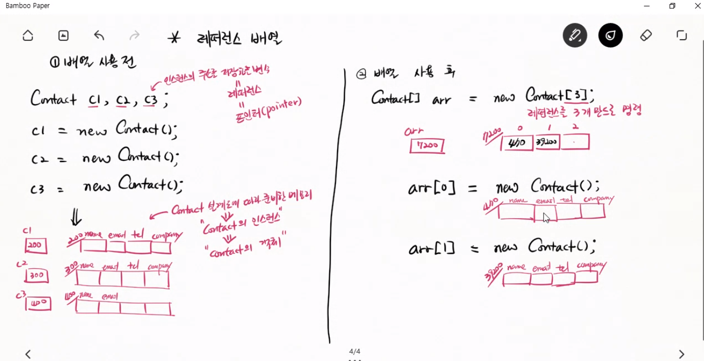
  - toString : 선언한 변수를 한줄의 문자열로 만들어줌
  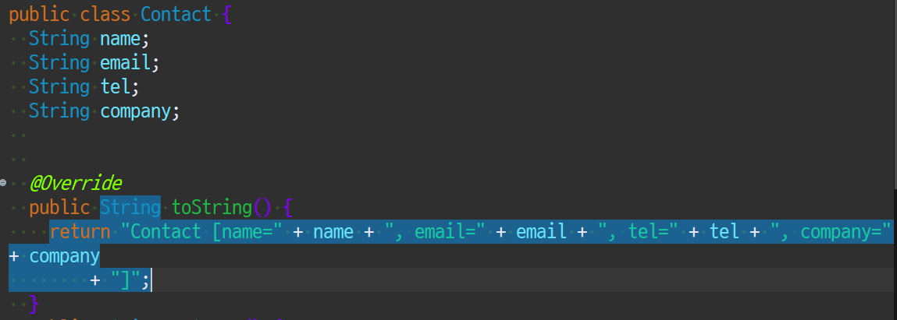

  ## Spring Boot와 클래스 파라미터(get, set메서드)
    - 웹 서버에서 각 파라미터를 요청 (add?name=aaa&email=aaa@test.com 등) -> 스프링부트는 페이지컨트롤러(ContactController)의 요청핸들러(add()메서드) 를 호출하기 전에 add()에 선언된 클래스 인스턴스를 생성한다.
    그 후 요청파라미터값(name=aaa&email=aaa@test.com 등)을 그 인스턴스 각 변수에 저장(name에 aaa, email에 aaa@test.com 저장)
    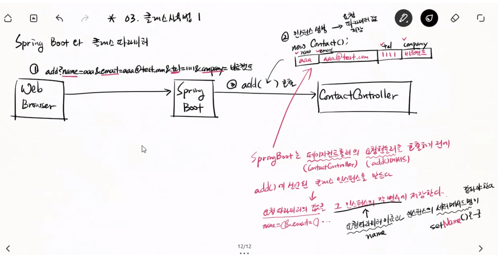
    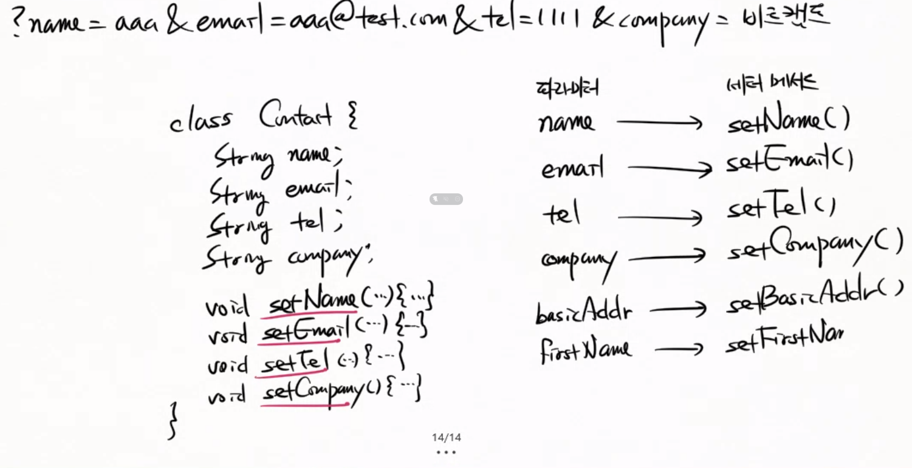
    -> String으로 선언한 변수명은 쿼리스트링의 파라미터와 관련없다.
    -> 세터메서드는 쿼리스트링의 파라미터와 관련있다.
    -> 쿼리스트링의 파라미터와 세터메서드
    name -> setName
    email -> setEmail
    tel -> setTel
    company -> setCompany
    basicAddr -> setBasicAddr
  - 레퍼런스와 인스턴스 변수
    - 인스턴스 변수에 값저장
   ```java
    Contact c = new Contact()
    c(인스턴스 주소를 알고있는 레퍼런스).name(인스턴스 변수) = "홍길동";
    c.email = "test@test.com";
    c.tel  = "1111";
    c.company = "비트";
   ```
   - 인스턴스 변경
   ```java
   c = new Contact()
   c.name = "임꺽정";
   c.email = "leem@test.com";
   c.tel =  "2222"
   c.company = "캠프";   
   ```

- web ex04 객체
  - 기본 틀(원형 객체) 없이 빈 객체 만들기
  ```javascript
  var obj1 = Object.create(null);
  var obj2 = new Object;
  var obj3 = {};
  모두 같은결과, 빈객체 생성
  ```
  - ex04/exam02.html
  
   Object 라는 생성자가 초기화한 object(객체)라는 의미.
  - javascript에서 프로퍼티 변수를 사용할 때는 java와 달리 this.를 생략할 수 없다
  ```javascript
  var obj = new Object();

  obj.name = "홍길동";
  obj.kor = 100;
  obj.eng = 90;
  obj.math = 80;
  obj.toString = function() {
	return this.name + "," + this.kor + "," + this.eng + "," + this.math;
  };
  ```
  - javascript 객체 생성과 JSON
  ```javascript
  <jvascript 객체> 
  { name : "홍길동"
    "email" : "a@test.com"
    'tel' : '1111'
    프로퍼티명, value는 "", '' 둘다 사용가능
  }
  <JSON(Javascript Object Notation) 문자열>
  { "name" : "홍길동"
    "email" : "a@test.com"
    "tel" : "1111"
  }
  JSON형식 데이터의 프로퍼티명은  반드시 문자열 형식으로 사용해야하고, 문자열은 ""를 사용해야한다.
  ```
```javascript
var obj = {
	sum: () => this.kor + this.eng + this.math,
	aver: () => this.sum() / 3,
}; 
화살표 함수로 객체를 정의할 때 this.는 window객체를 가리키게 된다.
```
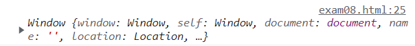
-> 때문에 객체의 멤버 함수로 등록할 때는 화살표 함수는 가급적 사용하지 않는다.

- 객체 생성과 초기화의 다양한 방법
  ```javascript
  1)
  var s1 = new Object();
  s1.name = "홍길동";
  s1.kor = 100;
  s1.eng = 100;
  
  2)var scores = []; //new Array();
  scores[0] = new Object();
  scores[0].name = "홍길동";
  scores[0].kor = 100;
  scores[0].eng = 100;
  //배열을 이용해 객체를 생성하면 반복문을 돌릴 수 있다.
  for (var score of scores) {
  console.log(score.name, score.kor, score.eng,score.math, score.sum, score.aver);
  }
  
  3)function createScore(name, kor, eng, math) {
	var obj = new Object();
	obj.name = name;
	obj.kor = kor;
	obj.eng = eng;
  //함수를 이용해 객체를 생성하면 프로퍼티의 값을 일일이 지정하지 않아도 함수를 호출하여 파라미터에 값만 넣어주면 된다.
  var scores = []; // new Array();
  scores[0] = createScore("홍길동", 100, 100, 100);

  4)function createScore(name, kor, eng, math) {
	var obj = new Object();
	obj.name = name;
	obj.kor = kor;
	obj.eng = eng;
  obj.sum = function() { 
		return this.kor + this.eng;
  	};
  }
  //객체에 함수를 포함시킬 수 있다.
  ```


# 12월 22일
- 생성자
  - 함수 호출시 new로 초기화 하면 this.을 사용할 수 있다.(new명령으로 함수 호출 시 생성자 함수)
  - 객체에 대해 공통으로 사용하는 함수는 메모리 낭비를 방지하기 위해 생성자 객체 내의 prototype객체에 별도 보관한다.
  - new 명령후에 함수 호출하면 기본객체를 생성하고 그 객체 자체가 리턴값이 된다.
  - 하지만 new명령없이 함수를 호출하게 되면 리턴값이 없기 때문에 undefined가 된다.
  - 상속
    ```javascript
    function f1(n){
      this.name = n;

    }
    function f2(n, k, e, m) {
      //상위 생성자를 명시적으로 호출한다.
      f1.call(this, n);

      this.kor = k;
      this.eng = e;
      this.math = m;
    }
    var obj1 = new f2("홍길동", 100, 90, 80)
    -> 상위 생성자.call(this.상위 생성자의 프로퍼티)
    ```
## CSS

- ul : unordered list
    
   
- ol : ordered list
    
  
- 선택자
  - id : "#"으로 id를 구분
  - class : "." 으로 class를 구분
    - 여러 클래스에 소속되있는 경우 
    < li class="guest member" >와 같이 클래스명 클래스명 식으로 표기
  - tag  : tag명으로 구분
  - 부모태그 자식태그
    ```html
    <style>
    #부모 > ul {
      스타일 적용
    }
    #형제 + ul {
      스타일 적용
    }
    </style>
    <div id = "부모">
      <ul>
      </ul>
    </div> 
    div태그는 ul태그의 부모태그, 
    ul태그는 div태그의 자식태그이다.
    <div id = "형제">
      <ul>
      </ul>  
    </div>
    똑같은 ul 태그이지만 부모태그의 자식태그인 ul태그로
    특정지었기 때문에 부모태그 안에있는 ul태그에만
    style이 적용된다.
    형제를 id로 갖는 태그 + ul 태그로 지정하면 형제 id를
    갖는 태그 다음의 ul태그만을 지정하게 된다. 
    ```
    ```css  
      input[name^="office"] { 
        /* 속성의 값이 특정 문자열로 시작하는 경우*/}
    ```
## javascript
- 자바스크립트는 태그를 다룰 때 사용할 도구를 제공.
  - DOM(Document Object Model), API가 그 도구이다
    - DOM API -  doucument 객체

# 12월 23일
## 생성자 (예제 javascript 04-11-8)
- 모든 함수는 prototype을 가지고 있다.
- Object()함수에 prototype.test0추가
```javascript
Object.prototype.test0 = function() {
  console.log("test0()...");
}
```
- prototype안에는 constructor에 대한 정보가 들어있다
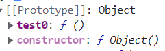
- prototype안에는 기본적으로 toString, valueOf, constructor정보 등이 보관되어 있다.
- Object()상위 생성자의 prototype은 null(Object생성자가 최상위이기 때문에 상위생성자가 없다.)
- 생성자 상속
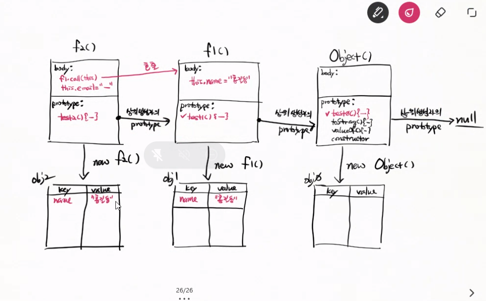
- instanceof 오른편 생성자, 왼편 객체주소
 ex) obj1(객체명) instanceof Object(생성자)

- 함수 소속 프로퍼티와 객체 소속 프로퍼티
  - JSON.passe()(함수 소속)
      JSON.parse('{"name" : "홍길동", "age" :20}')
  - JSON.stringify()
  -  Array.prototype.push() (객체 소속)
      var arr = new Array();
      arr(객체).push(프로퍼티명)("aaa")
  - 특정 객체를 다루지 않는 프로퍼티는 함수에 소속시켜라
    ```javascript
    Score.count = 0; /* 몇명의 학생을 
    만들었는지 특정하지 않는 프로퍼티이기 
    때문에 함수에 소속시켰다*/
    Score.count++;
    var values =  csv.split(",");
      return new Score(values[0], parseInt(values[1]), parseInt(values[2]), parseInt(values[3]))
    }
    ```
  - 특정 객체를 다루는 프로퍼티는 prototype에 소속시켜라
  ```javascript
  Score.prototype.sum = function() {
    return this.kor + this.eng + this.math;
  };
  Score.prototype.aver = function () {
    return this.sum() /3;
    };
  var score1 = Score.create("홍길동,100,100,100")
  console.log(score1.sum(), score1.aver());
  /*sum, aver는 특정학생, 홍길동학생의 점수의
   합산, 평균을 다루기 때문에 prototype에 넣었다.*/
  ```
- Document.getElementById -> Document함수에 소속된 것이 아니라 Document.prototype에 소속되어 있는 것이다  -> 그 객체에 대해 사용할 수 있다는 의미.

javascript ex 05 01~

- getElementsByTagName은 HTMLCollection 객체를 리턴한다.
- 이 객체는 배열이 아니기 때문에 for...in 반복문을 사용하게되면 인덱스 번호에 포함되지 않은 프로퍼티 까지 반복되게 된다.
- 그래서 일반적으로 for...of 반복문을 사용한다
ex05 0번에서 끝까지

# 12월 24일(ex06 - 1~)
## 이벤트 다루기
- 이벤트 발생할 때 호출되는 메서드
  - 리스너(Listener) = 이벤트 핸들러(Event handler)
- 이벤트 종류
  - click 이벤트
    - 태그 속성에 onclick 속성 넣기
    ```javascript
    ex1) 
    <button onclick ="자바스크립트 코드">
    //onclick에 직접 자바스크립트 코드 등록
    ex2) 
    <button id="btn1-2" onclick="btn1Click()">버튼1-2</button>
      function btn1Click() {
        var str = "Hello";
        window.alert(str);
        }//함수를 따로 등록해놓고 onclick에서 함수를 호출
    ex3) 
    var btn2 = document.getElementById("btn2");
    // var btn2 = document.querySelector("#btn2")
    btn2.onclick =f1;
    둘 중 아무거나 사용하면 됨.
    // btn2에 객체 멤버로 on클릭을 등록하는 방법
    ex4)
    btn2.onclick = function() {
    var str = "Hello2b!";
    window.alert(str);
    console.log(this); 
    //일반 함수에서 this가 가리키는 객체는 현재 소속된 객체(btn2)이다.
    /* 익명함수를 정의하고 정의된 함수 객체
    주소를 onclick이란 이름으로 btn2에 
    저장하겠다는 의미(onclick에 직접저장하는 것 아님)*/
    객체에 저장하는 속성 : property
    속성 값 : value
    ex5)
    btn2.onclick = () => {
      var str = "Hello2c!";
      window.alert(str);
      console.log(this);
    }
    //화살표 함수에서 this가 가리키는 객체는 window객체이다
    ex6)
    var btn3 = document.querySelector("#btn3");

    btn3.addEventListener("click", btn3Click);
    // 함수 정의 전에 함수를 호출해도 호이스팅 도기 때문에 상관 없다.
    function btn3Click() {
      var str = "Hi2!!";
      window.alert(str);
      console.log(this); // this는 btn3 객체이다.
    } 
    
    ex7)
      btn3.addEventListener("click", function() {
      var str = "Hi2!!";
      window.alert(str);
      console.log(this); // this는 btn3 객체이다.
    });

    보통 한개의 이벤트만 등록할 때는
    btn.onclick = () => {
    }
    방식을 자주 쓴다.
    ```
- 리스너 실행 순서
  - 리스너를 등록할 때 한가지 종류로만 등록해야 유지보수가 용이하다.
  - 태그에 직접 onclick을 등록하고, 태그 객체에 onclick을등록했다면 태그 객체에 등록한 것이 덮어쓴다.
  ```javascript
  우선순위1) btn1.onclick = () => {
    var str = "Hello2";
    window.alert(str);
    };

   우선순위2)btn1.addEventListener("click", () => {
      var str = "Hello3";
      window.alert(str);
  });

  우선순위3)<button id="btn1" onclick="var str='Hello1'; window.alert(str);">버튼1</button><br>
  ```
 ```javascript
 <button id="btn1" onclick="btn1Click(event)">버튼1</
 button><br>
 태그에 이벤드 객체이름은 (event)를 반드시 써야 한다
 ```
  - ***id가 부여된 태그는*** window 객체를 통해 바로 접근할 수 있다.
  window.btn1.onclick = function() {
	console.log("test..ok!");
    }; 
    하지만 window변수는 글로벌 변수이기 때문에 변수이름을 덮어 쓸수 있기 때문에 주의해야 한다.
- 태그의 속성값 꺼내기
  ```javascript
  <button id="btn1" data-no="100">버튼1</button><br>
  document.getElementById("btn1").addEventListener("click", function(e) {
	console.log(this); 
	console.log(this.getAttribute("data-no"));
  console.log(this["data-no"])// 임의로 태그에 속성에 
  //추가한 방법은 getAttribute없이 꺼낼 수 없다.
  ------------------------------------------------
    // arrow function인 경우 
    // this는 window 객체를 가리킨다.
 
  document.getElementById("btn1").addEventListener("click", (e) => {
  console.log(this); // window 객체이다.
  
  // 그럼 arrow function(자바에서는 Lambda라 부른다)에서는 
  // 이벤트가 발생된 객체를 알 수 없는가?
  // => 있다!
  //    이벤트 객체에 이벤트가 발생된 태그의 주소가 들어 있다.
  console.log(e.target);
  ```
- 이벤트 발생과 전달 과정
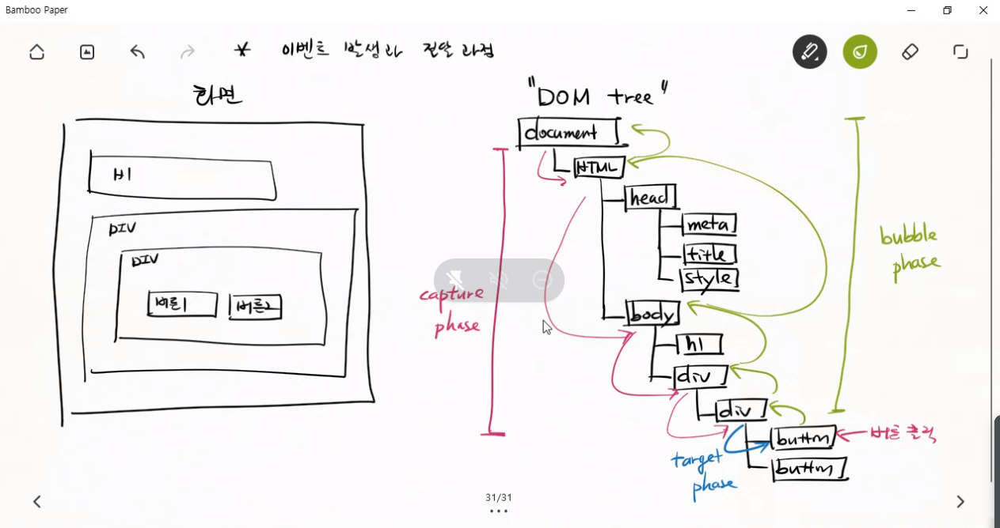
이 그림에서 HTML은 root element라고 한다.
- d1 클릭하면 이벤트 리스너 호출된다, 거기서 실행이 끝나는게 아니라 부모 태그인 body태그로 다시가서 이벤트 리스너가 있는지 찾는다.
- 찾으면 부모태그인 body태그의 이벤트리스너도 호출한다. -> 의도하지 않은 작업이 실행될 수 있다.
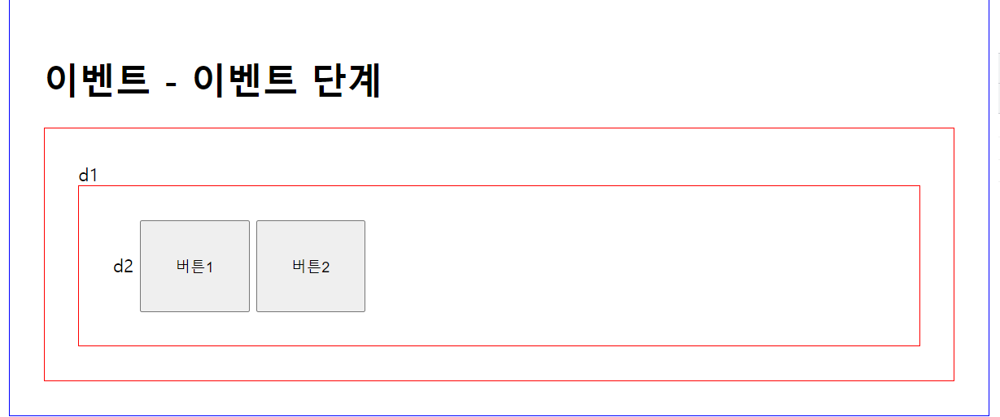
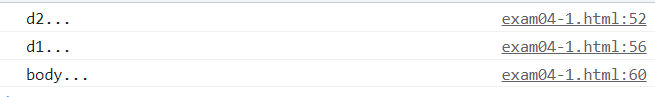
d2만 클릭했는데 d1, body에 등록되어있는 이벤트리스너도 호출된다.
  - target단계뿐만아니라, bubble단계에서도 이벤트리스너가 호출됨을 주의하자.
  - 이를 막기위해서 stopPropagation(전파 중지)를 쓴다
- 직접 이벤트 실행하지 않고 이벤트 발생시키기
  ```javascript
   <button id="btn1">버튼1</button>
   document.getElementById("btn1").addEventListener(function(e){
     var myEvent = new MouseEvent("click")
     document.getElementById("btn2").dispatchEvent(myEvent)
   })
   document.getElementById("btn2").addEventListener("click", function(e) {
    console.log("버튼2...");
    });
   btn2에 이벤트객체 myEvent를 dispatchEvent를 통해 보낸다
   이렇게 하면 직접 btn2를 클릭하지 않아도 btn1을 눌렀을 때
   btn2를 클릭하면 실행되는 작업이 수행되게 된다.
  ```
- 기본 작동을 막는 명령
  - return false
  - preventDefault  
  - **주의** addEventListener()로 함수를 등록하면 return false 로 기본동작을 취소할 수 없다.
  - onclick로 함수를 등록했을 때만 return false로 취소할 수 있다.
  - preventDefault는 onclick, addEventListener 상관없이 기본동작 취소 가능하다.
- button type 지정안하면 defalut가 submit이다

# 12월 27일
## 클래스 사용법 : 메서드 분류하기(mylistboot- app순서별로 확인하기)
- 한 개의 클레스에 여러 역할을 수행하는 메서드가 있다
  - 다른 클래스에 동일한 일을 하는 메서드가 중복될 가능성이 높다.
    - 개선 방법은, 한 클래스가 한가지 역할만 담당하게 하는 것이다.(유지보수에 용이)
    - GRASP 패턴의 "High Cohesion" 설계 기법(높은 응집력)
**이클립스 컨트롤 f누르고 리플레이스 올하면 모든단어 변화**

# 12월 28일
- fetch는 서버에서 데이터를 받아올 때 javascript가 사용할 수 없는 타입의 데이터를 받아온다.
- 때문에 .json으로 javascript가 사용할 수 있는 객체 형태의 타입으로 바꿔준다.
- 기본 클래스의 부모 클래스는 기본적으로 Object 클래스이다.
- 게시판 만들기.
  
# 12월 29일
- 보드 객체를 add에서 요청하면 클라이언트 객체를 담아서 나한테 줘라고 add에서 요청해서 준다는뜻
    - add(Board board)
    - Board클래스 자체가 객체이다
  - span 태그 : UI에 영향 끼치지 않고 contents의 영역 분리에 사용.
- 인스턴스 멤버 사용법 : 인스턴스 필드 활용하기
  - ArrayList안에 add(), toArray(), set()등 메서드들이 있다.
  - ArrayList에는 Object[]배열이 있다. 위의 메서드들은 Object[]배열을 사용한다
  - ArrayList2에도 ArrayList에 있는 메서드가 있기 때문에 중복이 일어난다.(기능 변경,추가를 어렵게 한다 - 유지보수에 방해)
  - 같은 일을 하는 클래스가 여러개 존재하는 문제 발생.
  - 즉 ArrayList에 변경사항이 발생하면 ArrayList를 복사해서 만든 클래스들도 변경해야 한다.(매우 번거로워진다.)  
  - static 필드 대신 instance필드를 사용하여 코드를 공유하기.
    - ArrayList안에 있는 add(), toArray(), set() 등의 메서드
    - {list: Object[], size : int,} : 인스턴스 필드 = new ArrayList()를 선언하면 list라는 배열과size라는 변수(ArrayList의 인스턴스) 생성. 
    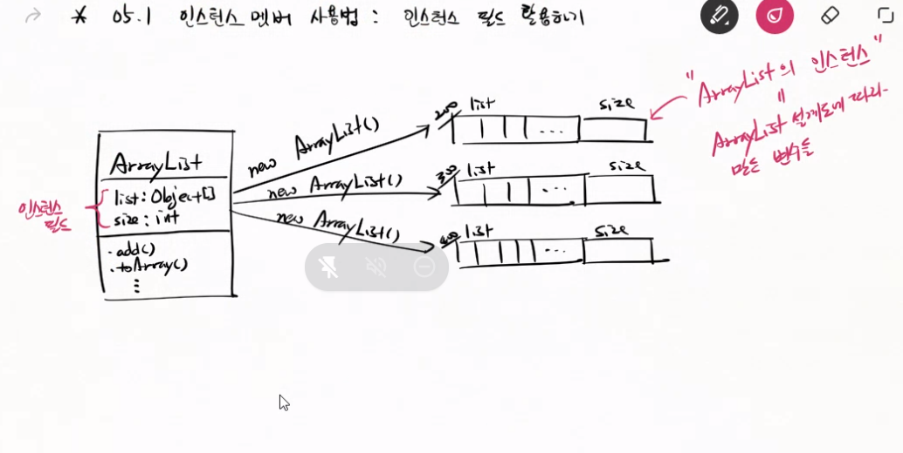
    - add(), toArray() => 실행할 때 사용할 인스턴스 주소를 알려준다.
      - add(ArrayLlist(사용할 인스턴스 주소를준다, 인스턴스 주소에 따라 add()가 사용하는 배열이 결정된다.), Board)
      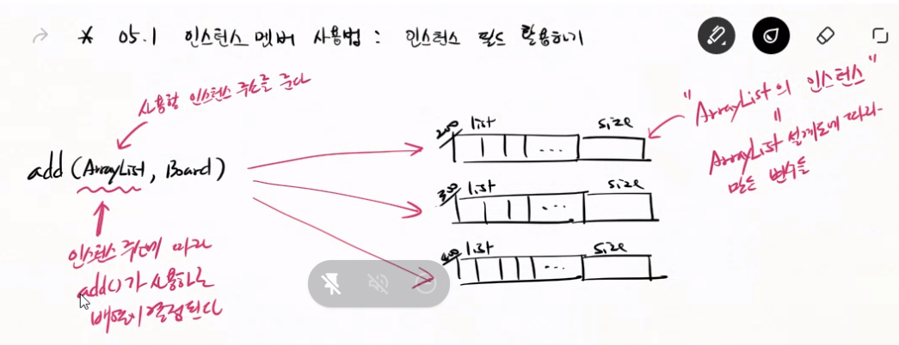
    - contactcontroller, boardcontroller, todocontroller 모두 같은 클래스 ArrayList를 사용한다
    - 보드컨트롤러가 호출하면 400번지인 list배열의 주소를 add란 메서드에 전달하면 , add는 400번지 주소 배열에 board란 객체값을 저장한다.
    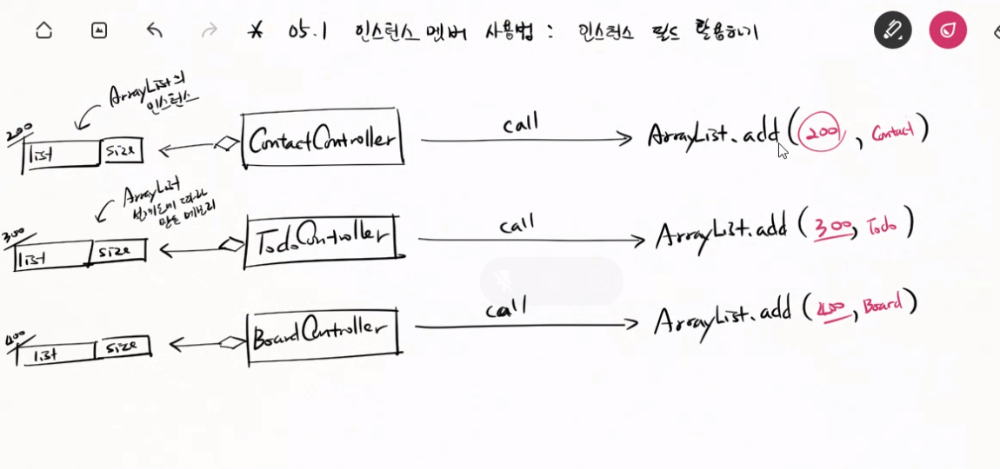
    - 웹브라우저에서 /board/add?t=aaa&c=bbb 라는 요청을 Spring Boot에 보냄
      - add(Board board)메서드를 호출하면 : new Board()란 객체를 스프링부트가 생성
      - 빈 new Board()객체를 add(Board)에 주는것이 아니라 클라이언트가 쿼리스트링에 요청한 t=aaa&c=bbb라는 데이터값을 담아서 준다.
      -  담는 기준은 파라미터 이름(t,c)과 일치하는 세터 메서드(프로퍼티)를 찾는다.
      - add(Board board)의 의미는 클라이언트가 요청한 쿼리스트링의 파라미터명과 일치하는 세터메서드를 호출해서 new Board()객체에 담아서 add의 파라미터로 넘겨줘라.
      ex) 클라이언트가 add?t=aaa라고 요청했으면 t라는 세터메서드가 없기때문에 null값을 리턴한다. 
      public void setTitle(String title) {
       this.title = title;
      }

# 12월 30일

- static 멤버와 non-static 멤버
  - static(클래스) 필드와 static(클래스) 메서드
   ArrayList클래스
   { static Object[] list = new Object[5];
    static int size;} => 클래스 소속
   { static void add() {}
    static Object remove(){} } => 같은 클래스 소속인(static멤버) static필드에 직접 접근 가능
  
  - non-static(인스턴스) 필드와 static(클래스) 메서드
     ArrayList클래스
   {  Object[] list = new Object[5];
      int size;} => 인스턴스 소속
   { static void add() {}
    static Object remove(){} } => 클래스소속. 클래스 소속메서드는 인스턴스 필드에 직접 접근 불가.
    메서드 호출시 인스턴스 주소를 알려줘야 한다.
  
  - non-static(인스턴스) 필드와 non-static(인스턴스) 메서드
     ArrayList클래스
   { Object[] list = new Object[5];
     int size;} => 인스턴스 소속
   { void add() {}
     Object remove(){} } => 인스턴스 소속
     인스턴스 소속 메서드에서 인스턴스 소속 필드에 빌트인 변수인 **this**를 사용하여 인스턴스 멤버에 접근한다.(메서드를 호출할 때 파라미터로 인스턴스 주소를 알려줄 필요가 없다. 대신 메서드 앞에 인스턴스 주소를 적어야 한다.)
 - ArrayList 메서드를 호출할 때 인스턴스 주소를 파라미터로 넘기지 않고 메서드 호출 앞 부분에 넘긴다
    - ArrayList 메서드 호출할 때 인스턴스 주소를 앞쪽에 넘긴다
 - ArrayList의 메서드를 인스턴스 메서드로 전환하기
  - 메서드를 호출할 때 앞쪽에서 전달한 인스턴스 주소를 받을 수 있도록 인스턴스 메서드로 선언한다.  
  - 메서드 정의에서 static 키워드 제거
  - 빌트인 변수 this를 사용하여 인스턴스 변수에 접근
  
- 패키지 사용법 : 클래스 분류하기 + public 접근 제어
  - 클래스를 관리하기 쉽도록 역할 별로 패키지에 분류한다.
    - 도메인 역할을 수행하는 클래스를 별도의 패키지로 분류한다
    데이터 타입 역할을 수행하는 클래스를 **도메인** 클래스라 부른다.
    - com.emocs.mylist.domain 패키지 생성
    - Contact, Todo, Board 클래스를 domain 패키지로 이동
      - 필드의 기본 접근 범위는 패키지다.
      - 즉 같은 패키지에 소속된 클래스만이 접근 가능하다.
      - 다른 패키지에서 접근 하고 싶다면 직접 변수를 사용하지 말고 setter/getter를 이용하라.
    - com.eomcs.mylist.XxxController 클래스 변경
      - 도메인 클래스의 필드를 사용할 때 setter/getter를 사용한다.
    - com.eomcs.util 패키지 생성
      - 특정 프로젝트에서만 사용되는 클래스가 아니라면 보통 그룹 패키지 밑에 둔다.
      - 다른 패키지에서 메서드를 사용할 수 있도록 public 으로 공개한다.
      - 외부에서 직접 필드를 접근하지 못하도록 만든다.
      - 대신 그 값을 꺼내거나 설정할 수 있도록 setter/getter메서드를 추가한다.
        - size() 추가
        - get(int) 추가
      - com.eomcs.mylist.XxxController클래스 변경
        - ArrayList 클래스 변경에 맞춰 size대신 size()를 사용한다.
        - list 배열을 직접 접근하는 대신 get()을 사용한다.
      - 페이지 컨트롤러 역할을 수행하는 클래스를 contoroller 패키지로 분류한다.
        - com.eomcs.mylist.controller 패키지 생성
        - XxxController 클래스를 controller 패키지로 이동한다.
 -----------------------------------------------------------------------------------------------
  - java-lang oop ex01
    - 클래스는 원시 데이터타입을 제외하고, 사용자가 원하는 데이터타입을 정의할 수 있도록 정의하게 해주는 문법이다.
    - 이것을 사용자(개발자) 정의 데이터타입(user defined data type)이라고 한다.
    - 새 데이터 타입의 이름은 대문자로 시작한다.
    - ex01.Exam0114
      Method Area
      class Exam0114 {
      }
      class Score{
      }
      JVM Stack
      로컬변수는 JVM Stack에 생성됨.
      s, name, kor, eng, math

      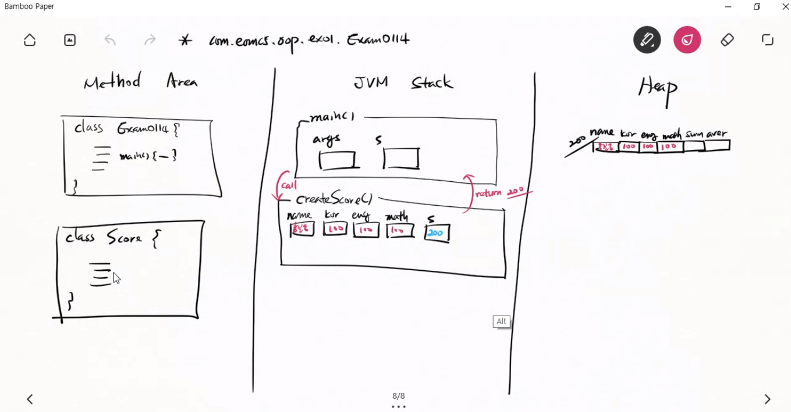
      메서드 호출이 끝나면 JVM Stack에 있던 로컬변수는 사라진다.
    - com.eomcs.oop.ex01.Exam0210
      - 레퍼런스 Score s1, s2, s3
      - s1 = new Score()
      - s2 = new Score()
      - s3 = new Score()
      각각의 메모리를 생성하고, 객체를 생성한 후  레퍼런스 주소에 저장.
      new 명령어로 생성된 것들은 모두 heap 메모리에 저장.
      - 배열로 레퍼런스 생성
      Score[] arr = new Score[3]
      레퍼런스 배열에 각각 인스턴스를 저장한 후 사용해야 한다.
      arr[0] = new Score();
      arr[1] = new Score();
      arr[2] = new Score();
      - 자바에서는 인스턴스 배열을 만들 수 없다.
      - 레퍼런스만 배열로 만들 수 있다.
    - ex01.Exam0310
    - main 메서드 호출하면 args, s1, s2생성
      class Scrore{
        String name;
        int eng;
        int math;
        int sum;
        float aver;
      }
      Score s1
      s1 = new Score() => s1주소에 name, eng, math, sum, aver 인스턴스 저장.
      그후 새로운 인스턴스를 다시 s1에 저장
      s1 = new Score() 기존에 있던 인스턴스 들은 사용할 수 없는 garbage가 된다.
      s2 = new Score()
      
# 12월 31일
##oop ex01 Exam0410~
- 클래스 블록과 .class 파일
  - 메서드 안에 선언된 클래스 = 로컬 클래스
  ```java
  package com.eomcs
  
  public class A { ->A.class
    class B{} -> A$B.clss(일반 클래스는 그냥 $만 붙음)
    void main(){
      class C{} -> A$1C.class(첫번째 로컬 클래스 $1로 구분)
    }
  }
  class D{} ->D.class
  패키지 안에 속해있는 클래스들을 패키지 멤버 클래스(= Top level클래스).
  B와 C클래스 같은경우 중첩클래스(nested)라고 한다.
  B는 non-static중첩클래스(= inner class), C는 로컬 클래스로 다시 분류된다.
  ```
- static 멤버와 non-static 멤버 간의 접근 규칙
  - static멤버 <------> non-static 멤버
    - static 멤버가 non-static멤버에 접근하려면 인스턴스 주소를 지정해야 한다.
    - non-static멤버가 static멤버를 사용할 때는 인스턴스 주소 없이 클래스 이름으로 접근 가능하다.
- 패키지 멤버 클래스 : default vs public
  - com/eomcs/oop/ex01/class X{} ,public class Y{}public class Exam0610{}, sub/class X2{}, public class Y2{}
  
   public이 안붙으면 해당 패키지 안에서만 사용할 수 있는 클래스이다.
   public이 붙으면 다른 패키지에서도 접근가능 하다.
- 같은 패키지내에 있는 클래스는 public의 여부 관계없이 접근할 수 있다.
- 하지만 다른 패키지의 클래스에 접근하는 경우 public이 붙은 클래스에만 접근 가능하다.
- 다른 패키지 클래스에 접근하는 경우 다른 패키지명 경로 전체를 입력해야한다.
- 다른 패키지 클래스 사용할 때마다 패키지명 모두 다적어주면 코드가 너무 길어진다.
- 그래서 import를 사용한다. import는 패키지명 다음에 위치해야 한다.

- 메서드 호출과 로컬 클래스 정의
  - 메서드가 호출될 때마다 안에 있는 클래스가 계속 정의 되는가? 아니다. 컴파일 될 때 메서드 안에 있는 클래스 코드가 따로 분리된다.

- 클래스 문법
  - 메모리 유형 설계
  ```java
  class Score {
    String name;
    int kor;
    int eng;
    int math;
    int sum;
    float aver;

    Score s = new Score()
  }
  ```
 Score s = new Score를 하게 되면
  - JVM Stack
  arg
  s

  - Heap
  200번지 주소(name, kor, eng, math, sum, aver : Score 설계도에 따라 준비한 변수들 - Score의 인스턴스,객체) 변수가 연속적으로 Heap메모리에 만들어진다.
  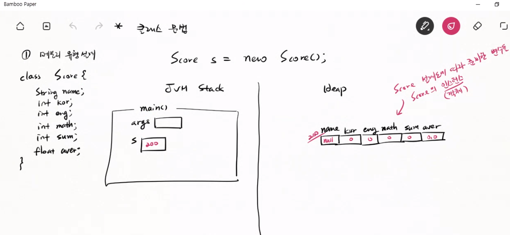
- 클래스 문법 - 사용자 정의 데이터 타입
 ```java
  class Score {
    String name;
    int kor;
    int eng;
    int math;
    int sum;
    float aver;

    Score s = new Score()
    public static void calculate(Score score) {
      score.sum = score.kor + score.eng + score.math;
      score.average = score.sum / 3f;
      
    }
  }
  ```
  
    - void calcuate() -> 파라미터를 안받는대신
      내장변수 this. 을 사용한다
      this.sum = this.kor ....
    - s.calculate(); => 인스턴스 주소s를 메서드 calculate()에 전달. 메서드의 내장변수 this에 저장됨.
- 클래스 정의
  - 데이터를 저장할 메모리 구조 설계(인스턴스 필드 선언)
  - 새 데이터 유형을 다룰 연산자 정의(메서드 정의)
  - 스태틱으로 정의한 메서드 호출 클래스이름.메서드(연산자가 다루고자하는데이터)
  - 논스태틱 정의한 메서드 호출 연산자가 다루고자하는데이터.연산자()
  ```java
  class Score {
    String name;
    int kor;
    int eng;
    int math;
    int sum;
    float aver;

    static void calculate(Score score) {
      score.sum = score.kor + score.eng + score.math;
      score.average = score.sum / 3f;
      
    }
    public static void main(String[] args) {
    Score s = new Score();
    s.name = "홍길동";
    s.kor = 100;
    s.eng = 90;
    s.math = 85;
    Score.calculate(s) 
    클래스명.연산자(다루고자하는데이터)
    -->static을 제거하고 , 클래스명 대신 클래스 내장변수인 this를 사용해 인스턴스에 접근한다.
    class Score {
    String name;
    int kor;
    int eng;
    int math;
    int sum;
    float aver;

     void calculate(Score score) {
      this.sum = this.kor + this.eng + this.math;
      this.average = this.sum / 3f;
      
    }
    public static void main(String[] args) {
    Score s = new Score();
    s.name = "홍길동";
    s.kor = 100;
    s.eng = 90;
    s.math = 85;
    s.calculate() ;
    사용할 데이터타입을 파라미터로 받지 않고 앞으로 빼서 사용한다.
    }
  }
  
  ```
- 인스턴스 메서드는 인스턴스의 주소를 this라는 내장 변수에 자동으로 받는다. 

# 2022년 01월04일(OOP ex03 Exam 130~430)

- Web Browser가 /board/list/를 SpringBoot에 요청
- SpringBoot는 BoardController에게 요청
- BoardController가 요청받은 작업을 처리하여 SpringBoot에게 전달
- SpringBoot는 그 요청받은 작업 데이터를 json형식에서 Javascript가 읽을 수 있는 형태로 바꿔서 전달(.json명령어) 
- Heap 영역에 만들어진 메모리 : non-static(= instance변수)변수
- new () 명령어 실행하는 순간 Heap에 생성됨
- 주소를 가지고 있는 레퍼런스.xxx로 접근
  ex) s1.name = "홍길동"
- 클래스 로딩(loading) : 외부 저장장치(HDD, SSD등)에 보관된 .class 파일 읽어서 메모리에(RAM) 복사한다.
- 저장(Save)은 메모리(RAM)에서 데이터를 외부 저장장치에 보관하는 작업
- instance 변수(필드) = non-static 변수(필드)
  - 클래스를 로딩하는 순간 자동 생성된다.
  - 클래스와 함께 "Method Area"영역에 존재한다.
  - 클래스 이름으로 접근하여, 클래스 변수라고 한다.
  - 클래스 변수는 클래스가 로딩될 때 생성되기 때문에, 클래스에 대해 딱 한 번 자동으로 생성된다.
- Heap영역에는 method가 생성되지 않는다. new()명령어를 실행했을 때 생성되는 변수가 저장된다.
- 클래스 변수와 인스턴스 변수
- 1)이클립스에서 run버튼 누르면 method area에 Exam0140의 클래스파일을 로딩한다.
  - 하지만 Exam0140이 품고있는 클래스가 같이 로딩되지는 않는다
- 2)로딩후 main() 메서드를 호출한다.
  - 이 때 JVM Stack에 args, p, p2 등(로컬변수들)이 준비된다.
- 3) 그 후 Exam0140이 품고 있는 class A가 method area에 로딩된다
  - 로딩되면 스태틱필드가 method area에 생성된다.
  A.v1 = 100;을 실행한다.(static붙은 변수는 method area에 생성)
- 4) A클래스의 인스턴스를 만들 때 static이 붙지 않은, non-static(instance)변수 v2는 Heap에 생성한다.  - new A()실행
  - JVM Stack에 있는 p에 (인스턴스 주소 저장)
  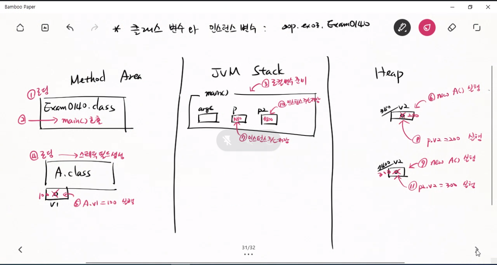
- 인스턴스 메서드와 클래스 메서드
  - static이 붙지 않은 메서드(인스턴스 메서드)는 호출하려면 인스턴스 주소가 있어야 한다.
  - 인스턴스 메서드는 this라는 내장변수가 존재(유효한 인스턴스 주소가 this에 들어있어야 함), static 메서드에는 존재하지 않음(this사용 불가능).
  - 인스턴스를 생성할 때 클래스에 대한 정보가 추가된다.
   ```java
   new A(); -> 클래스에 대한 최소한의 정보가 들어있다.
   ```
- 변수에 유효하지 않은 인스턴스 주소가 들어가 있으면 null point exception에러 발생
  ```java
  A obj2 = null;
  obj2.m2(); -> 컴파일 오류는 발생하지 않지만 실행 오류 발생.
  ```
- 실무에서는 일단 메서드는 인스턴스로 선언.
- 인스턴스 변수를 사용하지 않는 것이 확실할 때 클래스 메서드로 선언하라.
- 원시 데이터타입(int, short, long, double, float, String, char,Boolean) 8개를 제외한 모든 변수는 인스턴스의 주소를 담는 레퍼런스타입이다.
- 인스턴스 멤버(변수와 메서드) Exam0230

```java
int i; 자체는 변수가 아님 -> 메모리를 만드는 명령문(변수선언)
i = 100; 
```
- 인스턴스 변수를 사용하지 않고 파라미터 값을 갖는 경우 클래스 메서드로 정의한다.
- 생성자
  - 클래스 이름과 같은 이름으로 만든 메서드.
  - 리턴 타입을 선언하지 않는다. 즉, 값을 리턴하지 않는다.
  ```java
   static class Score {
    String name;
    int kor;
    int eng;
    int math;
    int sum;
    float average;

  Score() {
    System.out.println("Score()"));
  }
          }
   생성자 명은 클래스명과 반드시 일치해야 한다.
  ---------------------------------------------------------
  Score(타입) obj(레퍼런스) = new Score(클래스명)();
  ```
- 생성자 활용 => 인스턴스 변수를 초기화시킨다.
```java
Score obj = new Score("aaa", 100, 90, 80);
-> ex03-Exam0420
1. obj에 인스턴스 주소 할당
2. new Score 설계도에 따라 변수 생성
name에 null, 나머지에 0을 기본 값으로 저장.
3. 각각의 변수에 입력한 값 aaa, 100, 90, 80 저장, compute()호출하여 sum, average 실행.

```
- 호출될 생성자를 결정하는 방법
```java
class Score {

} 
Score(){}
Score(String){}
Scroe(String, int, int, int){}

new Score();
new Score("aaa");
new Score("aaaa",100,90,80,80);
new Score(80,90,100); -> 숫자만 3개받는 생성자는 존재하지 않기때문에 컴파일 오류 발생
생성자가 여러개일 때 파라미터에 전달하는 값으로 호출할 생성자를 결정한다.
```

# 22년 01월 05일(ex03 Exam0430~)

- 생성자를 한 개라도 만들었다면 컴파일러는 기본 생성자를 만들지 않는다.
- 파라미터가 있는 생성자를 만들었다면, 파라미터 갯수, 타입에 맞는 값을 호출해야 한다.
- 생성자는 여러개 만들 수 있다. 여러개의 파라미터중 어떤 생성자를 호출할 지는 파라미터의 값으로 결정 한다.
- 생성자 내에서만 다른 생성자를 호출할 수 있다. 일반 메서드에서는 다른 생성자를 호출할 수 없다.
```java
public static void main(String[] args) {
this("오호라!")
}
```
- 스태틱 변수는 자동으로 초기화되지만, 로컬 변수는 초기화 작업을 수행해야 사용할 수 있다.
- 인스턴스 변수 또한 new() 작업을 수행하는 즉시 자동으로 초기화 된다.
- 클래스는 스태틱 메서드를 호출할 때 클래스가 로딩된 상태가 아니라면 클래스를 로딩한다.
- 클래스가 로딩되면 스태틱 초기화 블록이 실행된다.
  - 클래스 로딩되는 경우
    - 스태틱 필드나 스태틱 메서드 사용할 때
    - new명령어 사용하여 인스턴스 생성할 때
- 각각의 스태틱 블록에 있는 로컬변수가 이름이 같아도, JVM이 내부적으로 다른 주소의 변수로 관리하기 때문에 충돌이 일어나지 않는다. 
- 작성된 순서대로 실행시킨다.
- Exam 0670 
 - static int a; 명령만 실행했을 때는 클래스 파일을 확인해보면 static블록이 없다.
 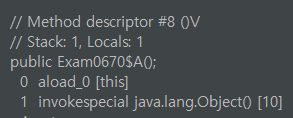
 - 하지만 static int a = 100; 명령을 하면 클래스파일에 static 블록이 생성된다
 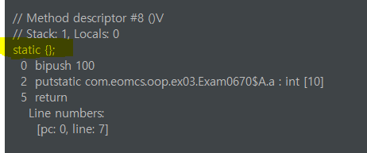
 - static int a = 100; 문장은
 - static int a
    static {
      a = 100;
    }
    이 문장으로 바뀐다

- 인스턴스 초기화 블록
  - 인스턴스 초기화 블록은 인스턴스 블록의 순서에 상관없이 생성자의 맨 앞부분에 삽입된다.
  - 생성자가 여러개라면 모든 생성자 앞 부분에 자동으로 삽입된다. 
  - 여러개의 초기화 블록이 있다면 작성된 순서대로 생성자 앞 부분에 삽입된다.
  ```java 
  static class A {
    int a;
    int b;
    int c;
    {
      a = 100;
      System.out.println("hello");
    }
    -> 생성자가 없을 때 
    public A(){
      a = 100;
      System.out.println("hello");
    }
    ->인스턴스 블록은 사라지고 자동으로 생성된
    기본 생성자 맨 앞부분에 인스턴스 블록의 내용이 오게 된다.
    생성자가 존재할 때는 존재하는 모든 생성자의 앞부분에 인스턴스
    블록의 내용이 삽입된다.
    -----------------------------------
    static class A{
      int a;
      int b;
      int c;
      A(){

      }
      A(int b){

      }
    }
    여러개의 생성자가 있을 때는 모든 생성자에 인스턴스 블록 내용이
    삽입된다.
    --------------------------------------
    여러개의 인스턴스 블록이 있는 경우 작성된 순서대로 생성자에 삽입된다.
  ```
- 변수 초기화 문장(인스턴스 필드)도 인스턴스 초기화 블록과 같은 기능을 한다.
- 인스턴스 초기화블록, 인스턴스 필드 초기화 문장이 같이 존재할 경우 작성된 순서대로
- 생성자 앞 부분에 삽입되게 된다.
- 자바 컴파일러는 인스턴스 초기화 블록, 인스턴스 필드(변수) 초기화 문장을 만나면 
- 종류 상관없이 생성자 앞부분에 복사한다.

# 22년 01월 06일(ex04, basic ex02 : Exam0110~ -S tring class )
- String은 문자열을 다루는 생성자 역할을 한다.
- String은 그 자체로 인스턴스 역할을 하고, 불변 객체이다.
- import java.util.Date;
- Date d1 = new Date(); -> 날짜 얻는 코드
- public static final int YEAR = 1; : public, static, final 은 modifier라고 한다.
- Immutable 객체와 String
  - new String("abc") : 처음 객체를 만들면 그 객체에 들어있는 값을 변경할 수 없다.
  - 즉, String 객체는 Imuutable(불변)객체이다.
  - primitive type과 wrapper 클래스
    - int -> java.lang.Integer
    - byte -> java.lang.Byte
    - short -> java.lang.Short
    - long -> java.lang.Long
    - float -> java.lang.Float
    - double -> java.lang.Double
    - boolean -> java.lang.Boolean
    - char -> java.lang.Char
## String 클래스 사용법
- String 리터럴은 상수풀에 같은 문자열의 인스턴스가 있다면 그 인스턴스의 주소를 리턴한다.
```java
String x1 = "Hello";
Srring x2 = "Hello";
x1 == x2; -> true
주소는 같고 인스턴스의 값을 비교하기 때문
```
- String 인스턴스는 인스턴스를 생성할 때마다 다른 주소값이 할당된다.
```java
String s1 = new String("Hello");
String s2 = new String("Hello");
s1 == s2 -> false
s1, s2의 메모리 주소가 다르기 때문에 
```
- intern()
  - String 객체에 들어있는 문자열과 동일한 문자열을 String constant pool에서 찾는다.
  - 찾으면 가지고 있는 문자열의 주소값을 리턴한다.
  - 없으면 String constant pool에 String 객체를 생성하고 그 주소값을 리턴한다.
  ```java
  String s1 = new String("Hello");
  String s2 = s1.intern(); // s2에는 s1에 생성된 String 인스턴스Hello가 없기 때문에 pool영역에 String객체 생성하고 주소값 리턴
  String s3 = "Hello";  
  s2 == s3 -> true
  s1 == s2 -> false
  ```
- equals
```java
String s1 = new String("Hello");
    String s2 = new String("Hello");
    System.out.println(s1 == s2); ->false
    System.out.println(s1.equals(s2)); ->true
    equals는 문자열 자체를 비교한다.(대소문자 구분)
    // 대소문자 구분없이 문자열을 비교하고 싶다면,
    System.out.println(s1.equalsIgnoreCase(s2));
```
exam 122,123은 상속 배운후에 할것
- Spring Boot와 객체들
  - 1) Spring Boot 실행
  - 2) App 클래스가 소속된 패키지를 찾는다.
  - 3) @Componentm, @controller, @RestController 등의 어노테테이션이 붙은
  클래스를 찾아 인스턴스를 생성한다
  - 4) 생성한 인스턴스를 빈컨테이너(Bean Container - 객체의 생성, 소멸을 관리)에 보관한다.
  - 5) @Controller 또는 @RestController가 붙은 클래스에서 @RequestMapping, @GetMapping, @PostMapping 관련 
  메서드를 분석하여 요청처리 정보를 준비한다.
  - 6) 요청이 들어오면 요청처리 메서드(request handler)를 호출한다.

- 스프링부트 시작 -> 톰캣서버 시작(웹서버 + 서블릿컨테이너) -> 스프링 빈 컨테이너 시작 -> 패키지 탐색하여 객체 생성
- 웹서버에 요청( ex - /board/add ) -> 서블릿컨테이너에 전달하여 프론트 컨트롤러(디스패치 서블릿)실행 ->스프링빈 컨테이너에 요청처리기 요구 ->요청처리기 리턴(페이지컨트롤러 ex - BoardController) ->프론트 컨트롤러가 Board에 객체생성하고 값저장 -> 프론트 컨트롤러에서 보드컨트롤러에 메서드 호출 (ex- add()) :프론트 컨트롤러에서 저장한 값이 호출한 메서드의 파라미터로 들어감 -> 메서드 실행
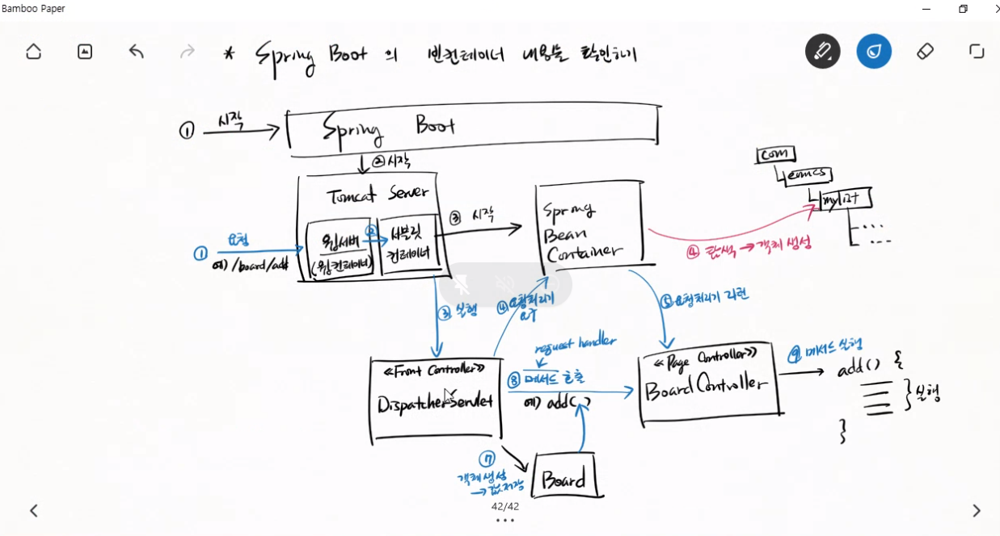
- 생성자 호출되면 인스턴스가 생성됨

# 2022년 01월 07일
- Java 클래스에 setter메서드가 없으면 스프링부트가 파라미터를 전달받지 못해서 클라이언트가 요청한 객체 값을 처리할 수 없다.
- 클라이언트에서 보내는 데이터는 모두 String이다.

## 요청 파라미터(요청할 때 보내는 데이터)와 객체 매핑
- add?title=a&author=b.... ->스프링부트에 요청 -> 스프링부트는 파라미터 값을 객체에 담는다
  스프링부트는 new Book()객체를 생성 -> 요청 파라미터값을 객체에 저장 : title = a -> setTitle("a")
  요청된 파라미터 이름으로 세터 메서드를 찾은후 값을 저장한다.
- 날짜 파라미"터 값 변환
  - "2021-1-1" -> Date.valueOf(2022-1-1). valueof는 Date객체
  - 날짜가 빈문자열 일 때 -> Date.valueOf() : 요청 파라미터는 있지만 값이 없는 경우(readDate ="") 그 파라미터의 값은 빈 문자열이 된다. 
  - 실행오류 발생. 빈 문자열은 Date객체로 만들 수 없기 때문. -> readDate 파라미터가 없으면 setReadDate()를 호출할 필요가 없다. 따라서 값을 변환할 이유가 없어서 실행 오류 발생하지 않음.

## 데이터를 파일로 출력하기 : 텍스트로 출력
- FileWriter에 문자열(String객체)을 주면 지정된 파일로 출력한다.

- DOM : 태그를 다룰 때 사용하는 API


# 2022년 01월 10일
  
  ## 상속(기능 확장을 위해 필요) : 기존 코드의 기능을 그대로 가져오면서, 새 기능추가
```java
class A{
  f1()
  f2()
}
class B {
  f3()
}
B obj = new B();
obj.f3() => B의 f3()호출
obj.f2() => A의 f2()호출
obj.f1() => A의 f1()호출
-> 상속은 B클래스가 A클래스의 코드를 가지고 있는 것이 아니라
A의 코드를 찾아서 사용하는 것.
```
- 상속 문법과 용어 
```java
class Calculator{
  plus()
  minus()
} - 기준
class Calculator2{
  multiple()
} - sub class
class Calculator3{
  divide()
} - child
```
- Java의 모든 클래스는 Object의 Sub클래스다.

# 2022년 01월 11일
## 상속 문법(OOP - ex05 a : Exam01~)
- 상속 : 기능 확장을 위한 문법
class Car
maker
model
capacity
run()


- 기존 코드에 계속 코드를 추가하는 방식
  - Project1, Project2, Project3이 위의 클래스를 사용할 때 새로운 신규 프로젝트 Project4가 새로운 기능이 필요한 경우
  -  기존 Car class에 새필드, 새 메서드 추가하거나 변경하게 되면 기존 Car class를 사용했던 새로운 신규 프로젝트 Project1, 2, 3에 영향을 끼치게 된다.
  - 기존 코드를 손대는 것은 위험하다.
  - 상속을 사용하지 않고 기능을 추가하려면 기존 코드를 수정해야 하기 때문에 예기치 않은 오류가 발생할 수 있다.
  - 코드를 계속 추가하다보면 쓰지 않는 코드가 누적 되는 문제가 발생한다.
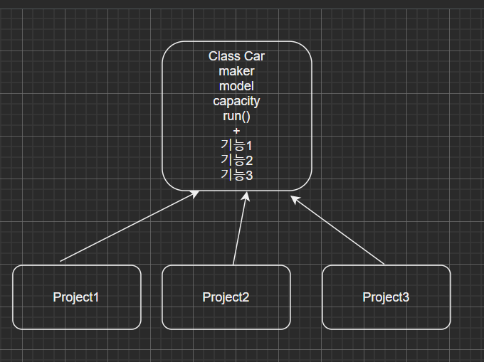

- 기존 코드를 복제하여 새 기능을 추가하는 방식
  - Car class를 그대로 복제해 각 Project에 필요한 기능만 추가하여 각각의 class를 사용.
    - 기존 코드를 변경하지 않기 때문에 기존 Project에 영향을 끼치지 않는다.
    - 하지만 기존 class 코드 자체에 문제가 있다면 복사한 모든 class를 수정해야 한다.
    - 기존 코드가 없다면 불가능하다.
  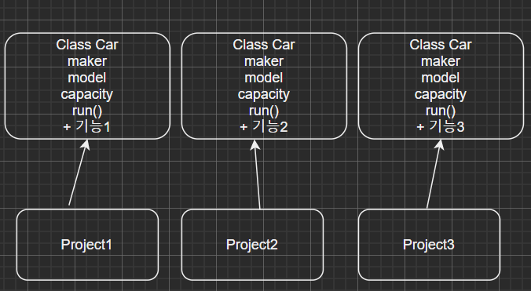

- 상속을 받는 클래스를 하위 클래스(서브 클래스), 상속을 해주는 클래스를 부모 클래스(수퍼 클래스) 라고 한다.
- 상속의 범위는 부모클래스의 필드(변수)와 메서드이다.
- private로 설정된 필드, 메서드는 상속 불가하다.
- super클래스는 sub클래스에서 정의한 자원을 사용할 수 없다.
- sub클래스는 super클래스의 자원을 사용할 수 있다.
```java
class 자식클래스명 extends 부모클래스명 {
}
```
- 하나의 자식클래스가 여러 부모클래스로부터 상속을 받는 것은 불가하다.
- 하지만 하나의 부모클래스는 여러 자식에게 상속이 가능하다.
- 상속은 기존 코드를 수정하면 상속받은 모든 클래스에 자동으로 적용된다.
 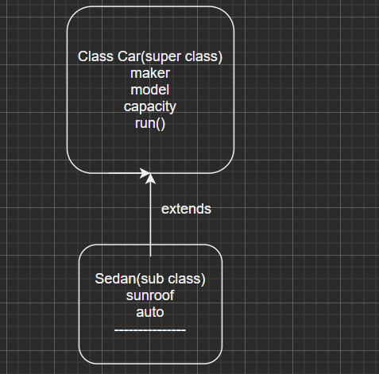
 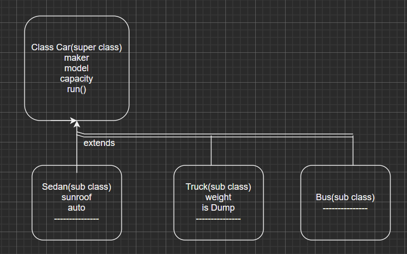

- 상속 ex - OOP.ex05.package a,b,c,d
  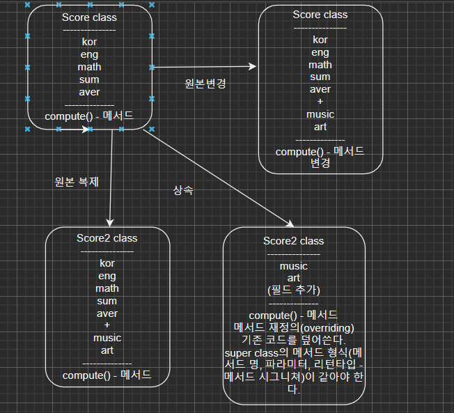
  - 메서드 시그니쳐 = 메서드 형식(메서드명, 리턴타입, 파라미터)
  - 오버라이딩 시 @Override annotation을 붙이는 것이 실수를 줄일 수 있다..(컴파일러에게 메서드 재정의를 옳바르게 했는지 검사 요청)
  - 상속은 새 class를 만들지만, 기존 코드를 수동으로 복사하지 않고 extends 명령을 통하여 기존 class의 코드를 찾아서 사용한다. 새로운 필드(변수)를 추가하고 기존의 메서드를 재정의한다(오버라이딩)
  - 메서드 재정의 시에는 메서드 시그니쳐(형식) 즉, 메서드의 파라미터, 이름, 리턴타입이 일치해야 한다.
  **주의**
  - 오버로딩(Overloading)은 기존 클래스에 없던 메서드를 정의.
  - 오버라이딩(Overiding)은 상속받은 메서드의 내용을 기능에 맞게 재정의 하는것.
- ex) A,B,C 클래스가 있다
  B클래스는 A클래스를 상속, C클래스는 B클래스를 상속.
  -> B클래스는 A클래스의 자원 사용가능. C클래스는 A와B의 자원 모두 사용가능.

- 상속 시 생성자 실행 순서
  - GrandFa, Fa, Son 클래스가 있다
    - Son은 Fa클래스를 상속 받았고, Fa클래스는 GrandFa클래스를 상속 받았다. 
    - Son에 super(); 명령을 하게 되면 Son의 super클래스인 Fa의 생성자를 호출한다
    - 그 후 Fa클래스가 상속받은 super클래스가 있는지를 또 찾는다. 
    - Fa는 GrandFa 클래스를 상속 받았기 때문에 GrandFa 클래스의 생성자를 찾아서 호출한 후GrandFa클래스의 생성자를 실행한후 , Fa생성자 실행, 다시 Son의 생성자로 돌아와서 실행한다.
      - 상속받은 super클래스가 없을 때까지 super클래스를 찾아 올라가 생성자를 호출한후, 최상위 class의 생성자를 실행한후 차례대로 내려오면서 생성자를 실행한다.
    - 이러한 이유 때문에 객체지향의 작업 처리 속도가 다소 느려지는 것이다.
    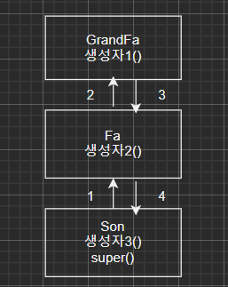
  - 수퍼클래스, 서브클래스 인스턴스 생성과정
    - A,B클래스가 있다. B클래스는 A클래스를 상속받았다.
      - B의 수퍼클래스(A)를 먼저 로딩한다. 
      - A클래스가 로딩되면 스태틱 필드를 생성하고 스태틱 블록을 실행한다.
      - 그 후 B클래스를 로딩한다
      - B의 스태틱필드를 생성한 후 스태틱 블록을 실행한다.
      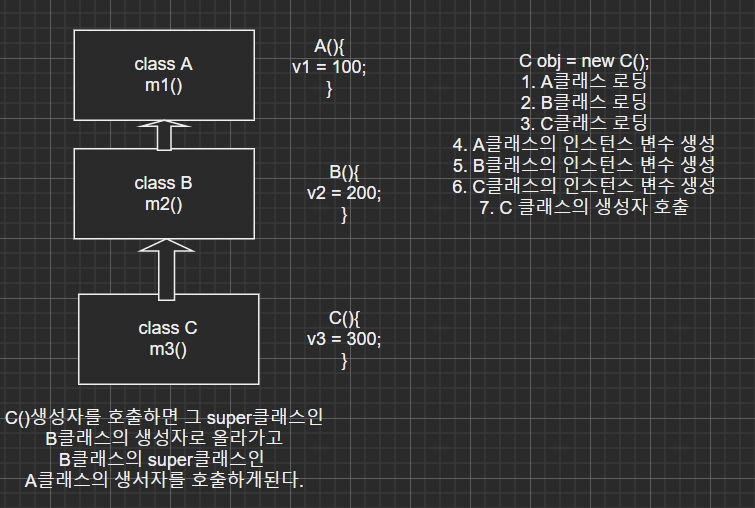

- 상속의 개념은 서브 클래스가 수퍼 클래스의 코드를 복사해오는 것이 아니다.
- 서브 클래스에는 수퍼 클래스의 코드가 없다.
- 서브 클래스에서 수퍼 클래스의 코드를 사용하기 위해선, 수퍼 클래스의 클래스 파일이 존재해야 한다.
- 상속과 수퍼클래스 생성자(OOP.ex05.h)
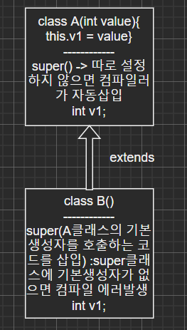
    -> 수퍼 클래스의 어떤 생성자를 설정하지 않으면 컴파일러는 수퍼클래스의 기본생성자를 호출한다.
    -> 이 때 수퍼클래스에 기본 생성자가 존재하지 않으면 컴파일 에러가 발생하게 된다.
    -> 그래서 기본 생성자가 수퍼클래스에 존재하지 않을 때 직접 어떤 생성자를 호출할지 지정해줘야 한다.

## 다중상속
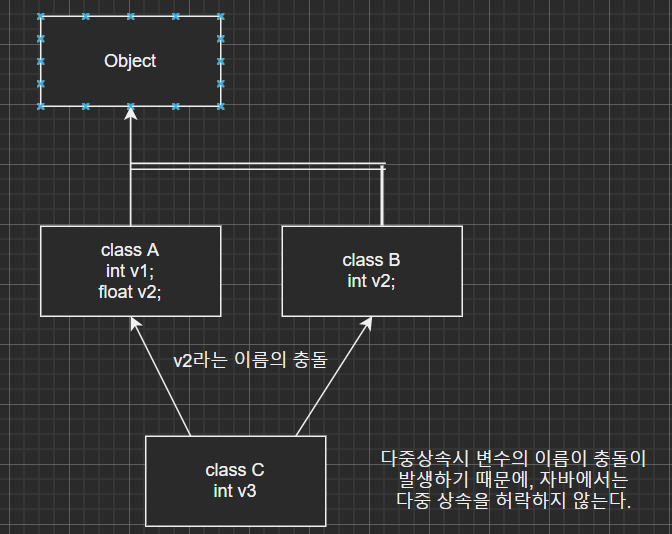
- Java에서는 다중상속을 허락하지 않는다.

- 상속 : 전문화(Specialization)와 일반화(Generalization)
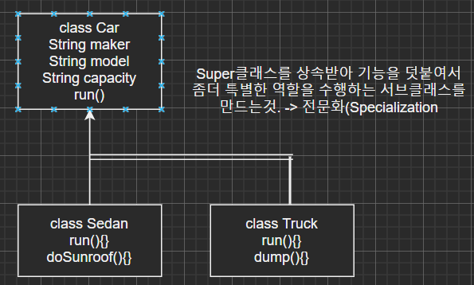
 수퍼 클래스에서 상속받아 기능을 덧붙여서 특별한 역할을 수행하는 서브 클래스를 만드는 것을 전문화.
 
 각각 다른 클래스에서 공통된 기능을 추출하여 새로운 클래스를 만든 후, 새로운 클래스를 상속받도록 하는것이
 일반화.
 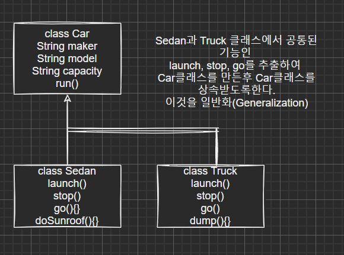
 일반화에서 공통된 기능을 추출하여 만든 새로운 클래스는, 직접 사용하려고 만든 클래스가 아니다. 처음부터 사용하려고
 만든 super클래스를 가지는 전문화와의 차이점이 이것이다. 공통기능을 관리하기 쉽게 하려고 Super클래스를 만든 것이다.
 

## 추상 클래스
- 공통기능을 관리하려고 만든 클래스는 직접 사용하지 못하도록 만드는 것이 추상 클래스이다.
abstract class 클래스명 형식으로 사용된다. 추상클래스로 지정되면 인스턴스를 생성할 수 없다.
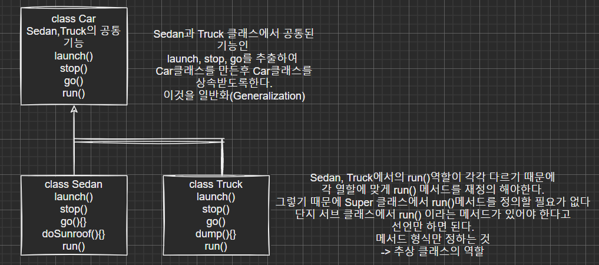


## 추상 메서드(OOP.ex05.n)
- 추상 메서드는 서브클래스의 역할에 맞춰서 구현해야 하는 메서드인 경우에 사용한다.
- 메서드 시그니쳐(메서드명, 리턴타입, 파라미터)만 작성한다.
- 추상 메서드는 서브 클래스에게 구현을 강요하는 문법이다.
- 추상 메서드는 메서드의 몸체를 만들지 않기 때문에(method() {몸체}) 일반 클래스에는 추상 메서드를 둘 수 없다.
- 오직 추상 클래스(또는 인터페이스)만이 추상 메서드를 가질 수 있다.
abstract void 메서드명()

# 2022년 01월 12일

## 다형성(Polymorhpism) - OOP.ex06.a~e
- 상위 클래스의 레퍼런스는 하위 클래스의 인스턴스 주소를 담을 수 있다.
- 상위 클래스의 레퍼런스는 하위 클래스의 인스턴스를 가리킬 수 있다.
- 상위 클래스의 레퍼런스는 하위 클래스의 객체를 가리킬 수 있다.
- 하위 클래스의 레퍼런스는 상위 클래스의 객체 주소를 담을 수 없다.
```java
class Vehicle(){
  int c1; 
  c1 = new Vehicle();
  c1 = new Bike(); 
  c1.engine = true; // 하위 클래스 Bike의 인스턴스 engine을 가리킬 수 있다.
}
class Bike extends Vehicle(){
  boolean engine;
}
class Car extends Vehicle(){
  int c1;
  c1 = new Vehicle() // 상위 클래스의 인스턴스 주소 Vehicle을 가리켰기 때문에 오류발생
  int cc;
  int valve;
}
-> 상위 클래스 Vehicle의 레퍼런스 c1은 하위 클래스 Bike의 인스턴스를 가리킬 수 있다.
-> 하지만 하위 클래스 Car의 레퍼런스 c1은 상위클래스 Vehicle의 인스턴스를 가리킬 수 없다.
```
- 레퍼런스의 형변환 : 상위 레퍼런스(c)로 하위클래스의 레퍼런스 (new Sedan)를 가리킬 때
  - Car에 model, valve, cc변수가 있다.
  - Car를 상속받는 Sedan에는 sunroof, auto 변수가있다.
  ```java
  Car c = new Sedan();
  c.model = "소나타";
  c.valve = 16;
  c.cc = 2000;
  -> Car 클래스에 있는 model, valve, cc는 사용가능
  하지만 
  c.sunroof = true;
  c.auto = true;
  -> 에러 발생. Car에는 sunroof, auto 변수가 없기  때문이다.
  Sedan s = (Sedan) c; // 형변환을통해 Sedan에 c의 레퍼런스 주소를 담는다.
  s.sunroof = true;
  s.auto = true; // 사용 가능
  ```
  ```java
  class A{
    Sedan obj;
  }
  void m(){
    Sedan obj; // Sedan의 서브 클래스의 모든 변수를 obj에 담을 수 있다.
  }
  ```
 ```java
  Vehicle v = new Vehicle();
    Bike b = new Bike();
    Car c = new Car();
    Sedan s = new Sedan();
    Truck t = new Truck();
    
    Bike b2 = null;
    b2 = c; 
    -> 컴파일 에러 발생
    Bike, Car 모두 Vehicle의 서브 클래스이지만 Car 클래스는 Bike 클래스에만 정의된 클래스 멤버(인스턴스 변수, 메서드)
    를 가지고 있지 않기 때문이다.
 ```
 ### 다형성 - 오버로딩(OOP.ex06.b)
 ```java
 class A(){
 m()
 m(int x)
 m(String s,int x)
 m(int, String)
 } -> 
 오버로딩은 파라미터의 개수나 타입이 다르더라도 같은 일을 하는 메서드에 대해 
 같은 이름을 부여함으로써 프로그래밍의 일관성을 제공.
 argument의 타입과 순서, 개수로 사용하고자 하는 메서드를 호출한다.
 A.m()
 A.m(100)
 A.m("홍길동")
 A.m("홍길동",20)
 A.m(20, "홍길동")
 변수 이름만 바꿔서 중복 메서드 만들 수 없다.
 m(int a) -> 에러
 m(String r, int a) -> 에러
 리턴 타입만 바꿔서 중복 메서드 만들 수 없다.
 ```
 - 한 클래스에서 같은 이름으로 여러 메서드를 만드는 것이 오버로딩이다.
 - Super 클래스에 있는 메서드와 같은 이름으로 Sub 클래스에서 파라미터 타입, 개수가 다른 메서드를 추가 하는 것 또한 오버로딩이다.(파라미터의 이름만 다른 것은 안됨.)
 ```java
 class A(){
   static void m(){

   }
   static int m(){
     return 0;
   } // 에러 -> 리턴 타입만 다르게 해서 중복된 메서드를 만들 수 없다. 
 }
 ```
- 오버라이딩(overriding) 
  - 상속 받은 메서드를 서브 클래스의 역할에 맞춰 재정의 하는 것.
  - 오버라이딩한 메서드는 Super 클래스의 메서드와 파라미터 시그니쳐(메서드명, 파라미터 타입,개수,순서)가 같아야 한다.
  - 파라미터 시그니쳐를 일치시킨 후 필요한 기능에 맞춰서 파라미터를 추가할 수 있다.
  - 오버로딩, 오버라이딩을 헷갈리지 않도록 @Overriding 에노테이션을 추가하여 검사한다.
  - private로 설정된 메서드는 오버라이딩 자체가 불가능하다.
  
  - 추상 클래스의 추상메서드 오버라이딩 그리고 레퍼런스
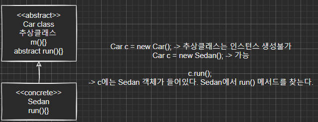

- final 사용법
  - 클래스에 final을 붙이면 서브 클래스를 생성할 수 없다.
  - 메서드에 final을 붙이면 서브 클래스에서 오버라이딩 할 수 없다.
  
  ## 2022년 01월 13일

  ## 기능 확장을 위한 다양한 기법
  - 기존 클래스에 코드 추가(test1)
    - 기존 클래스를 이용하고 있는 App에 영향끼침
    - 기존 코드를 손대면 오류 발생 위험 증가.

  - 기존 클래스 복제 한 후 코드 추가
    - App 마다 중복코드 생성. -> 중복코드에 변경사항 발생 시 모두 바꿔줘야 하는 번거로움이 있다.

  - 기존 클래스를 상속 받은 후에 코드 추가.
    - 기존 코드의 소스 파일이 없어도 된다.(수퍼 클래스의 코드를 사용할 권한을 얻었기 때문)
    - 기존 코드를 손대지 않는다. -> 기존 코드에 오류 발생시키지 않음.

  - 의존 객체(dependency object) 주입(injection)받기
    - 의존 객체는 작업할 때 사용하는 객체, 주입은 사용할 객체를 설정하는 것
    - 상속에 비해 유지보수가 유연하다. 필요한 객체만 포함할 수 있기 때문
    - 의존 객체 주입을 자동화 - Dependency Injection(DI)
    - 의존 객체 주입 자동화를 도와주는 도구  - DI Container = IOC Container
    - IOC Container를 포함하는 Spring IOC Container. 
    - Spring IOC Container를 포함하는 Spring boot

- 기능 확장 실습 1 - 기존 코드에 새 기능 추가 : oop.ex05.x2
 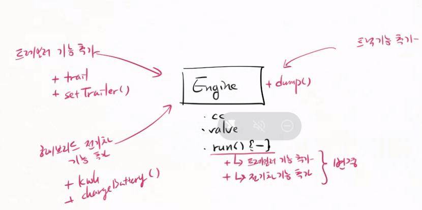
   -> 
    - App을 만들 때 마다 Engine 클래스에 기능을 추가(기존 코드를 변경하다 보면 버그가 추가될 가능성이 높아진다.)
    - 한 클래스가 많은 역할을 수행하게 됨.
    - 트럭 기능만 필요한 App을 만드는 입장에서는 불필요한 기능까지 가졍가야 한다.
    - 유지보수가 번거로워 진다.
- 기능 확장 실습 2 - 복제한 코드에 새 기능추가 : oop.ex05.x3

- 기능 확장 실습 3 - 상속 문법을 활용 : oop.ex05.x4
  - 상속을 통한 기능 확장의 한계
  - 만약 요구 사항이 : 전기 트럭을 만들라! 트럭 기능이 있는 트레일러를 만들어라! -> 추가 기능에 따라 수많은 서브 클래스들을 생성해야함.
- 기능 확징 실습 4 - 데코레이터 설계기법
  - 데코레이터는 주 객체에 붙이는 선택기능이다.
  - new 옵션1(주객체)
  - ((new 옵션2) new 옵션1(주객체))
  - new 옵션3(new 옵션2( new 옵션1(주객체)))

  # 2022년 01월14일 

  - 추상 클래스와 구현
    - 추상 클래스는 서브 클래스에게 공통기능을 상속해주는 것이 목적이다
    - 인스턴스를 생성할 수 없다.
    - 추상 클래스는 서브 클래스에서 서브 클래스에서 필요한 기능에 맞게 구현 된다.
    - 자식 클래스 객체의 인스턴스 주소를 담을 수(가리킬 수) 있다 -> car = new Sedan();
   
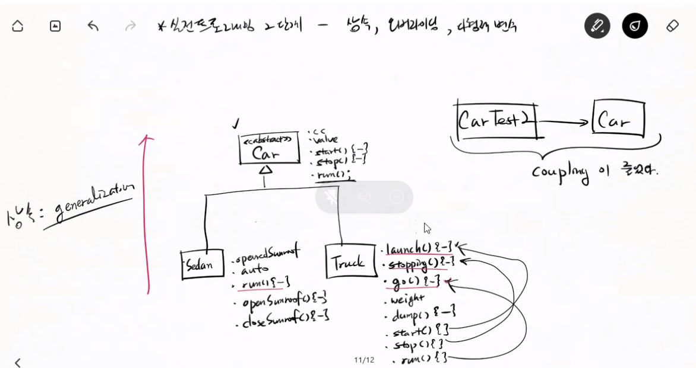
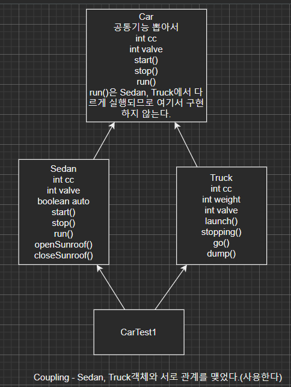

- 클래스 관계
  - 연관(Association)(지속적 사용)
  - 의존(Dependancy)(특정 작업에서만 일시적으로 사용)
  - 집합(Aggregation)(포함관계)
  - 복합(Composition)(강한연결)
    -> 모두 의존 객체이다. 코드로는 구분할 수 없다. 개념적으로 구분

- I/O streams - java.io.* , java.nio.*
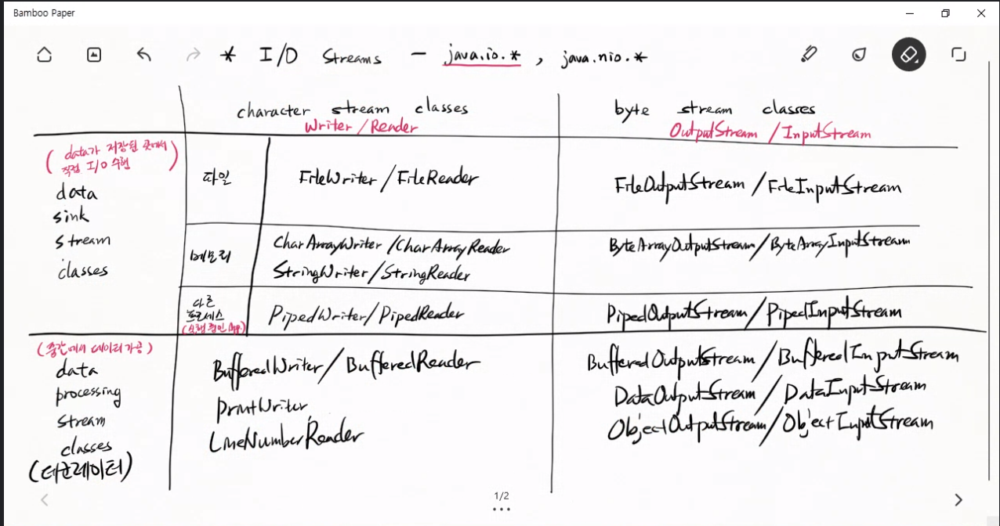

## OS의 파일 시스템 (파일과 디렉토리의 위치정보(HDD, CD-ROM, USB 메모리 등 저장장치)를 관리하는 시스템)다루기 - File 클래스 : io.ex01~
- 현재 디렉토리는 '.'으로 조회한다
- 이클립스에서는 '.'은 현재 프로젝트를 조회한다.


## 2022년 01월17일(io ex01-Exam0210~)
- 특정 클래스에 수퍼 클래스를 따로 지정하지 않으면 기본적으로 Object가 수퍼 클래스로 지정된다.
- 수퍼 클래스를 상속 받아 특정 기능을 하는 클래스를 만드는 것을 Specialization
- 특정 클래스들의 공통된 기능을  뽑아 수퍼 클래스를 만드는 것을 Generalization
- 데코레이터 설계
  - 클래스에 특정 기능을 필요에 따라 탈,부착 하는 설계기법.

## File 클래스
- 파일이나 디렉토리 정보를 관리.
- 디렉토리 생성
```java
 File dir = new File("temp2/a"); // 디렉토리를 만들고자 하는 위치경로 지정
 if (dir.mkdir()) { // 디렉토리 생성
 }
만약 존재하지 않는 파일에 하위 파일까지 생성하고 싶을 때는
mkdirs 명령을 실행한다.
if (dir.mkdirs(){
}
```
- 파일 생성
  ```java
  File file = new file("파일 생성하고자하는 경로")
  
  if (file.createNewFile()){

  }
  ```
- 파일 객체와 파일명 필터의 작업 과정
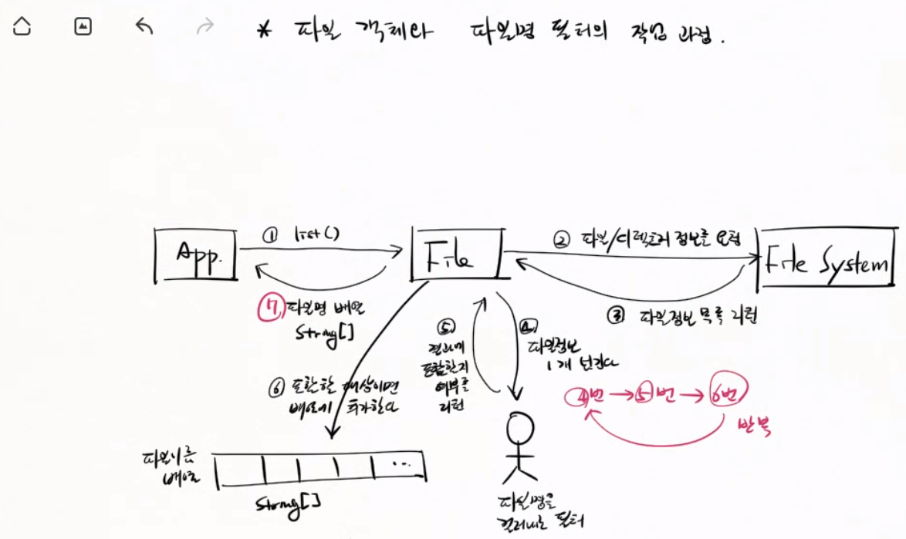
- 파일 객체와 필터의 관계(io - ex01 : Exam0610)
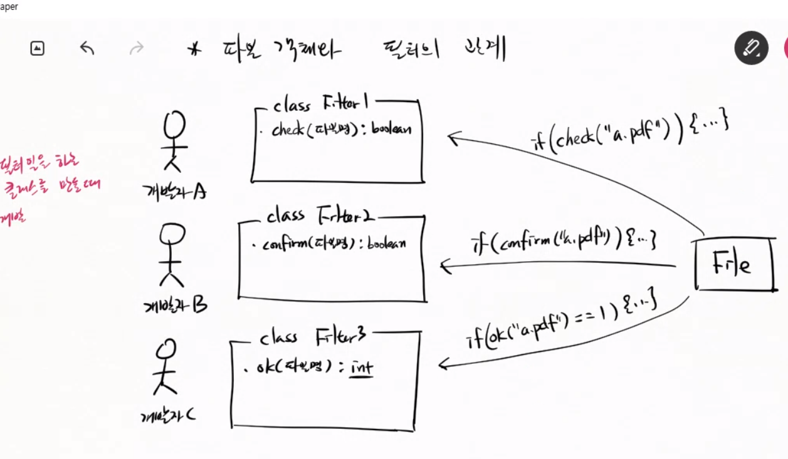
- 필터일을 하는 클래스를 만들 때 개발자마다 사용법(메서드를 호출하는 방법)이 다르다면
필터 사용법이 일관성이 없기 때문에 프로그래밍이 어려워진다.
- 인터페이스
  - 메서드를 만드는 사람에 상관없이 동일한 시그니처(메서드명, 파라미터, 리턴타입)를 갖는 메서드를 정의한다.
  - 그래서 그 메서드를 사용하는 개발자가 일관된 방식으로 사용할 수 있어서 프로그래밍이 용이해짐.(객체의 교체가 용이해짐)
  - 해당 클래스를 받는 개발자에 상관없이 일관된 방법으로 사용할 수 있다.
  -> 메서드 규칙을 정의하는 이유!
- 파일 필터와 인터페이스의 관계
  
- FilenameFilter 인터페이스
  630~660번 넘어가기

# 2022년 02월 16일
## 미니프로젝트2(성적관리 시스템)
- 1단계 : standalone
  - 입력, 조회, 변경, 삭제(CRUD)기능을 하는 APP을 각각 다른 파일로 작업하게 되면 APP끼리 데이터 공유가 불편하다.
  - 데이터 동기화가 어렵다(실시간 동기화가 어렵다)
- 2단계 : 데이터 처리 기능을 분리
  - 실시간 데이터 공유
  - DBMS(Database Management System)을 통해 데이터 실시간 공유
  
- build.gradle 파일 내에서 명령어 설정
  - 이 설정영역 내에서 사용되는 프로그래밍 언어
  - Domain-Specific Language(DSL) : groovy, kotlin
# 2022년  02월 18일
## DBMS
- 데이터 관리(데이터를 파일에 I/O)
- DBMS는 Client와 Server가 통신을 할 때 전용 프로토콜을 이용하기 때문에 각각의 DBMS종류에 따라 전용 프로토콜을 이용해야 한다.(표준 프로토콜이 없기 때문)
- 이와 달리 Web Browser와 Web Server끼리의 통신에는 표준 HTTP 프로토콜이 있기 때문에 Web Browser의 종류에 상관없이 표준 프로토콜 하나로 통신이 가능.
- 
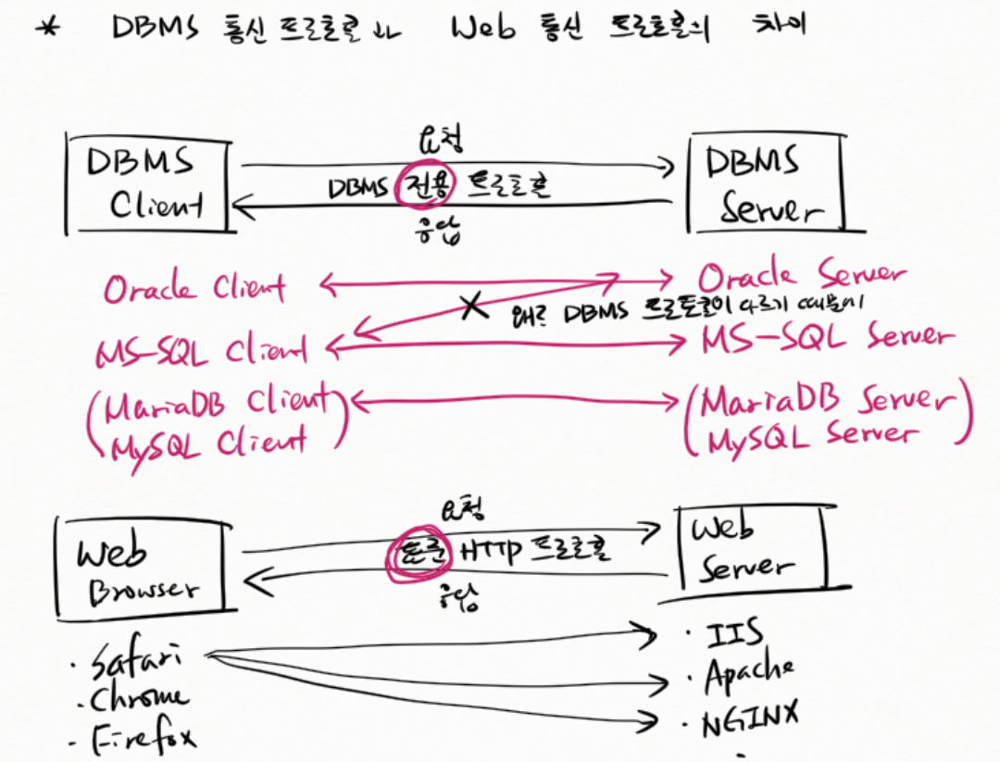
- MariaDB 작동 방식
- mariadb 
  - mariadb.org접속
  - Use UTF8 as default server's character set 체크(한글, 영어 둘다 저장)
  - 설치후 환경변수 편집 -> 고급 -> path에 새로만들기 -> mariadb 설치폴더 -> bin 등록
  - cmd창 실행 -> mysql -u root -p 입력 -> 설치 시 설정했던 패스워드 입력
  - show databases; : mariadb관리정보에 관련덴 데이터베이스 보는 명령어
- DBMS(Database Management System)와 SQL(DBMS에 상관없이 표준적으로 사용할 수 있는 명령어)
- Client에서 Oracle DBMS, MS-SQL DBMS, MySQL DBMS등 DBMS종류에 상관없이 사용할수 있는 명령어를 SQL이라고 한다.

- 스프링 부트 컨테이너

- AWS 서버구축(서버연동동영상 5~7 참고)
  -  AWS EC2 서버를 사용하는 사용자가 자물쇠(public key), 열쇠(private key)를 가지고 있다.
  -  사용자의 자물쇠를 EC2서버에 준다. EC2서버는 데이터를 사용자에게 보낼 때 사용자의 자물쇠로 잠궈서(public key) 보낸다. 
  -  사용자는 받은 데이터를 열쇠(private key)로 열어서 사용한다.

- 실행권한부여
  - r(read)w(write)x(excute-실행)(사용자 자신) rwx(사용자와 같은 그룹) rwx(기타)

- DBMS마다 명령문법이 다르다면 사용하기 매우 불편할 것이다.
  - 그래서 표준 명령 문법을 정함 -> Structured Query Lanaguage(SQL)

- 데이터베이스(database) = 스키마(shcema)
- 테이블
  - 테이블 생성
   - create table studydb.test01 (
      name varchar(50) not null, // not null은 필수 입력 항목(null이 되면 안됨)
    )
    
  - 테이블 사용 
    
    -  use studydb;
    -> 한 번 사용할 db명을 등록하면 테이블을 다시 만들 때 
    db명을 입력하지 않아도 된다
    -> create table test01
  
  - 데이터 입력
    - insert into 테이블명(입력할 데이터) values(데이터의 값)
    - 테이블을 만들 때 사용할 컬럼을 not null로 설정하면 필수입력 항목이되어 입력하지 않을 시 에러 발생.
    - 입력값을 생략하면 해당 컬럼에 지정된 기본값이 대신 입력된다.
      - create int not null,
      - name varchar(20) default 'noname',
   
  - 테이블에 입력된 데이터 타입 출력
    - desc(describe의 약자) 테이블명
  - 테이블에 입력된 실제 데이터 출력
    - select *(테이블의 모든 정보를 뜻함) from 테이블명

  - mariadb 컬럼의 데이터 타입(DBMS마다 타입이 제각각이기 때문에 document참고할 것)
    - int 
      - tinyint, smallint, mediumint, bigint
    - float
      - 부동소수점 저장
    - numeric = decimal
      - 전체 자릿수와 소수점 이하의 자릿수를 정밀하게 지정 가능.
      - numeric(6,2) -> 전체 6자리중 소수점이하는 2자리(즉, 정수는 4자리). 소수점 2자리를 초과하는 수는 버리거나, 반올림
      - 범위를 설정하지않고 numeric만 설정할 시 기본 10자리
      - numeric은 소수점이 없다. 
      - numeric에 12345678.92란 숫자를 입력하면 0.92를 반올림해 12345679가 출력된다.
  
- 뷰
- 트리거(trigger = listener)
  - 특정 조건에서 자동으로 호출되는 함수
  - 특정 조건은 SQL 실행 전/후 등을 의미한다.
- 함수(function)
- 인덱스(index)

## 프로젝트 목적
- 관리시스템 개발 : 데이터 등록, 삭제, 변경 등을 할 수 있는가?

# 2022년 02월 21일
- A,B 라는서로 다른 사람이 작업을 할 때 각각의 컴퓨터에 자료를 두고 공유하는 것이 아니라, 한 컴퓨터에 두고 자료를 공유
- A,B 두 사람이 동시에 파일을 수정, 삭제 등 작업을 할 때 문제가 발생.
- 데이터 관리 시스템(사용자 인증, 사용자 권한 관리,  동기화 관리 등)을 만들어서 각 사용자의 권한에 따라 파일을 작업할 수 있도록 함.
- -> 데이터 관리를 학문적으로 체계화(일관된 방식으로 프로그램 개발 가능)
- 공학 : 기술적 경험을 학문적으로 체계화 시키는 것.
- DBMS : Database Management System
- 데이터베이스 : 여러 사람이 공유하고 사용할 목적으로 통합 관리되는 정보의 집합.

## mariadb 
- 실행 : mysql -u 유저명 -p
- sql문 작성하면 dbms클라이언트는 이 명령문을 dbms에 넘겨줘서 그 결과가 dbms client에 출력된다. 
- DDL(Data Definition Language) : 데이터 구조 정의, 함수/프로시저/리스너
- DML(Data Manipulation Language) : insert, update, delete
- DQL(Data Query Language) : select(데이터를 조회)
- 테이블 생성
create table 테이블명(
  컬럼명 타입 옵션,
);
- show databases; : 유저가 사용할 수 있는 데이터베이스목록 출력.
- show tables; : 현재 생성된 테이블 목록 출력.
- drop table 테이블명 : 테이블 삭제
- where 컬럼명='데이터'; :  특정 데이터가 입력된 컬럼 찾기
**특정 DBMS에서는 컬럼의 데이터값 비교할 때 공백까지 비교하는 경우가 있다.**

- char(n)
  - 최대 n개의 문자를 저장
  - -> 0 <= n  <= 255
  - 한 문자만 저장하더라도 지정한 n자만큼의 메모리를 사용한다.
  - 메모리 크기가 고정되어서 낭비가 발생하지만, 검색 속도가 빠르다.
- varchar(n)
  - 최대 n개의 문자를 저장.
  - 0~65535 바이트 크기를 갖는다.
  - n값은 문자집합에 따라 최대값이 다르다.
  - 한 문자에 1바이트를 사용하는 ISO-8859-n 문자 집합인 경우 최대 65535이다.
  - 하지만 UTF-8로 지정된 경우, n의 최대값은 21844이다.
  - 메모리 크기가 가변적이라서 데이터 낭비가 없지만, 검색 속도가 느리다.
- datetime
  - 날짜 정보를 저장
  - 년, 월, 일 정보를 저장
  - date는 년,월,일
  - time 시,분,초 
  - datetime으로 설정된 컬럼에 날짜 정보만 주면 시,분,초 모두 0으로 설정된다.
  - datetime으로 설정된 컬럼은 날짜 정보는 필수입력 사항이다.
- boolean
  - ture,false를 의미하는 값을 저장할 때 정수 1또는 0으로 포함한다.
  - 실제 컬럼을 생성할 때 tinyint(1byte)크기로 설정한다.
  - boolean타입으로 설정된 컬럼은 Y,N는 입력할 수 없다. true,false 또는 문자열 '0', '1'은 허용되며 0,1로 입력된다.
  

- 바이너리 데이터를 텍스트로 변환할 때
  - base64 : 바이너리 데이터를 텍스트로 변환할 때 사용하는 인코딩 알고리즘
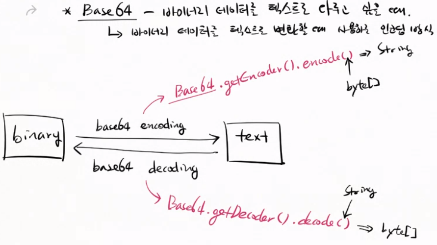

- 키 컬럼 지정
  - 데이터를 구분할 때 사용하는 값
  
  - 테이블
    - name, email, jumin, id, pwd, tel, postno, basic_addr, gender
  
  - key
    - 데이터를 구분할 때 사용하는 컬럼들의 집합.
    - ex) 
      - {email}, {jumin}, {id},{name,tel}, {tel, basic_addr, gender, name}
  
  - candidate key(후보키 = 최소키)
    - 최소 항목으로 줄인 key
  
  - primary key(주 키)
    - candidate key 중에서 DBMS 관리자가 사용하기로 결정한 키
    - primary key(pk)를 지정하지 않으면 데이터가 중복될 수 있다.
    - 데이터 타입 primary key 명령어를 통해 pk로 지정.
    - primary key로 지정되면 기본적으로 not null로 설정된다.
    - 여러개의 primary key로 지정하기 위해서는 
     constraint 제약조건명 primary key(컬럼명, 컬럼명...) 의 형식으로 지정해야 한다.
  
  - alternate key(대안 키)
    - candidate key 중에서 primary key를 제외한 나머지 키.
    constraint 제약조건명 unique (컬럼명, 컬럼명..)의 형식으로 지정.
  
  - artificial key(인공 키)
    - primary key로 사용할 키를 찾을 수 없을 때 사용하는 키
    - 인공키는 일반적으로 정수값을 사용한다.(회원 일련번호 등)

  - index
    - 특정 컬럼의 값을 오름차순, 내림차순으로 정렬시키는 문법.
    - index를 지정하면 조회 속도가 증가한다.
    - 하지만 입력,변경,삭제 시에는 속도가 감소한다.
    fulltext index 제약조건명(컬럼명);
  
  - 컬럼 추가
    alter table 테이블명
    add coulumn 컬럼명 타입;
  
  - 컬럼에 옵션 추가
    alter table 컬럼명
    modifty column 컬럼명 타입 옵션

  - 컬럼 값 자동 증가
    - 숫자 타입의 pk 컬럼인 경우 값을 1씩 자동 증가시킬 수 있다.
    - 
    - 즉 데이터를 입력할 때 해당컬럼의 값을 입력하지 않아도 자동으로 증가.
    - 단 삭제되었을 때 비어있는 번호는 다시 채우지 않는다.
    alter table 테이블명
    modify column 컬럼명 타입 auto_increment;
  - auto_increment;로 설정한 컬럼의 값을 직접 설정할 수도 있다.
  - 중간에 있는 값을 건너뛰고 컬럼값을 입력하면 입력한 시점의 값으로부터 자동 증가한다.

# 2022년 02월 22일(sql exam01)
## 뷰
- 조회 결과를 테이블처럼 사용하는 문법

- select table_name, column_name, constraint_name from key_column_usage;

- 제약 조건(primary key 등) 이 어떤 테이블에 속해있고, 어떤 컬럼명을 사용하는지 조회하는 문법

- 뷰는 select를 실행했을 때 별도의 테이블을 생성한 것이 아니다. select를 실행할 때마다 요청한 데이터를 가상의 테이블로 만들어서 보여주는 것이다.
ex) create view worker
  as select no, name, class from test1 where working = 'Y';
  위의 문장이 select * from worker; 명령을 실행할 때마다 자동적으로 실행되는 것.

- 자신이 조회하고 싶은 정보만 따로 가상의 테이블로 지정해놓는 기능.

- test1 이라는 테이블에는 no, name, class, working, tel 컬럼이 있지만 view로 지정한 worker라는 가상 테이블에는 내가 조회하고싶은 no, name, class의 정보만 입력되어있다.

- 따라서 worker테이블엥서는 no, name, class의 정보만 조회할 수 있다.
  
- not null로 설정된 컬럼을 auto_increment를 통해 자동증가로 설정하면 null로 입력하더라도 자동으로 증가된다.

- 값 입력시 컬럼을 지정하지 않으면 컬럼을 생성한 순서대로 값을 입력해야 한다.

- 값 입력시 컬럼의 순서를 테이블 생성할 때 지정한 순서와 다르게 지정할 수 있다.

- 하지만 입력시에 지정한 컬럼의 순서대로 컬럼 값을 입력해야 한다.

## DML(Data Manipulation Language)
- 데이터 등록, 변경, 삭제를 다루는 SQL 문법

- insert
  - 데이터를 입력할 때 사용하는 문법.
  
- 여러 개의 값을 한번에 입력하기
insert into test1(name,tel) values
('aaa','1111'),
('bbb','2222'),
('ccc','3333')

- update 
  - 등록된 데이터를 변경할 때 사용하는 명령
  update 테이블명 set 변경할 컬럼명=값, 컬럼명=값, ... where 바꾸고자 하는 컬럼의 값;

- delete
  - 등록된 데이터를 삭제할 때 사용하는 명령
  delete from 테이블명 where 조건;

- autocommit
  - mysql의 autocommit의 기본값은 true이다.
  
  - autocommit이 false로 설정된 경우, mysql 클라이언트가 쓰레드에 요청을 하면 쓰레드가 mariadb server에 요청을하고 mariadb server는 파일에서 정보를 가져와서 쓰레드 임시 데이터베이스에 임시보관을한다. 그후 클라이언트가 select를 하게되면 임시데이터베이스에 보관된 결과 + 실제 테이블에 보관된 결과를 클라이언트에게 리턴한다.
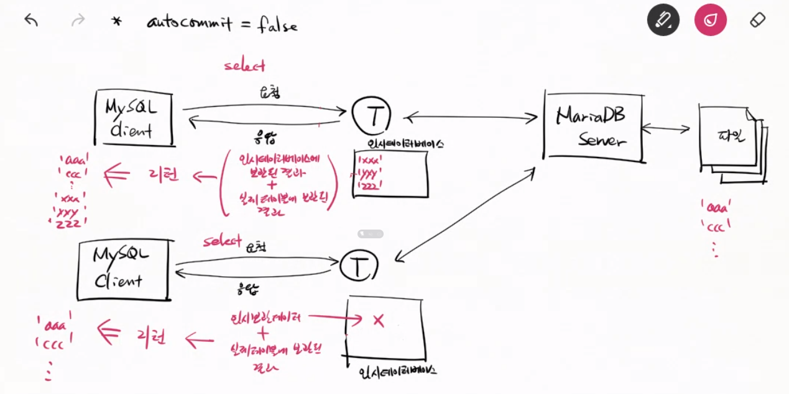
  
  - commit을 하게되면 쓰레드의 임시데이터베이스에 보관된 결과가 실제 파일에 저장되게 된다.

  - rollback
  - 최종 commit 전의 단계로 되돌린다.

## DQL(Data Query Language)
- select
  - 데이터를 조회할 때 사용
  
  - 모든 데이터 조회
  select * from 테이블명
  
  - 특정 데이터 조회(projection)
  select 
  컬럼명
  컬럼명
  컬럼명
  from 테이블명

  - 가상의 컬럼 값 조회
  select no, concat(name,'(',class,')') from test1;
  https://mariadb.com/kb/en/concat/ 참고

  - 특정 컬럼 조회(selection)
  select * from 테이블명 조건
  ## selection, projection 차이 공부하기

  - null 여부인지 가릴 때는 is, is not 연산자를 사용.

- like
  - 문자열을 비교할 때 사용
  select * from test1 where class like '%java%'
  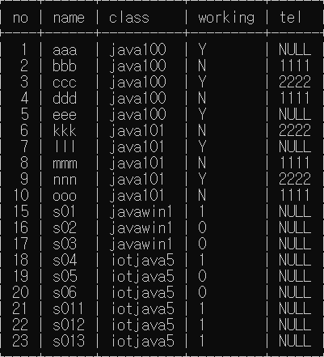

  
  # 2022년 02월 23일(sql Exam04)
  
  ## FK(Foreign Key) - 부모테이블 + 자식테이블 : 다른테이블의 프라이머리, 유니크키
  - Foreign Key는 원래 한 테이블에 들어가야 할 컬럼을 데이터 중복을 피하기 위해 여러 테이블로 나누기 위해 사용한다.
  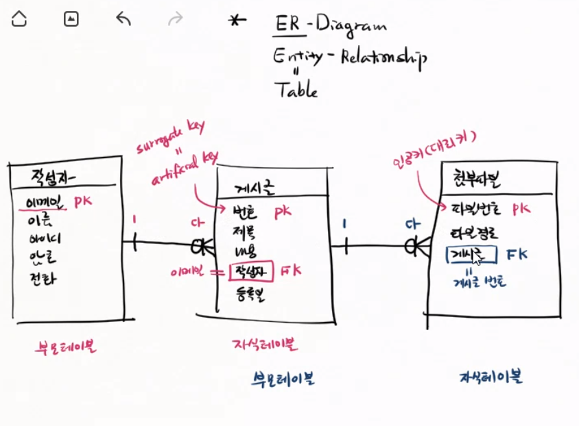

  - ER-Diagram 
  - Entity-Relationship(=table)

- surrogate key(대리 키) = artificial key(인공 키)
  
- 첨부파일 고유번호 fno, 게시글번호 bno, 파일시스템에 저장된 첨부파일의 경로 filepath
  
- FK 제약 조건이 없을 때 첨부파일이 있는 게시글을 삭제하더라도 첨부파일은 그대로 남아있어 메모리 낭비가 발생하게 된다.
- 다른 테이블의 데이터를 참조하는지 검사하지 않았기 때문에 이런 문제가 발생한다.
- 따라서 다른 테이블의 데이터를 참조하는 경우 해당 데이터가 존재하는지의 여부를 검사하도록 한다.
- 이것을 가능하게 하는 문법이 외부키(Foreign key)이다.
- FK 제약조건을 설정하면 참조하는 데이터가 있는 컬럼의 경우 삭제 할 수 없게된다.

# 2022년 02월 24일

- primary key는 중복될 수 없다.
- primary key를 참조하는 foregin key가 있는 쪽이 자식.
- primary key가 있는 쪽이 부모.
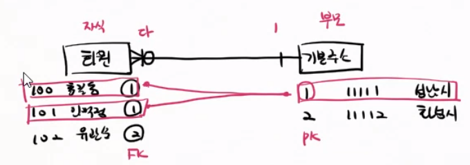
- 부모, 자식 관계는 1대 다의관계이다.

## 이클립스에 http://exerd.com/update/exerd/3.x/ 설치함

## eomcs-docs/db/modeling
- 모델링 : 시스템을 분석하고 구조화해서 글과 그림으로 표현(추상화).
- DB 모델링 : 데이터를 분석하고 구조화해서 데이터 속성과 관계를 글과 그림으로 표현(추상화)
  - 데이터가 중복되지 않도록 테이블을 구조화 하는 것. 
- 주요 용어
  - table( = relation, entitiy, file)
  - intension( = schema, header) : 데이터 구조 설계도
  - extension( = instance, data) : epdlxj
  - row( = tuple, record) : 데이터(여러 컬럼ㄹ으로 이루어진) 한 개.
  - coulmn( = attribute, field) : 데이터의 한 항목

  - key : 데이터를 구분할 때 사용할 식별자.
    - 수퍼 키라고 부른다.
  - candidate key(후보 키) : 수퍼키들 중에서 선별된 최소키를 가리킨다.
    - 최소한의 컬럼 값 만으로 식별이 가능한 키

- SQL 문법으로는 포함관계와, 배타적 관계를 제어할 수 없다.(프로그래밍에서 제어해야 한다.)
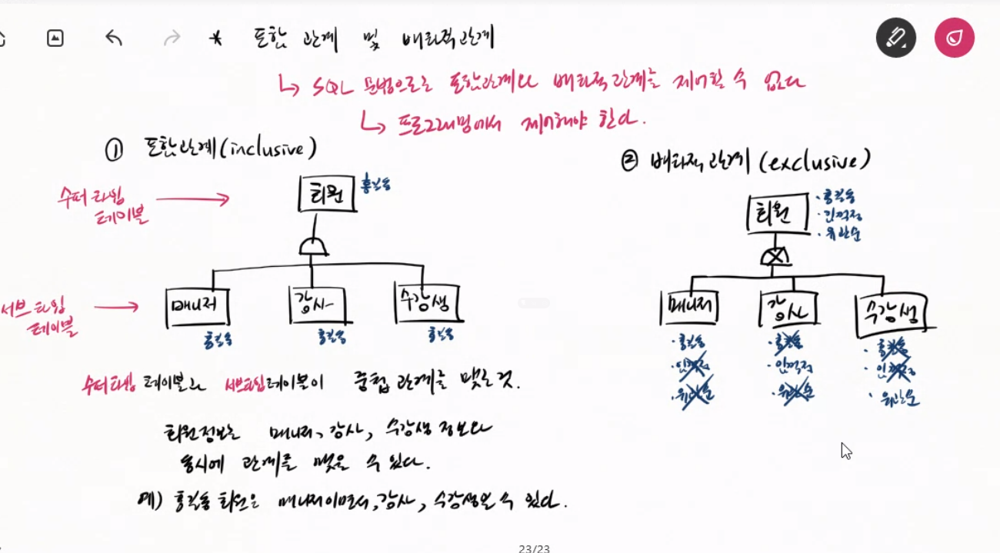

- 관계 테이블 식별
  
  - 테이블과 테이블 간의 관계를 식별하여 별도의 테이블로 정의한다.
    - 이런 테이블을 "관계 테이블" 이라 부른다.
    - 두 테이블의 관계 정보를 저장한다.
  
  - 두 테이블과 관계 테이블 사이를 부모-자식 관계로 만든다.
    - 다른 테이블의 데이터를 참조하는 테이블이 자식 테이블이다.
    ex) 한 강의실에 여러가지 강의가 배정될 수 있다. - 1대 다의 관계 ( 1이 부모(강의실), 다가 자식(강의))
    
  
  
  - 일반 관계
    - 두 테이블 사이의 관계 식별하여 연결한다.
    - 부모 - 자식 관계로 정의한다.
      - 데이터를 참조하는 쪽이 자식 테이블
      - 데이터를 제공하는 쪽이 부모 테이블
  
  - 다 대 다 관계의 해소
    - 테이블과 테이블 사이에 다 대 다 관계를 형성한다면, 일 대 다의 관계로 변경해야 한다.

- 제1 정규화
  - 데이터 중복을 찾아내어 별도의 테이블로 데이터를 분리시키는 것.
  - 자식 테이블에서는 부모 테이블의 데이터를 가리키기 위해 그 데이터의 pk값을 보관해야 한다.

- 논리 모델과 물리모델
  - 물리모델 : 특정 DBMS에 맞춘 물리적인 모델링

# 2022년 02월 25일
- exerd 도메인 설정
  - 도메인으로 설정하면 도메인에 설정한 데이터 타입의 값이 자동으로 적용된다.

## 오늘은 11번까지 논리모델까지 해보기

# 2022년 02월 28일(sql ex05)

## select
- 모든데이터 가져오기
select all 컬럼명 from 테이블명;
-> all은 생략 가능

- 중복 데이터 제외
select distinct loc from 테이블명; 

- 출력 라벨명 변경
select 컬럼명 as 변경할 컬럼명 from 테이블명;
-> select rno as room_no, loc as location from room;
  - as는 생략가능하다.

- 결과 합치기 
  -  select distinct(중복제외) 컬럼명 from 테이블명 union seelct distinct 컬럼명 from 테이블명
  -  각 테이블에서 사용되는 컬럼을 중복된 결과 없이 합쳐서 출력하고 싶을 때 사용.

- 차집합
   select distinct bank from stnt where not bank in (select distinct bank from tcher);
-> tcher 테이블에 없는 bank컬럼만 출력해라

- join 
  - cross join(cartesian join)
    - 두 테이블의 데이터를 1:1로 모두 연결한다.
  
  - inner join
    - 두 테이블의 각 기준점을 분류하여 기준점이 일치하는  데이터끼리 연결한다.

  - left outer join

  - right outer join
  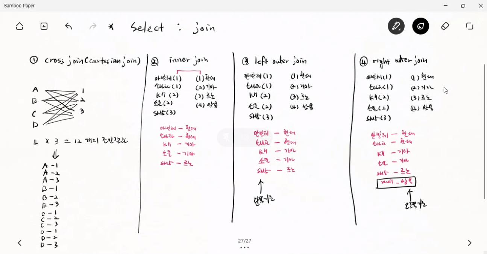

  - natural join 
    -  두 테이블의 기준점이 모두 같을 때만 join가능.
    - natural join이 유효한 경우와 무효한 경우
      - 부모테이블의 PK컬럼명과 자식테이블의 FK컬럼명이 다를 경우

      - 부모 테이블의 PK 컬럼명과 자식테이블의 다른 컬럼명이 같을 경우
      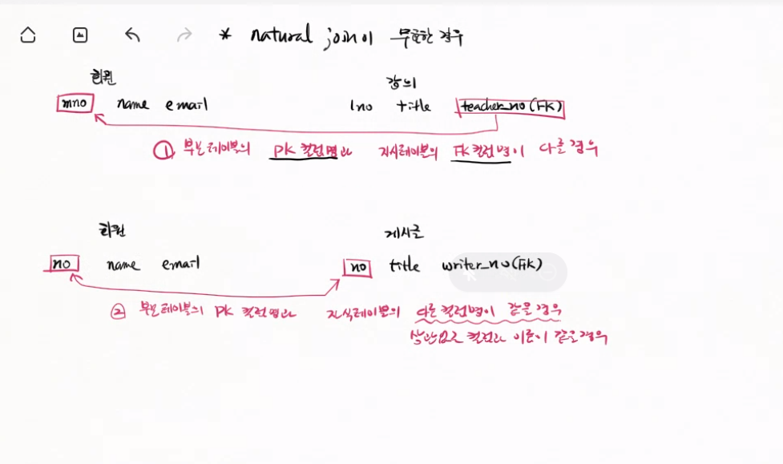

# 2022년 03월 02일
- join

- 특정 컬럼을 기준으로 그룹으로 묶기
  - group by 명령어를 통해 그룹으로 데이터를 묶는다.
  - group by, having을 통해 group 중에서 특정 데이터만 추출한다.

## DB모델링 발표 끝난후 포워드 엔지니어링 이용하여 테이블 생성하여 실제 샘플 데이터 insert할 계획.

## 다음 주에는 git리포 협업 배움.

## 2022년 03월 03일
- 사용자가 App에 데이터를 입력하면 App은 파일에 저장(HDD에)
- 여러 사용자가 동시에 한 파일을 수정하는 데에 문제점 발생
  
- DBMS를 통하여 여러 사용자가 동시에 한 파일을 수정 가능하게 함.
- 사용자가 DBMS 클라이언트에 SQL 명령어를 입력하면 DBMS 서버에 전달한다
- 서버는 전달받은 명령을 처리하여 클라이언트에 전달하여 사용자 화면에 출력한다.
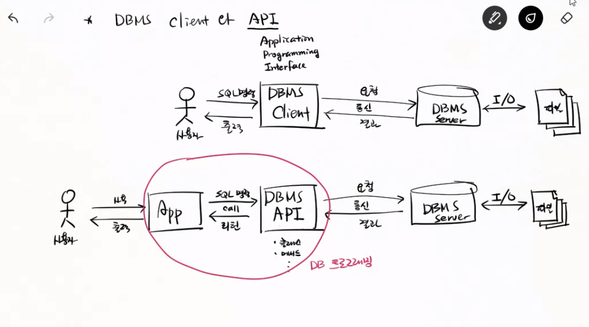

- DBMS 서버에 직접 접근하는 방법
  - App이 DBMS에 요청을하면 입출력(I/O) 시스템을 통해 파일에서 작업을 수행하고 응답받는다.
    - 단점은 개발자가 DBMS 전용 프로토콜에 맞춰 통신프로그램을 만들어야 한다.
    - 복잡하고 번거로운 작업
    - DBMS 제조사에서 기술유출을 방지하기 위해 프로토콜을 공개하지 않음.

- DBMS 서버에 간접적으로 접근하는 방법
  - App이 API(클래스, 메서드 등)에 call요청을하여 DBMS에 요청을하여 접근하는 방법.
    - API는 DBMS에서 제공하고, DBMS와의 통신을 대행하는 역할을 수행한다.
    - 이 방식은 DBMS 통신 프로토콜을 알 필요가 없고, 통신프로그래밍이 필요 없다.

- SQL과 DB프로그래밍
  - 사용자는 mysql -u -p와 같은 명령어를 통해 DBMS 클라이언트를 이용.

- Native(DBMS제조사에서 제공하는 API) API = Vender API(Application Programming Interface)

- DBMS마다 API가 달라서 프로그래밍의 일관성이 없다.
  - API의 규격을 통일(메서드 사용법) -> DMBS 제조사는 ODBC API 규격에 맞춰 클래스와 메서드를 제작
  - API가 같기 때문에 DBMS마다 따로 프래그래밍 할 필요가 없다
  - 하지만 실행속도가 느리다는 단점이 있다.
  - Native API

- DBMS마다 메서드, 리턴타입 등의 사용법이 모두 다르다. Oracle, MS-SQL, MYSQL등의 DBMS종류에 따라 프로그래밍 방법이 달라진다는 의미이다.
- 이를 해겨하기위해 ODBC(Open DataBase Connectivity)를 이용한다.
- 여러 DBMS의 일관성있는 사용법을 위해 공통으로 사용할 수 있는 API를 이용하는 방식이다.

# 2022년 03월 14일
- Mybatis
  - App이 Mybatis 라이브러리(JDBC 프로그래밍 코드를 캡슐화)를 콜 -> JDBC Driver를 콜 -> DBMS

  - Mybatis select
  - 컬럼명과 필드 이름이 일치해야 한다.
  - Mybatis에서 컬럼값을 객체에 담을 때 컬럼명과 같은 이름을 가진 필드를 찾는다.

# 2022년 03월 16일
## css 활용
- border-style

- display 속성 : block, inline, liline-block

  - block
    - 한 줄을 모두 점유한다.
    
  - inline-block
    - 한 줄을 공유한다.

- Object
  - 단순 기능 수행

- Component
  - 복합 기능 수행
  - 한 개 이상의 객체로 구성됨
  - 하나의 Object가 하나의 Component가 될 수 있고, 여러개의 Object가 하나의 Component가 될 수 있다.
  - 즉 한 개 이상의 Object로 이루어진 것이 Component이다. 

- Framework

- UI Component
  - 한 개 이상의 태그로 이루어진 것.

- float 속성
  - margin은 따로 설정을 해주지 않으면 서로 다른 영역의 margin끼리 겹침을 허용한다.
  - 하지만 float을 설정하게 되면 겹침을 허용하지 않아 각각의 margin값이 적용된다.
  - float속성은 너비, 높이 계산에서 제외된다.
  - float으로 설정된 태그의 다음태그가 float으로 설정된 태그의 자리를 차지한다.
  - width, height 값을 지정하지 않으면 inline속성 처럼 콘텐츠의 크기에 따라 폭, 높이가 결정된다.

- absolute 속성(eomcs_web/ css / test 10_5)
  - 가장 가까운 조상태그가 relative, fixed, absolute속성을 가졌다면 가장 가까운 조상태그를 기준으로 자신의 위치를 조정한다.
  - 만약 조상중에 relative, fixed, absolute속성이 없다면 현재 페이지의 가장자리 끝을 기준으로 위치를 조정한다.

- clear 속성
  - clear : left를 선언하게되면 왼쪽에 float으로 지정된 객체가 있으면 자동으로 왼쪽에 아무것도 없는 상태가 되도록 아래로 위치를 이동시킨다.
  - clear는 float이랑만 사용가능(absolute와는 사용 불가)

- min-height 속성
  - 높이를 일반 height로 고정하면 height를 초과하는 내용물이 들어가면 지정된 범위를 넘어서 출력되게 된다.
  - min으로 최소높이를 설정하게되면 넘치지않고 내용물에 맞춰 영역이 조정된다.

- fixed 속성
  -  특정 위치에 고정되어 스크롤 등을 통해 화면을 움직이더라도 위치가 변하지 않는다.

- 화면 가운데정렬(test10_9)
  - position을 relative로 설정 후 margin을 위아래 0px, 좌우 auto로 설정
  - 화면 크기 비율 조정할 때 내용이 비율에 맞춰 가운데 정렬 됨.

- css와 html 코드 분리하기
  - <link rel= "stylesheet" type = "text/css" href="testx.css">
- javascript코드 분리하기
  - <script type = "text/javascript" src="testx.js"></script>

## 부트스트랩 활용하기
- 외부 CSS/Javascript 라이브러리 적용하는 방법
  - CDN 방식(Content Delivery Network) : 외부 서버에서 가져오기
    - CDN방식은 웹브라우저로 다운로드 받은 파일을 서버별로 일정크기만큼 보관해둔다.
    - 따라서 같은 서버의 라이브러리를 사용한다면 다시 다운로드를 받지 않는다.
    - 라이브러리 서버가 다운되면 그 서버의 파일에 의존하는 모든 사이트가 화면을 정상적으로 출력할 수 없게 된다.

# 03월 17일
## jQuery 만들어 보기
- CDN 라이브러리 대신 npm으로 다운로드 받은 라이브러리를 사용한다.

# 03월 18일
 - contactDao사용
   - controller에 입력요청 : /contact/add?name=xxx&email=xxxx&company=xxx&tel=xxx&telxxx&tel=xxx
   -  -> contactDao에 insert()(insertTel은 전화번호 개수만큼 여러번 호출)호출

   - 스프링부트
  
# 03월 21일
## 트랜잭션이 필요한 이유와 다루는 방법
- 연락처 입력
  - 연락처 기본 정보를 입력할 때 전화 번호의 값을 20자리 넘어가게 입력한다.
  - 입력을 수행한 후 테이블에서 전화번호 입력 상태를 확인한다.
  - 전화번호 입력 값이 컬럼의 크기를 넘어서는 경우 오류 발생
    - 그러나 그 전에 수행했던 입력 작업은 실제 테이블에 반영되어 있다.
  - 만약 오류가 발생하지 않을 경우에만 입력을 완료하고 싶다면 입력작업들을 한 단위로 묶어라!.
  - 

- 트랜잭션 적용 전
  - 입력값
    - 전화 : 16자리
    - 전화 : 23자리
    - 전화 : 13자리
    - 이메일 : hong@test.com
    - 회사 : 비트캠프
   -> 이름, 이메일, 회사는 정상적으로 ml_contact에 입력됨.
   -> ml_contact_tel에 16자리 전화번호 입력됨, 23자리 전화번호는 입력 오류(설정된 varchar20을 초과했기때문)
   -> 오류발생하면 메서드 호출 종료(요청 처리 중단.)
   -> dbms에 임시보관 없이 테이블에 데이터 변경 즉시 적용

- 데이터 처리 중 오류 발생 시 대응 방법
  - 데이터 변경작업(입력,수정,삭제)에 대한 처리 방법
    - 1. 데이터 처리 작업 중 일부 작업이 실패하더라도 그전에 수행한 작업은 그대로 승인하는 경우.
    - 2. 데이터 처리 작업 중 일부 작업에 오류 발생 시 그전에 수행한 작업을 모두 취소해야 하는 경우.
    ex) 좌석 예약 : 결제실패 -> 예약취소, 일부좌석 예약 실패 -> 전체예약 취소
        주문 : 결제실패 -> 주문취소
      -> 모든 데이터 변경작업이 정상적으로 수행되거나, 모두 취소되는 상황 : 트랜잭션 적용이 필요
    
- 트랜잭션 적용 후
  - 여러개의 데이터 조작 작업(manipulation - 입력/변경/삭제)을 한 단위로 묶은 것(데이터 처리가 단위별로 수행된다.)
  - 단위에 묶인 모든 작업이 성공하면 db에 적용
  - commit전까진 dbms에 임시보관
  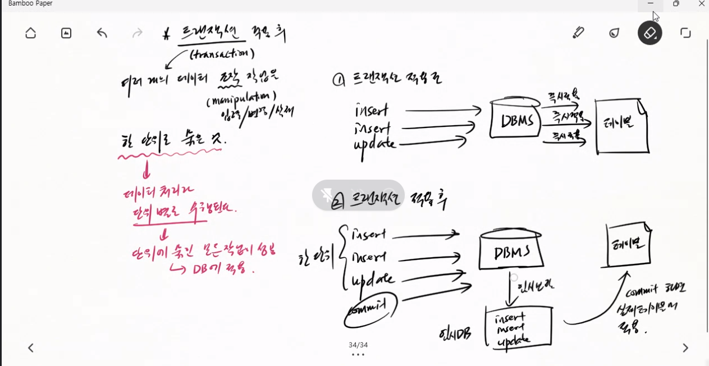

- 트랜잭션을 설정한다.
  - @EnableTransactionManagement 설정 추가
  - Annotation으로 트랜잭션을 제어할 수 있게 한다.
- 트랜잭션 관리자 객체 준비
  
- 트랜잭션을 적용한다.
  - com.eomcs.mylist.controller.ContactController 클래스 변경
    - add() 메서드에 트랜잭션 적용

  - Spring에서 트랜잭션 적용하기

- Spring Boot
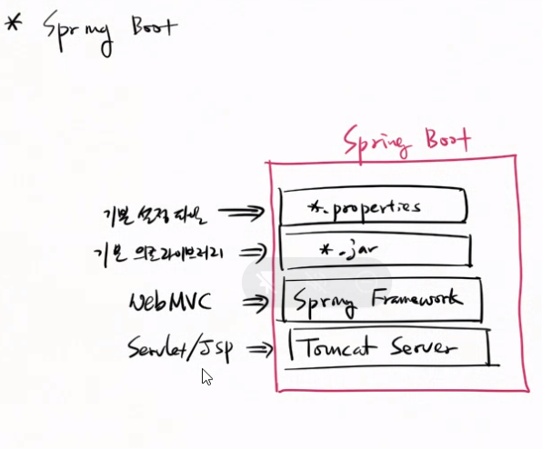

- 서비스 객체 도입(업무관련 코드와 트랜잭션 관련 코드를 캡슐화)
 - 이전 방식
   - ContactController(요청된 파라미터 분석, 클라이언트에게 응답 데이터 가공(JSON데이터))에 요청 -> ContactDao에서 데이터처리 -> Mybatis -> JDBC Driver -> DBMS에서 작업 완료하여 사용자에게 리턴

# 2022년 04월 01일

ㄴㅁㅇㅁㄴㅇ